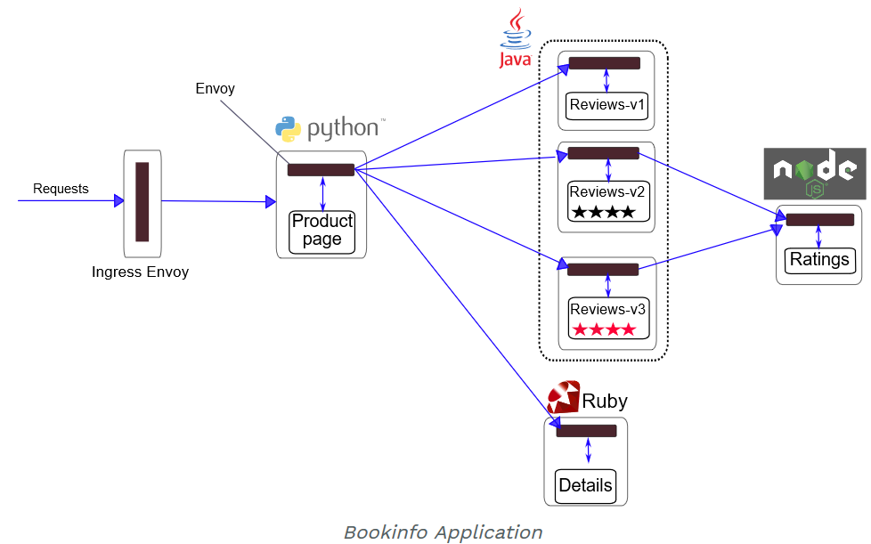

# Installing Walkthrough

This example deploys a sample application composed of four separate microservices used to demonstrate various Istio features. The application displays information about a book, similar to a single catalog entry of an online book store. Displayed on the page is a description of the book, book `details` (ISBN, number of pages, and so on), and a few book `reviews`.

The Bookinfo application is broken into four separate microservices:

- `productpage`. The `productpage` microservice calls the `details` and `reviews` microservices to populate the page.
- `details`. The `details` microservice contains book information.
- `reviews`. The `reviews` microservice contains book `reviews`. It also calls the `ratings` microservice.
- `ratings`. The `ratings` microservice contains book ranking information that accompanies a book review.

There are 3 versions of the `reviews` microservice:

- Version `v1` doesn’t call the `ratings` service.
- Version `v2` calls the `ratings` service, and displays each rating as 1 to 5 black stars.
- Version `v3` calls the `ratings` service, and displays each rating as 1 to 5 red stars.


## More points

There are some other interesting points to notice about the diagram above:

- There are three distinct languages used for each of the different services
- We will learn how to route traffic to specific version numbers, leveraging the concepts of Canary releases

## Deployment of Sidecar

You will also notice in the diagram below that the envoy proxy has been installed into each of the services.




## The Deployment Yaml for Bookinfo

In the next section we are about to deploy Bookinfo using a couple of commands in conjunction with each other (`kubectl` and `istioctl`).

The beauty of these commands is that the 'Envoy' sidecar automatically gets injected into the each of the services.

it might be worth noting that there is a bash script do the cleanup, `cleanup.sh`.

```
  platform
    └── kube
        ├── bookinfo-add-serviceaccount.yaml
        ├── bookinfo-certificate.yaml
        ├── bookinfo-db.yaml
        ├── bookinfo-details-v2.yaml
        ├── bookinfo-details.yaml
        ├── bookinfo-ingress.yaml
        ├── bookinfo-mysql.yaml
        ├── bookinfo-ratings-discovery.yaml
        ├── bookinfo-ratings-v2-mysql-vm.yaml
        ├── bookinfo-ratings-v2-mysql.yaml
        ├── bookinfo-ratings-v2.yaml
        ├── bookinfo-ratings.yaml
        ├── bookinfo-reviews-v2.yaml
        ├── bookinfo.yaml
        ├── cleanup.sh
        ├── istio-rbac-details-reviews.yaml
        ├── istio-rbac-enable.yaml
        ├── istio-rbac-namespace.yaml
        ├── istio-rbac-productpage.yaml
        ├── istio-rbac-ratings.yaml
        ├── rbac
        │   ├── details-reviews-policy.yaml
        │   ├── namespace-policy.yaml
        │   ├── productpage-policy.yaml
        │   ├── ratings-policy.yaml
        │   └── rbac-config-ON.yaml
        └── README.md
```

### Command line to deploy Bookinfo

This particular version of the command is known as `manual sidecar injection` because `kubectl` is combined with `istioctl`.


```/bash
$ kubectl apply -f <(istioctl kube-inject -f samples/bookinfo/platform/kube/bookinfo.yaml)

service/details created
deployment.extensions/details-v1 created
service/ratings created
deployment.extensions/ratings-v1 created
service/reviews created
deployment.extensions/reviews-v1 created
deployment.extensions/reviews-v2 created
deployment.extensions/reviews-v3 created
service/productpage created
deployment.extensions/productpage-v1 created

```

Let's go ahead and verify that the appropriate components got installed:

```
$ kubectl get services

NAME          CLUSTER-IP     EXTERNAL-IP   PORT(S)    AGE
details       10.0.130.153   <none>        9080/TCP   6m
kubernetes    10.0.0.1       <none>        443/TCP    1d
productpage   10.0.254.100   <none>        9080/TCP   6m
ratings       10.0.178.102   <none>        9080/TCP   6m
reviews       10.0.112.9     <none>        9080/TCP   6m
```

You can also check the part as follows:

```
$ kubectl get pods

NAME                              READY     STATUS    RESTARTS   AGE
details-v1-5458f64c65-zkzf5       2/2       Running   0          9m
productpage-v1-577c9594b7-s9jsw   2/2       Running   0          9m
ratings-v1-79467df9b5-8gs8z       2/2       Running   0          9m
reviews-v1-5d46b744bd-bdh84       2/2       Running   0          9m
reviews-v2-7f7d7f99f7-xfm25       2/2       Running   0          9m
reviews-v3-7bc67f66-zpt64         2/2       Running   0          9m
```

Notice that the `reviews` pods has various versions. We will be taking a closer look at this with the upcoming demos, where we route a specific version of traffic to specific versions of the `release` microservice.

## Control Ingress Traffic

**The typical way to exposing services** - The Kubernetes Ingress Resource is used to specify services that should be exposed outside the cluster. 

**The better approach** - In an Istio service mesh, a better approach is to use Istio Gateway. 

**Why Better ?** - A Gateway allows Istio features such as monitoring and route rules to be applied to traffic entering the cluster.


As you can see from the image above, the deployment of BookInfo on the Azure Kubernetes Service is automatically resulted in a layer 4 load balancer getting deployed, thus exposing a publicly accessible IP address.

You can either go to the Kubernetes dashboard or you can issue the following command:

```bash
kubectl get svc istio-ingressgateway -n istio-system
```

The result should look something like this:

```bash
NAME                   CLUSTER-IP   EXTERNAL-IP     PORT(S)                                                                                                                   AGE
istio-ingressgateway   10.0.5.12    13.66.153.108   80:31380/TCP,443:31390/TCP,31400:31400/TCP,15011:30095/TCP,8060:31630/TCP,853:32106/TCP,15030:30937/TCP,15031:30425/TCP   1d
```

## Determining the ingress IP and port

**Browser enabled** - you need to make the application accessible from outside of your Kubernetes cluster, e.g., from a browser. 

**How to browser-enable** - An Istio Gateway is used for this purpose.

**Define a gateway** - The command below can create ingress gateway for the application:

```
$ kubectl apply -f samples/bookinfo/networking/bookinfo-gateway.yaml
```

**Confirm the gateway** -  with the following command.

```
kubectl get gateway
```

You should see the gateway:

```
NAME               AGE
bookinfo-gateway   32s
```

### Confirming with the Browser

| Public IP Address | URL
|:--|:---|
| 13.66.153.108 | http://13.66.153.108/productpage|


## Cleaning up and removing BookInfo

**To uninstall from Kubernetes environment** - Delete the routing rules and terminate the application pods

```
$ samples/bookinfo/platform/kube/cleanup.sh
```

### Confirm shutdown

```
$ kubectl get virtualservices   #-- there should be no virtual services
$ kubectl get destinationrules  #-- there should be no destination rules
$ kubectl get gateway           #-- there should be no gateway
$ kubectl get pods               #-- the Bookinfo pods should be deleted
```
