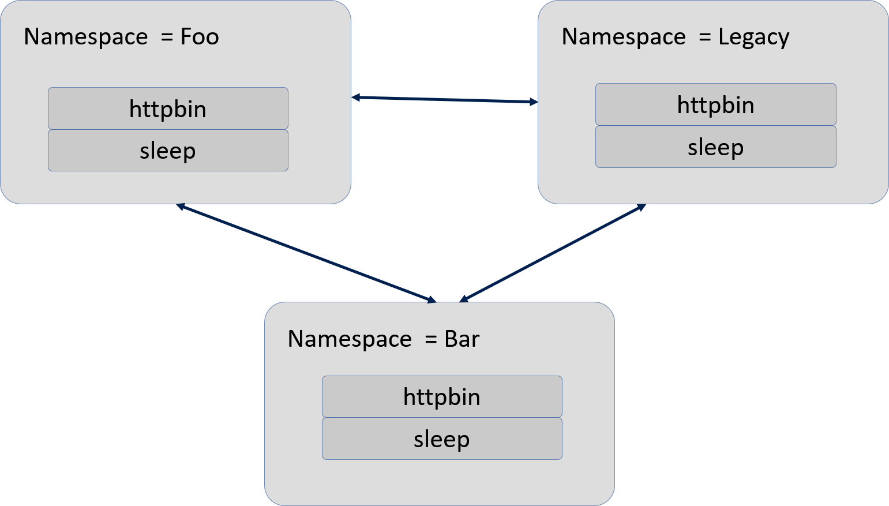
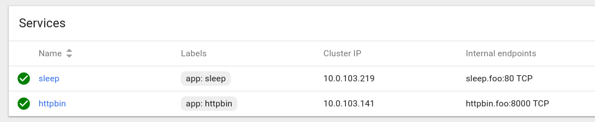

# Authentication With Istio Overview

## 2 Types of Istio Authentication Auth

**Type 1: Transport authentication** - Also known as service-to-service authentication: verifies the direct client making the connection. 
 - **TLS (Transport Layer Security)** - is the standard Internet Security protocol, successor of SSL (Secure Socket Layer)
 - **Secure Comm** - It is used to provide secured connections for communications done over Internet and in private cluster.
 - **Integrity** - It provides privacy & integrity of data between two applications communicating with each other.
- **Istio provides** - a key management system to automate key and certificate generation, distribution, and rotation.
- **Istio Offers Mutual TLS** - Istio offers mutual TLS as a full stack solution for transport authentication.
    - **Mutual TLS** - Also known as a two-way authentication refers to two parties authenticating each other at the same time, being a default mode of authentication in some 
    - **x509** - is used for authentication.

**Type 2: Origin authentication** - Also known as end-user authentication: verifies the original client making the request as an end-user or device. 

- Message authentication or data origin authentication is a property that a message has not been modified while in transit (data integrity) and that the receiving party can verify the source of the message.
- The authentication is based on a secret key shared by two parties to authenticate information transmitted between them
    - **JWT Token** - Istio enables request-level authentication with JSON Web Token (JWT) validation and a streamlined developer experience for Auth0, Firebase Auth, Google Auth, and custom auth.

**Auth Policies, where stored?** - The authentication policies in the Istio config store via a custom Kubernetes API.

**Pilot helps keep things up to date** - Pilot keeps them up-to-date for each proxy, along with the keys where appropriate.

## Mutual TLS authentication

**Envoy plays key role** - Istio tunnels service-to-service communication through the client side and server side Envoy proxies

# Walkthrough to Understand Mutual TLS




Let's create the three namespaces along with the two applications:
- httpbin
- sleep

Notice of the three name spaces, it is the `legacy` namespace that is created without Istio and the Envoy Sidecar.


```bash
$ kubectl create ns foo
$ kubectl apply -f <(istioctl kube-inject -f samples/httpbin/httpbin.yaml) -n foo
$ kubectl apply -f <(istioctl kube-inject -f samples/sleep/sleep.yaml) -n foo
$ kubectl create ns bar
$ kubectl apply -f <(istioctl kube-inject -f samples/httpbin/httpbin.yaml) -n bar
$ kubectl apply -f <(istioctl kube-inject -f samples/sleep/sleep.yaml) -n bar
$ kubectl create ns legacy
$ kubectl apply -f samples/httpbin/httpbin.yaml -n legacy
$ kubectl apply -f samples/sleep/sleep.yaml -n legacy
```

The results:

```bash
namespace/foo created
   service/httpbin created
   deployment.extensions/httpbin created

   service/sleep created
   deployment.extensions/sleep created

namespace/bar created
   service/httpbin created
   deployment.extensions/httpbin created

   service/sleep created
   deployment.extensions/sleep created

namespace/legacy created
   service/httpbin created
   deployment.extensions/httpbin created

   service/sleep created
   deployment.extensions/sleep created

```

## Let's review the pods and services deployed

### httpbin.yaml

```yml
apiVersion: v1
kind: Service
metadata:
  name: httpbin
  labels:
    app: httpbin
spec:
  ports:
  - name: http
    port: 8000
  selector:
    app: httpbin
---
apiVersion: extensions/v1beta1
kind: Deployment
metadata:
  name: httpbin
spec:
  replicas: 1
  template:
    metadata:
      labels:
        app: httpbin
        version: v1
    spec:
      containers:
      - image: docker.io/citizenstig/httpbin
        imagePullPolicy: IfNotPresent
        name: httpbin
        ports:
        - containerPort: 8000
```


### sleep.yaml

```yml
apiVersion: v1
kind: Service
metadata:
  name: sleep
  labels:
    app: sleep
spec:
  ports:
  - port: 80
    name: http
  selector:
    app: sleep
---
apiVersion: extensions/v1beta1
kind: Deployment
metadata:
  name: sleep
spec:
  replicas: 1
  template:
    metadata:
      labels:
        app: sleep
    spec:
      containers:
      - name: sleep
        image: pstauffer/curl
        command: ["/bin/sleep", "3650d"]
        imagePullPolicy: IfNotPresent
---
```

Let's now verify that there is no Mutual TLS that we could communicate among pods and containers.


**Namespace = Foo**




```
$ kubectl exec $(kubectl get pod -l app=sleep -n bar -o jsonpath={.items..metadata.name}) -c sleep -n bar -- curl http://httpbin.foo:8000/ip -s -o /dev/null -w "%{http_code}\n"
```
List out information about a pod:

|Command| Label(s) | Namespace | 
|-----|-----|-----|
|Get matching pods |app=sleep|bar|


```
kubectl get pod -l app=sleep -n bar -o jsonpath=
{.items..metadata.name}
```

Resulting pod

```
sleep-7dc47f96b6-7dfld
```
List out the containers in the `sleep` pod.
**Goal** - Get containers in pod

- **Pod** - sleep-7dc47f96b6-7dfld

- **Namespace of Pod** - bar

- **Syntax to get container** - jsonpath='{.spec.containers[*].name}'


```
kubectl get pods sleep-7dc47f96b6-7dfld -n bar -o jsonpath='{.spec.containers[*].name}'
```
Results are two containers:

```
'sleep istio-proxy'
```


Let's remote into that container so we can do a `curl` command against the app 

```
$ kubectl exec -it sleep-7dc47f96b6-7dfld -n bar --container sleep -- /bin/sh
```
Now that we are in the `sleep` container, do a `curl`.

But before we issue the curl command, we need to target a specific container in the pod.

What is important now is to try to access the internal endpoint using the `curl` command.

The internal endpoint is composed of 3 pieces.
- Service Name
- Namespace
- Port

```
kubectl exec -it sleep-7dc47f96b6-7dfld -n bar -- /bin/sh
```
Results:

We can now put together the necessary pieces.

```
kubectl get services httpbin -o wide -n foo
NAME      CLUSTER-IP     EXTERNAL-IP   PORT(S)    AGE       SELECTOR
httpbin   10.0.103.141   <none>        8000/TCP   1h        app=httpbin
```

**Service Name** - httpbin

**Namespace** - foo

**Port** - 8000

**Result** - http://httpbin.foo:8000

```
$ # curl http://httpbin.foo:8000 -w "%{http_code}\n"
```

Results show that we were able to get an http status 200, which means, `OK`.

```
[omitted for brevity]
<p><a href="http://python-requests.org" data-bare-link="true">http://python-requests.org</a></p>
</div>
</body>
</html>
**200**
```


