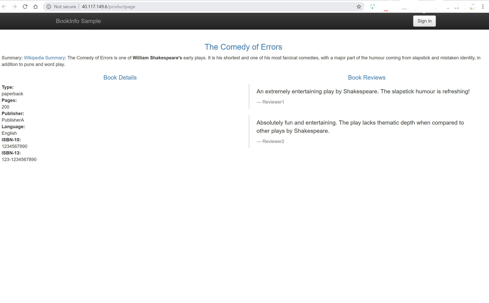
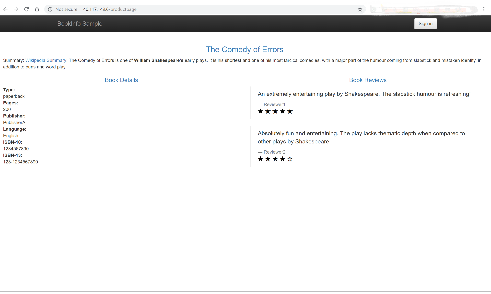
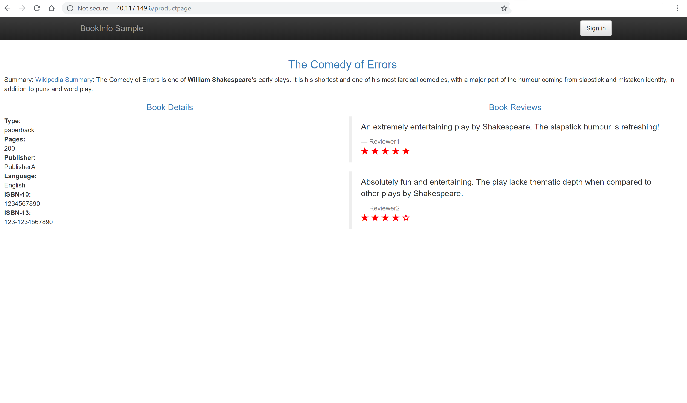

## Prerequisite

> * created an AKS cluster (Kubernetes 1.10 and above, with RBAC enabled) [AKS quickstart](https://github.com/MicrosoftDocs/azure-docs/blob/master/articles/aks/kubernetes-walkthrough.md)
> * An established `kubectl` connection with the cluster
> * Istio installed in your cluster [install Istio in AKS](https://github.com/MicrosoftDocs/azure-docs/blob/master/articles/aks/istio-install.md)
> * deploy BookInfo sample application [Installing Walkthrough](https://github.com/brunoterkaly/istio/blob/master/Istio-BookInfo-Walkthrough.md)

The Istio Bookinfo sample consists of four separate microservices, each with multiple versions. The initial goal of this task is to apply a rule that routes all traffic to v1 (version 1) of the ratings service. Later, you will apply a rule to route traffic based on the value of an HTTP request header.

To illustrate the problem this task solves, access the Bookinfo app’s /productpage in a browser and refresh several times. You’ll notice that sometimes the book review output contains star ratings and other times it does not. This is because without an explicit default service version to route to, Istio routes requests to all available versions in a round robin fashion.


First, create a namespace in your AKS cluster for the sample AKS BookInfo app named *booking* as follows:

```console
kubectl create namespace booking
```

Label the namespace with `istio-injection=enabled`. This label instructs Istio to automatically inject the istio-proxies as sidecars into all of your pods in this namespace.

```console
kubectl label namespace booking istio-injection=enabled
```

Now let's create the components for the AKS Booking app. Create these components in the *booking* namespace created in a previous step.

```console
kubectl apply -f samples/bookinfo/platform/kube/bookinfo.yaml --namespace booking
```

The following example output shows the resources were successfully created:

```
deployment.apps/voting-storage-1-0 created
servservice/details created
deployment.extensions/details-v1 created
service/ratings created
deployment.extensions/ratings-v1 created
service/reviews created
deployment.extensions/reviews-v1 created
deployment.extensions/reviews-v2 created
deployment.extensions/reviews-v3 created
service/productpage created
deployment.extensions/productpage-v1 created
```

> [!NOTE]
> Istio has some specific requirements around pods and services. For more information, see the [Istio Requirements for Pods and Services documentation](https://istio.io/docs/setup/kubernetes/spec-requirements/).

To see the pods that have been created, use the [kubectl get pods](https://kubernetes.io/docs/reference/generated/kubectl/kubectl-commands#get) command as follows:

```console
kubectl get pods -n booking
```

The following example output shows there are multiple instances of the *reviews* pod and a single instance of each of the *details*, *productpage* and *ratings* pods. Each of the pods has two containers. One of these containers is the component, and the other is the *istio-proxy*:

```
NAME                              READY   STATUS    RESTARTS   AGE
details-v1-7bcdcc4fd6-fdjnd       2/2     Running   0          27s
productpage-v1-8584c875d8-7sp9q   2/2     Running   0          26s
ratings-v1-54cf9dc8f8-5ggnz       2/2     Running   0          26s
reviews-v1-59cbdd7959-h7plq       2/2     Running   0          26s
reviews-v2-dccb4cfc9-qds7k        2/2     Running   0          26s
reviews-v3-5465dc97bc-pf9v7       2/2     Running   0          26s
```

To see information about the pod, use the [kubectl describe pod](https://kubernetes.io/docs/reference/generated/kubectl/kubectl-commands#describe). Replace the pod name with the name of a pod in your own AKS cluster from the previous output:

```console
kubectl describe pod reviews-v1-59cbdd7959-khlj7 --namespace booking
```

The *istio-proxy* container has automatically been injected by Istio to manage the network traffic to and from your components, as shown in the following example output:

```
[...]
Containers:
  reviews:
    Container ID:   docker://10599295b3b9a2003289f0f5feb152bc32f1d3bb93cf9bc0eb3e29c7d7ec705d
    Image:          istio/examples-bookinfo-reviews-v1:1.8.0
    Image ID:       docker-pullable://istio/examples-bookinfo-reviews-v1@sha256:920d46b3c526376b28b90d0e895ca7682d36132e6338301fcbcd567ef
    ...
  istio-proxy:
    Container ID:  docker://35e78b1f0f112b47f3ac0db57a9a18e451786e811aee9edeb6fcd04715a4db1a
    Image:         docker.io/istio/proxyv2:1.0.5
    Image ID:      docker-pullable://istio/proxyv2@sha256:8b7d549100638a3697886e549c149fb588800861de8c83605557a9b4b20343d4
    Port:          15090/TCP
    Host Port:     0/TCP
[...]
```

You can't connect to the booking app until you create the Istio Gateway and Virtual Service. These Istio resources route traffic from the default Istio ingress gateway to our application.

> [!NOTE]
> A *Gateway* is a component at the edge of the service mesh that receives inbound or outbound HTTP and TCP traffic.
>
> A *Virtual Service* defines a set of routing rules for one or more destination services.

Use the `istioctl` client binary to deploy the Gateway and Virtual Service yaml. As with the `kubectl apply` command, remember to specify the namespace that these resources are deployed into.

```console
kubectl apply -f <(istioctl kube-inject -f samples/bookinfo/platform/kube/bookinfo.yaml --namespace booking)
```
## Determining the ingress IP and port


**Define a gateway** - The command below can create ingress gateway for the application:

```
$ kubectl apply -f samples/bookinfo/networking/bookinfo-gateway.yaml --namespace booking
```

**Confirm the gateway** -  with the following command.

```
kubectl get gateway
```

You should see the gateway:

```
NAME               AGE
bookinfo-gateway   32s
```

Obtain the IP address of the Istio Ingress Gateway using the following command:

```console
kubectl get service istio-ingressgateway --namespace istio-system -o jsonpath='{.status.loadBalancer.ingress[0].ip}'
```

The following example output shows the IP address of the Ingress Gateway:

```
40.117.149.6
```

Open up a browser and paste in the IP address following productpage route (http://40.117.149.6/productpage). The sample AKS BookInfo app is displayed.

When pointing the browser to application URL the application’s main page can be seen and refreshing it reveals the different application versions, without ratings (v1), with black star ratings (v2) and red star ratings (v3)





## Configuring Request Routing

First, we will run one version only, apply a virtual service that sets the default version for a microservice by runing the following command in the *booking* namespace:

```
kubectl apply -f samples/bookinfo/networking/virtual-service-all-v1.yaml --namespace booking
```

The route configuration can be changed so that all traffic from a specific user is routed to a specific version. Now, The bookinfo application will display ratings without stars since it is configured to only use v1.

```
kubectl apply -f samples/bookinfo/networking/virtual-service-reviews-test-v2.yaml --namespace booking
```

### Traffic shifting

First we shift 50% of the traffic to the review service v3.

```console
istioctl replace -f samples/bookinfo/networking/virtual-service-reviews-50-v3.yaml --namespace booking
```

The following example output shows the Istio Virtual Service are successfully updated:

```
Updated config virtual-service/booking/reviews to revision 319638
```

Next, we may want to increase load to be 80% for v3 and 20% for v2 

```console
istioctl replace -f samples/bookinfo/networking/virtual-service-reviews-80-20.yaml --namespace booking
```
Finally, we may assume the service is stable and can route 100% of the traffic to v3.

```console
istioctl replace -f samples/bookinfo/networking/virtual-service-reviews-v3.yaml --namespace booking
```

You can more easily visualize that we are now only routed to v3
