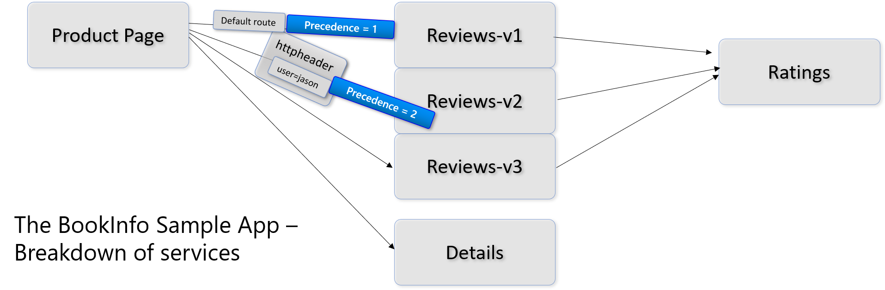

# Introducing Canary functionality

For more infomation see:
https://istio.io/docs/concepts/traffic-management/

**What is a canary release** - The main purpose of Canary deployments is to reduce the risk of introducing new software and production.

**Re-route a subset of traffic** - The idea is that it is preferable to route a small amount of traffic to the new notes so that it is possible to verify correct functionality, before routing all the traffic to the new release.

**In the above diagram** - It means that you could allocate a certain percentage of traffic to version 3, while still having version 2 in production at the same time supporting the remaining traffic.

**Blue Green is a little different** - The other related option for deployment is called Blue Green Deployment. blue-green deployment allows you to deploy a new version of your software to a completely new subset of your infrastructure, to which no users are routed.

**Test with Internal Users** - The idea is that internal users could do the test first on a subset in the world of Blue Green deployment. only when the internal users agree that the functionality and behavior is appropriate, do you start rerouting traffic from the old deployment to the new deployment.

**Simple Example** -  Istio, you can specify that v1 of a service receives 90% of incoming traffic, while v2 of that service only receives 10%. 

**Keep both versions** -Using Istio you can deploy v2 of your service and use built-in traffic management mechanisms to shift traffic to your updated services at a network level, then remove the v1 Pods.

**Dynamic-Routing** - Istio also gives you the ability to implement dynamic request routing (based on HTTP headers), failure recovery, retries, circuit breakers, and fault injection. For more information, check out the Traffic Management documentation.

- Layer 7 Load Balancing
- in the diagram below notice that based on an HTTP header, it is possible to route traffic to `Reviews-V2`, instead of `Reviews-V2`.

**Let's learn more about traffic routing** - This post walks through a technique that highlights a particularly useful way that you can implement Istio incrementally – in this case, only the traffic management features – without having to individually update each of your Pods.

**Forced Delays** - You can also introduce delays into the calling of your backend services for the purpose of testing timeouts in client requests.

## Example of Canary version

**% to specific versions** - You can specify via Pilot that you want 5% of traffic for a particular service to go to a canary version irrespective of the size of the canary deployment, or send traffic to a particular version depending on the content of the request.

### What is Pilot?

**Pilot** - Manages and configures all the Envoy proxy instances deployed in a particular Istio service mesh. 

**It is about Rules** - Pilot lets you specify which rules you want to use to route traffic between Envoy proxies and configure failure recovery features such as timeouts, retries, and circuit breakers. 

**Envoys automatically propagate routes** - It also maintains a canonical model of all the services in the mesh and uses this model to let Envoy instances know about the other Envoy instances in the mesh via its discovery service.

**Envoy talk to Pilot** - the load-balancing information in the sidecar is obtained from Pilot.

**Health Checks** - the system does periodic health checks, looking at other instances in the load-balancing pool. This enables intelligent traffic routing.

- When the number of health check failures for a given instance exceeds a pre-specified threshold

## Load Balancing Types

Istio currently allows three load balancing modes: round robin, random, and weighted least request.

