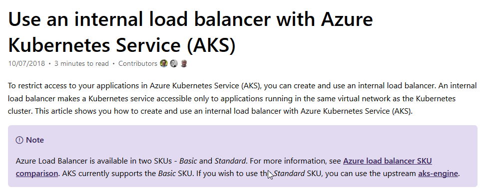

# Setting up a route to Services

https://docs.microsoft.com/en-us/azure/aks/internal-lb



## Guidance - https://istio.io/docs/tasks/traffic-management/ingress/


Execute the following command to determine if your Kubernetes cluster is running in an environment that supports external load balancers:

```
kubectl get svc istio-ingressgateway -n istio-system
```

## Determining the ingress IP and ports when using an external load balancer

Follow these instructions if you have determined that your environment does have an external load balancer.

Set the ingress IP and ports:

```
export INGRESS_HOST=$(kubectl -n istio-system get service istio-ingressgateway -o jsonpath='{.status.loadBalancer.ingress[0].ip}')
export INGRESS_PORT=$(kubectl -n istio-system get service istio-ingressgateway -o jsonpath='{.spec.ports[?(@.name=="http2")].port}')
export SECURE_INGRESS_PORT=$(kubectl -n istio-system get service istio-ingressgateway -o jsonpath='{.spec.ports[?(@.name=="https")].port}')
```

Note that in certain environments, the load balancer may be exposed using a host name, instead of an IP address.

In this case, the EXTERNAL-IP value in the output from the command in the previous section will not be an IP address, but rather a host name, and the above command will have failed to set the INGRESS_HOST environment variable. 

In this case, use the following command to correct the INGRESS_HOST value:

```
export INGRESS_HOST=$(kubectl -n istio-system get service istio-ingressgateway -o jsonpath='{.status.loadBalancer.ingress[0].hostname}')
```

## Configuring ingress using an Istio Gateway

An ingress Gateway describes a load balancer operating at the edge of the mesh that receives incoming HTTP/TCP connections. 

It configures exposed ports, protocols, etc. but, unlike Kubernetes Ingress Resources, does not include any traffic routing configuration. Traffic routing for ingress traffic is instead configured using Istio routing rules, exactly in the same was as for internal service requests.

Let’s see how you can configure a Gateway on port 80 for HTTP traffic.

### Create an Istio Gateway:

```
cat <<EOF | kubectl apply -f -
apiVersion: networking.istio.io/v1alpha3
kind: Gateway
metadata:
  name: httpbin-gateway
spec:
  selector:
    istio: ingressgateway # use Istio default gateway implementation
  servers:
  - port:
      number: 80
      name: http
      protocol: HTTP
    hosts:
    - "httpbin.example.com"
EOF
```

### Configure routes for traffic entering via the Gateway:

```
cat <<EOF | kubectl apply -f -
apiVersion: networking.istio.io/v1alpha3
kind: VirtualService
metadata:
  name: httpbin
spec:
  hosts:
  - "httpbin.example.com"
  gateways:
  - httpbin-gateway
  http:
  - match:
    - uri:
        prefix: /status
    - uri:
        prefix: /delay
    route:
    - destination:
        port:
          number: 8000
        host: httpbin
EOF
```
### Summary

You have now created a virtual service configuration for the httpbin service containing two route rules that allow traffic for paths /status and /delay.

Requests only through http-bin gateway:

The gateways list specifies that only requests through your httpbin-gateway are allowed. 

All other external requests will be rejected with a 404 response.

Note that in this configuration, internal requests from other services in the mesh are not subject to these rules but instead will default to round-robin routing. 

To apply these or other rules to internal calls, you can add the special value mesh to the list of gateways.

Access the httpbin service using curl:

```
$ curl -I -HHost:httpbin.example.com http://$INGRESS_HOST:$INGRESS_PORT/status/200
HTTP/1.1 200 OK
server: envoy
date: Mon, 29 Jan 2018 04:45:49 GMT
content-type: text/html; charset=utf-8
access-control-allow-origin: *
access-control-allow-credentials: true
content-length: 0
x-envoy-upstream-service-time: 48
```


Note that you use the -H flag to set the Host HTTP Header to “httpbin.example.com”. 

This is needed because your ingress Gateway is configured to handle “httpbin.example.com”, but in your test environment you have no DNS binding for that host and are simply sending your request to the ingress IP.

Access any other URL that has not been explicitly exposed. You should see an HTTP 404 error:

```
$ curl -I -HHost:httpbin.example.com http://$INGRESS_HOST:$INGRESS_PORT/headers
HTTP/1.1 404 Not Found
date: Mon, 29 Jan 2018 04:45:49 GMT
server: envoy
content-length: 0


