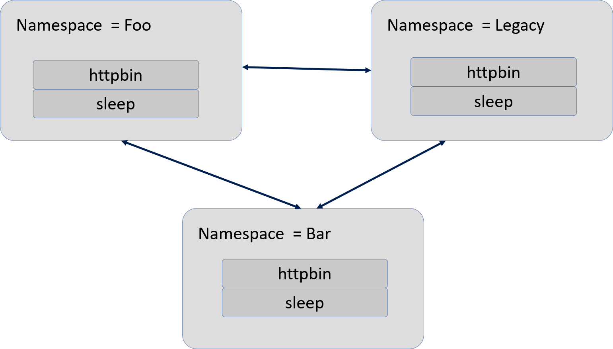
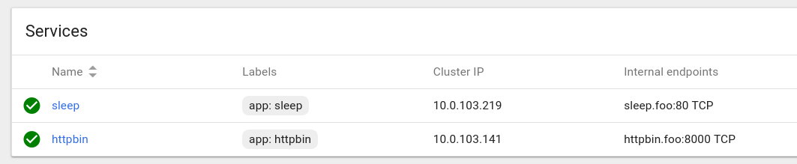

# Walkthrough to Understand Mutual TLS




The purpose of this section is to implement Transport Authentication. The goal is to limit traffic in and out of Kubernetes namespaces.

x509 Certificates will be used for this purpose, supporting two-way authentication with a key management system to automate key and certificate generation, distribution, and rotation.

This will provide privacy & integrity of data between two applications communicating with each other. This will also provide secured connections for both communications done over Internet and in private cluster.

Two namespaces will be provided so we can show that even with Istio installed, Mutual TLS support isn't the default. We  have to turn it on. So in the first part will will show that services across namespaces can talk to each other. 

We will then establish a `Destination Rule` for the ns=bar that disables traffic to the other namespaces, including the ns=legacy.

If attempts are made by apps in the ns=bar to reach other apps in other namespaces, they will be prohibited, getting an HTTP code of 56 (command terminated with exit code 56), instead of 200 (OK).

## Key commands


Applications
 - httpbin
 - sleep
Namespaces
 - foo
    - httpbin
    - sleep
 - bar
    - httpbin
    - sleep
 - legacy
    - httpbin
    - sleep

### Provisioning apps (httpbin, sleep) for Namespace = foo

Create a  namespace
 - kubectl create ns foo
 - ns=foo
Provision httpbin in Namespace=foo
 - kubectl apply -f <(istioctl kube-inject -f samples/httpbin/httpbin.yaml) -n foo
 - Service=httpbin, Pod=httpbin, Namespace=foo
 - Includes Istio sidecar container
Provision sleep in Namespace=foo
 - kubectl apply -f <(istioctl kube-inject -f samples/sleep/sleep.yaml) -n foo
 - Service=sleep, Pod=sleep, Namespace=foo
 - Includes Istio sidecar container

### Provisioning apps (httpbin, sleep) for Namespace = bar

Create a  namespace
 - kubectl create ns bar
 - ns=bar
Provision httpbin in Namespace=bar
 - kubectl apply -f <(istioctl kube-inject -f samples/httpbin/httpbin.yaml) -n bar
 - Service=httpbin, Pod=httpbin, Namespace=bar
 - Includes Istio sidecar container
Provision sleep in Namespace=bar
 - kubectl apply -f <(istioctl kube-inject -f samples/sleep/sleep.yaml) -n bar
 - Service=sleep, Pod=sleep, Namespace=bar
 - Includes Istio sidecar container


### Provisioning apps (httpbin, sleep) for Namespace = legacy

Create a  namespace
 - kubectl create ns legacy
 - ns=legacy
Provision httpbin in Namespace=legacy
 - kubectl apply -f samples/httpbin/httpbin.yaml -n legacy
 - Service=httpbin, Pod=httpbin, Namespace=legacy
 - Includes Istio sidecar container
Provision sleep in Namespace=legacy
 - kubectl apply -f < samples/sleep/sleep.yaml -n legacy
 - Service=sleep, Pod=sleep, Namespace=legacy
 - Does NOT include Istio sidecar container


Get the name of a pod
 - kubectl get pod -l app=sleep -n bar -o jsonpath= {.items..metadata.name}

 Get the containers in a pod
 - kubectl get pods sleep-7dc47f96b6-7dfld -n bar -o jsonpath='{.spec.containers[*].name}'

 Get information for Kubernetes Service INTERNAL endpoint
 - kubectl get services httpbin -o wide -n foo
 - Internal Endpoint = Service Name + Namespace + Port

 Remote into a container that is in a specific pod and namespace
 - kubectl exec -it sleep-7dc47f96b6-7dfld -n bar --container sleep -- /bin/sh

Issue Curl command against Internal Endpoint of httpbin service
 - curl http://httpbin.foo:8000 -w "%{http_code}\n"


WORKING ON THE STUFF BELOW


```bash
$ kubectl create ns foo
$ kubectl apply -f <(istioctl kube-inject -f samples/httpbin/httpbin.yaml) -n foo
$ kubectl apply -f <(istioctl kube-inject -f samples/sleep/sleep.yaml) -n foo
$ kubectl create ns bar
$ kubectl apply -f <(istioctl kube-inject -f samples/httpbin/httpbin.yaml) -n bar
$ kubectl apply -f <(istioctl kube-inject -f samples/sleep/sleep.yaml) -n bar
$ kubectl create ns legacy
$ kubectl apply -f samples/httpbin/httpbin.yaml -n legacy
$ kubectl apply -f samples/sleep/sleep.yaml -n legacy
```

The results:

```bash
namespace/foo created
   service/httpbin created
   deployment.extensions/httpbin created

   service/sleep created
   deployment.extensions/sleep created

namespace/bar created
   service/httpbin created
   deployment.extensions/httpbin created

   service/sleep created
   deployment.extensions/sleep created

namespace/legacy created
   service/httpbin created
   deployment.extensions/httpbin created

   service/sleep created
   deployment.extensions/sleep created

```

## Let's review the pods and services deployed

### httpbin.yaml

```yml
apiVersion: v1
kind: Service
metadata:
  name: httpbin
  labels:
    app: httpbin
spec:
  ports:
  - name: http
    port: 8000
  selector:
    app: httpbin
---
apiVersion: extensions/v1beta1
kind: Deployment
metadata:
  name: httpbin
spec:
  replicas: 1
  template:
    metadata:
      labels:
        app: httpbin
        version: v1
    spec:
      containers:
      - image: docker.io/citizenstig/httpbin
        imagePullPolicy: IfNotPresent
        name: httpbin
        ports:
        - containerPort: 8000
```


### sleep.yaml

```yml
apiVersion: v1
kind: Service
metadata:
  name: sleep
  labels:
    app: sleep
spec:
  ports:
  - port: 80
    name: http
  selector:
    app: sleep
---
apiVersion: extensions/v1beta1
kind: Deployment
metadata:
  name: sleep
spec:
  replicas: 1
  template:
    metadata:
      labels:
        app: sleep
    spec:
      containers:
      - name: sleep
        image: pstauffer/curl
        command: ["/bin/sleep", "3650d"]
        imagePullPolicy: IfNotPresent
---
```

Let's now verify that there is no Mutual TLS that we could communicate among pods and containers.


**Namespace = Foo**




List out information about a pod:

|Command| Label(s) | Namespace | 
|-----|-----|-----|
|Get matching pods |app=sleep|bar|


```
kubectl get pod -l app=sleep -n bar -o jsonpath=
{.items..metadata.name}
```

Resulting pod

```
sleep-7dc47f96b6-7dfld
```
List out the containers in the `sleep` pod.
**Goal** - Get containers in pod

- **Pod** - sleep-7dc47f96b6-7dfld

- **Namespace of Pod** - bar

- **Syntax to get container** - jsonpath='{.spec.containers[*].name}'


```
kubectl get pods sleep-7dc47f96b6-7dfld -n bar -o jsonpath='{.spec.containers[*].name}'
```
Results are two containers:

```
'sleep istio-proxy'
```


Let's remote into that container so we can do a `curl` command against the app 

```
$ kubectl exec -it sleep-7dc47f96b6-7dfld -n bar --container sleep -- /bin/sh
```
Now that we are in the `sleep` container, do a `curl`.

But before we issue the curl command, we need to target a specific container in the pod.

What is important now is to try to access the internal endpoint using the `curl` command.

The internal endpoint is composed of 3 pieces.
- Service Name
- Namespace
- Port

```
kubectl exec -it sleep-7dc47f96b6-7dfld -n bar -- /bin/sh
```
Results:

We can now put together the necessary pieces.

```
kubectl get services httpbin -o wide -n foo
NAME      CLUSTER-IP     EXTERNAL-IP   PORT(S)    AGE       SELECTOR
httpbin   10.0.103.141   <none>        8000/TCP   1h        app=httpbin
```

**Service Name** - httpbin

**Namespace** - foo

**Port** - 8000

**Result** - http://httpbin.foo:8000

```
$ # curl http://httpbin.foo:8000 -w "%{http_code}\n"
```

Results show that we were able to get an http status 200, which means, `OK`. A basic Python web page comes back, some of the first part of the page omitted.

```
[omitted for brevity]
<p><a href="http://python-requests.org" data-bare-link="true">http://python-requests.org</a></p>
</div>
</body>
</html>
**200**
```


