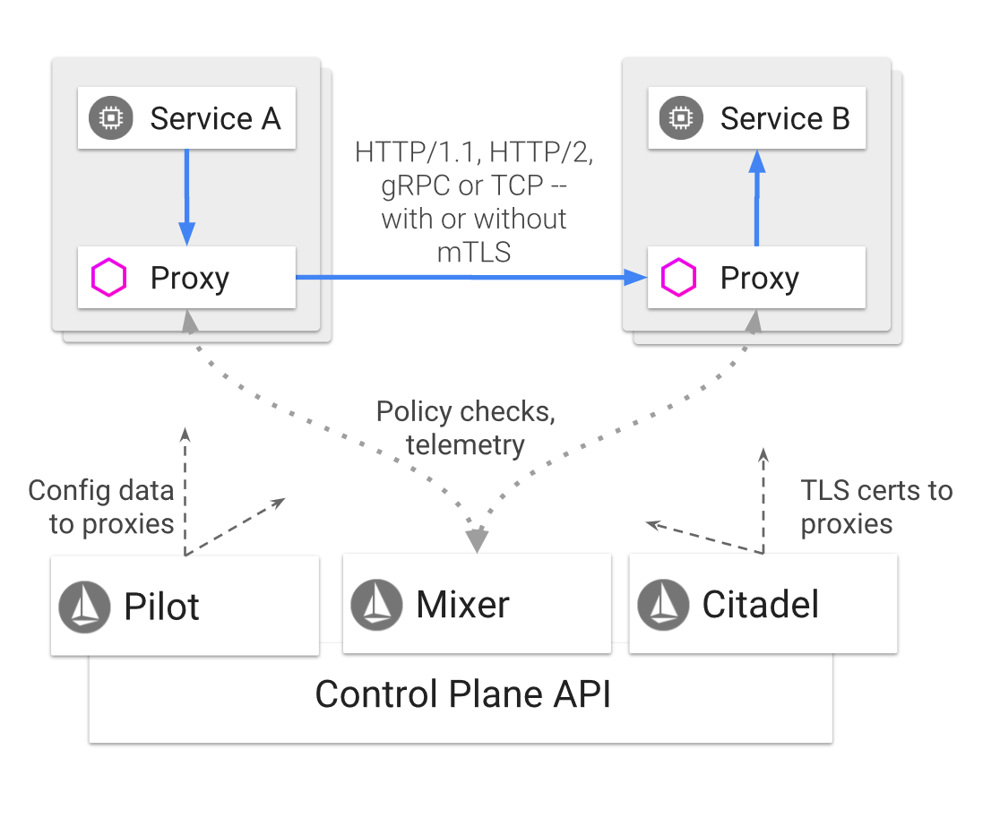
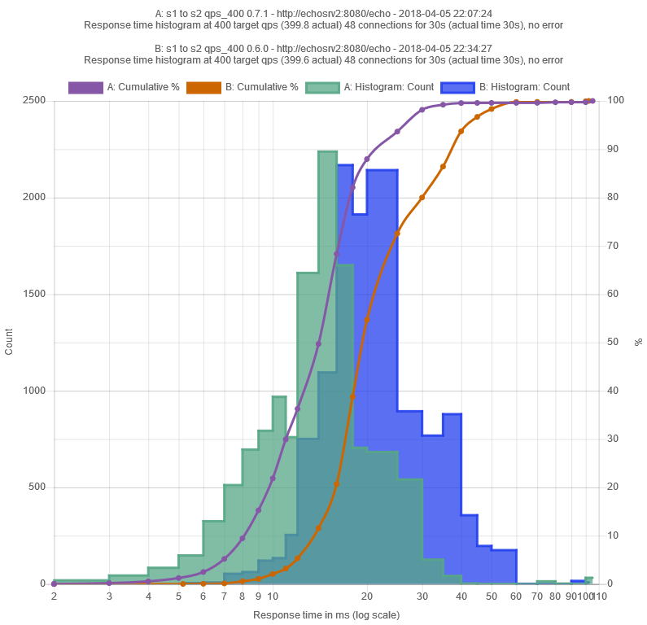
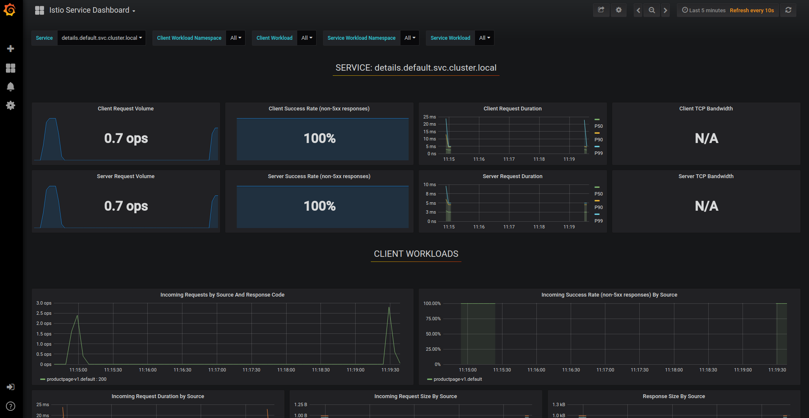

# Overview

Naturally, the goal is to make good use out of everybody's time

Will begin as a level set with Kubernetes and Istio.

## Starting from the beginning

**Start with Kubernetes** - In order to be effective as we learn more advanced topics of Service Mesh us, we should know something solid about the architecture of Kubernetes.

**Know the internals** - It's important to know its internal components and how Kubernetes itself is set up as a series of running containers in the cluster group together in units called pods - which turns out to be the most fundamental concept in Kubernetes.

**Introducing Istio** - Anyone learning Istio needs to understand the basic pillars of Kubernetes.

**Knowing Kubernetes Well** - All the commands necessary in Kubernetes are required to work effectively in the world of Istio.

**Core Istio** - Istio dramatically simplifies the administration of A/B testing, canary releases, rate limiting, access control, monitoring, automatic load-balancing or HTTP, gRPC, WebSocket and TCP Traffic, as well as end to end authentication.

## 6 areas to learn about over the next couple days

**Service Mesh** - Istio is a type of application called a Service Mesh

**Istio Architecture** - what are the core architectural components and how it was implemented. We should learn Istio both from an architectural perspective as well as from a capabilities perspective.

**Traffic Management** - Istio focuses on defining define rules rather than specific routes between pods/VMs. The reason is that you can scale without worrying about specific routes. Relying on rules when you're scaling frees you from the granular details of route tracking.

**Security** - Some pretty compelling features for security.

- Strong identity
- Flexible network policy
- Transparent TLS encryption
- No changes or modifications needed for application code
- Easy integration with existing security systems

**Policies And Telemetry** - includes a flexible model to enforce authorization policies and to collect telemetry for your services. telemetry there is a plug-in model so there is support for Datadog, Fluentd, CloudWatch, etc.

**Performance And Scalability** - there are two basic supports for benchmarking, the first is micro-benchmarks that rely on Golang's native tools and there is also and two and benchmarks that rely on products such as Fortio.

## Why are we here for 2 days?

**Why and What for 2 days** - The main reasons we are all here together today. Perhaps the first primary goal of any public facing website is to be extremely secure, both internally to the organization, as well as externally from customers or nefarious individuals on the broader web.

## How companies are building scalable applications for the cloud

**Goodbye Monoliths** - Another big trend has been organizations with monolithic architectures to move to a world of microservices.

**Smaller Services** - In general, in the context of Kubernetes and Istio, that means breaking applications into various smaller services that run containerize and pods on Kubernetes.

**Plugging in a Service Mesh** - It also means the products like Istio will come into the picture and add their own containers of applications that represents the entire Service Mesh that Istio is.

## (1) What are the core value propositions of Service Mesh?

In Service Mesh technologies, each service instance of a corporate application is paired with an instance of a reverse proxy server. This reverse proxy server is also known as:

- Service proxy
- Sidecar proxy
- Sidecar

## (2) Understanding the pillars of Istio

**What are the core architectural components and how it was implemented** - Show K8s Dashboard

**Sidecars** - In the world of Kubernetes this sidecar runs as another container in the same pod as a corporate application, acting as an intermediary handling all traffic interactions with the corporate application, dispatching and rerouting as necessary.

**Envoy** - In the case of Istio, that sidecar proxy is known as Envoy Proxy (https://www.envoyproxy.io/). Envoy was created by Lyft and is used broadly by some of the biggest companies in the world.

**Envoy handles** - Load balancing and resilience strategies for all internal calls. It provides a coherent layer for observability.

**Envoy provides:**

- Dynamic service discovery
- Load balancing
- TLS termination
- HTTP/2 and gRPC proxies
- Circuit breakers
- Health checks
- Staged rollouts with %-based traffic split
- Fault injection
- Rich metrics

Let's continue with examples of what the Service Mesh brings to companies with public facing websites.

**Understanding the data and control planes** -The control and data plans of Istio bring valuable capabilities.

## (3) Istio capabilities - Traffic Management

Traffic is Key - First of all it provides control over traffic behavior.

Kubernetes Gaps - Kubernetes by itself does not have every feature necessary for a company building a micro service architecture, such as:

- Rich routing rules, retries, failovers, timeouts, and fault injection.

- API supporting access controls, rate limits and quotas.

- Micro service applications require careful monitoring, logging, and performance analysis.

- Strong identity and authentication support is essential.

**It is really about the rules** - It is important to define rules rather than specific routes between pods/VMs.

**Easier scaling** - The reason is that you can scale without worrying about specific routes. Relying on rules when you're scaling frees you from the granular details of route tracking.

**Implementing canary capabilities** - To implement canary capabilities you simply say I want to route 5% traffic to a specific service. That service could have hundreds of pods that are load balanced across.

**Flexible dynamic routing rules** -  let you create rules based upon:

- headers
- tags or labels
- or by percentage weights

**Istio imposes strict control over ingress and egress** - Everything must go through an envoy of the as it enters or leaves the Service Mesh.

**Envoy in the middle** - The fact that the envoy proxy sits in front of your services makes it possible to easily implement:

- A/B Testing
- Canary services

**Protecting your micro services** - Istio provides capabilities that allow you to protect your macro service application.

**Avoiding cascading failure** - To avoid the cascading effect of failure in micro service architectures, the following Istio provided constructs are powerful:

- Timeouts
- Retries
- Circuit breakers

**Relying on the Kubernetes Service Registry** - In terms of keeping their service registry up-to-date, Istio gives this all the Kubernetes to do.

**Istio makes assumptions** - Istio makes the assumption that new instances will be automatically registered with the service registry.

**Fixing pods in poor health** - Istio assumes unhealthy instances will be automatically removed, restarted, and re-added to the service registry.

**Pilot is navigating your cluster network** - Pilot is the Istio component that relies on this service registry. Kubernetes maintains DNS and Istio relies on these names.

**Envoy is always listening and interrupting** - All traffic that is headed for a Kubernetes service is automatically rerouted through envoy, which distributes the traffic across instances in the load balancing pool based on its own sophisticated load-balancing algorithms and the routing rules that you may define.

### Dealing with Failure

We must embrace failure.

**Timeouts** - timeout budgets ensure that the calling service gets a response (success or failure) within a predictable time frame.

**Budgeting** - Bounded retries with timeout budgets

**Clever retries** -  Variable jitter between retries

**How many connections** - Limits on number of concurrent connections

**Upstream services** - Limits requests to upstream services

**Keeping an eye on health** - Active (periodic) health checks on each member of the load balancing pool

**Circuit breakers** - Fine-grained circuit breakers (passive health checks). Applied per instance in the load balancing pool

### Fault injection

From micro service applications it is important to test enter and failure recovery capability

**Poor user experiences** - come from poorly defined timeouts

**Minimize** - High levels of unavailability and critical services

**Forcing Failure** - Istio can inject faults as an alternative to killing and restarting PODS.

**Control HTTP codes in a timely manner** - Istio can return meaningful HTTP codes in a timely manner

**The two fault types** - are `delays` and `aborts` that Istio supports

### Configuring Rules

**A VirtualService** -  defines the rules that control how requests for a service are routed within an Istio service mesh.

**A DestinationRule** - configures the set of policies to be applied to a request after VirtualService routing has occurred.

**A ServiceEntry** - is commonly used to enable requests to services outside of an Istio service mesh.

**A Gateway** - configures a load balancer for HTTP/TCP traffic, most commonly operating at the edge of the mesh to enable ingress traffic for an application.

More Information:

https://istio.io/docs/concepts/traffic-management/

### Some great content around

 - How to split traffic between Release Versions

 - How to implement Timeouts and retries

 - How to implement Injecting Faults to test clients failing

 - How to apply Conditional routing rules

 - How to route based on headers (A rule could be that it applies to an incoming request if it includes a custom “end-user” header that contains the string “jason”)

 - How to decide which routes have more precedencs after routing from the virtual service

   - In other words, which route rules are more powerful than others?

 - Understanding how rules are evaluated. Read the fine print here, "Rule evaluation"

 - How ServiceEntry objects can be used to enable request to services outside of the Service Mesh.

   - The example could be allowing external calls access to a specific wildcard service name like, *.foo.com

 - How gateways can be used to allow traffic to flow. One example is allowing external HTTPS traffic for bookinfo.com

## (4) Istio capabilities - security

**Man in the middle attacks** - To prevent man in the middle attack through traffic encryption

**Mutual TLS** - Supporting Mutual TLS and fine-grained access policies

**Getting audited** - To audit what administrators and applications are doing in the Service Mesh

Learn how:

### Istio security features

- Strong identity
- Flexible network policy
- Transparent TLS encryption
- No changes or modifications needed for application code
- Easy integration with existing security systems

Learn more here:

https://istio.io/docs/concepts/security/

Understand:

**Citadel** - Key and certificate management is done by `Citadel`

**Side cars** - Secure communication between clients and servers is done by `sidecars` and `perimeter proxies`.

**Pilot** - Management of network and routing policy and naming conventions handled by `pilot`.

**Mixer** - Authentication as well as auditing done by `Mixer`

## Identity and Istio

Learn how:

**Integration with Other Platforms** - Istio can leverage service identities from other platforms, such as TCP, AWS, Kubernetes, and even on premises

**SPIFFE** - Understanding SPIFFE and Istio with the same verifiable identity document

**x509** - Understand the support for PKI, x509

**Some good business practices** - Understanding deployment best practices and guidelines

**Link** - https://istio.io/docs/concepts/security/

**Separating application tiers** - Understand the example on how to separate the front end, the backend, and the data store

**Namespaces for access control** - Understand how creating separate name spaces and how administration can be controlled for each of these three name spaces using several service accounts

**Two forms of authentication** - Understanding the forms of authentication (transport versus origin authentication)

**There is good demo for** - Understanding Mutual TLS authentication

**Pilot and `apiserver`** - Understanding how pilot communicates with the Kubernetes `apiserver` and generates its own secure naming information that it will distributed to the sidecar of envoy proxies.

**Defining authentication policies** - Understand how to create authentication policies through `.yaml` files.

**Pilot is a spy** - Understand how pilot watches configuration storage to notice any policy changes. If it finds any it will send them to each of the envoy sidecars.

See https://istio.io/docs/concepts/security/authn.svg in the section, 'Authentication architecture' to understand more about JWT, mutual TLS and destination rules. There is also a great example that walks you through this.

### Take the time to read https://istio.io/docs/concepts/security/

- Authentication policy target selectors

- Transport authentication

- Origin authentication

- Principal binding

- Large section on authorization RBAC (role-based access control

 - After pilot distributes the authorization policies, the envoy runs an authorization engine that authorizes requests at runtime

## (5) Istio capabilities - policies and telemetry

**Control without drawbacks** - One of the design goal up Istio was a difficult challenge. How do you provide written deep controls to the cluster operator, while minimizing the burden on service developers.

**Reduced complexity** - The end result was a reduction in system complexity, separating policy logic from service code and giving the capability to the cluster operators.

**Mixer supporting policy controls and telemetry data** -  is the component that provides policy controls and to collect telemetry information.

Mixer provides:

- Logging
- Monitoring
- Quotas
- ACL checking

## (6) Istio capabilities - performance and scalability

There are two types of benchmarks and measure performance:

**Micro-benchmarks** - which are code level

**End to end benchmarks** - that include entire scenarios

**Key Istio goal** - Support for automation to protect from regressions

Things to learn:

**Fortio** - Istio's use of Fortio (100% open source) which is a synthetic, end-to-end load testing tools

**Cool graphs** - Fortio supports user configurable amount of queries per second (QPS)

**Distributed tracing** - collecting trace bands has always been somewhat challenging. There is an open source project called Jaegar that gives you visual depictions of the way your micro services travel for certain scenarios that you define.

**URL for the Yeager dashboard** -  http://localhost:16686

**Support for visualization of performance data** - in combination of both Grafana and Prometheus, it is possible to get beautiful depictions of the performance information for your cluster.

## Summary

**Next steps** - we've done a high-level overview of all of the various components that make up Istio.

The next step is to go through some of the examples and actually implement these features using the sample BookInfo.

Most companies are encouraged to start here as long as there's no sensitive corporate applications that will be exposed to the Internet. The BookInfo sample provides a nice set of Micro services to begin your learnings with.
