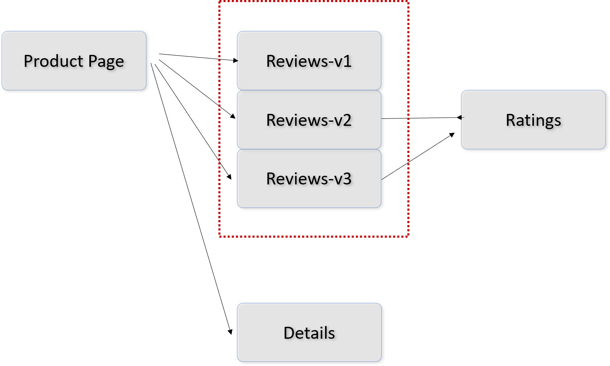
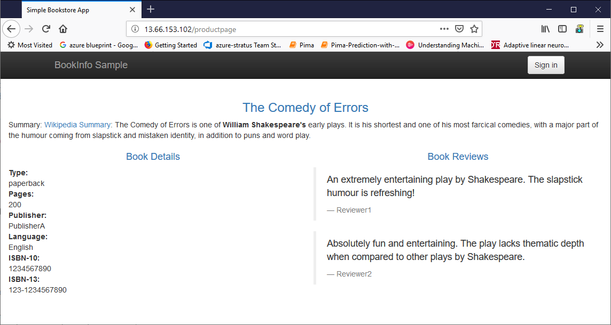
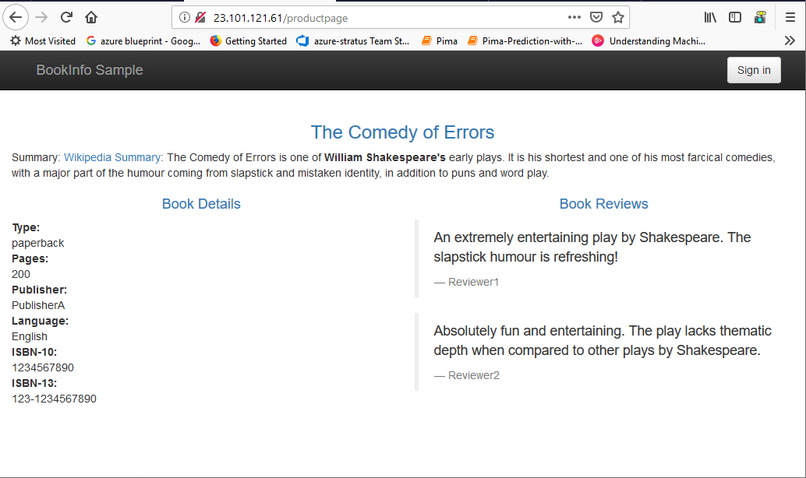

# Rule Configuration Walkthrough

For more infomation see:
https://istio.io/docs/concepts/traffic-management/




## Example

**A VirtualService** - defines the rules that control how requests for a service are routed within an Istio service mesh.
- The core routing device.

**A DestinationRule** - configures the set of policies to be applied to a request after VirtualService routing has occurred.
- Key word, "after"

**A ServiceEntry** - is commonly used to enable requests to services outside of an Istio service mesh.
 -  For going outside the mesh.

**A Gateway** - configures a load balancer for HTTP/TCP traffic, most commonly operating at the edge of the mesh to enable ingress traffic for an application
- For incoming HTTP/TCP traffic from outside the mesh.




This is necessary

```
kubectl apply -f samples/bookinfo/networking/destination-rule-all.yaml
```


```yaml
apiVersion: networking.istio.io/v1alpha3
kind: DestinationRule
metadata:
  name: productpage
spec:
  host: productpage
  subsets:
  - name: v1
    labels:
      version: v1
---
apiVersion: networking.istio.io/v1alpha3
kind: DestinationRule
metadata:
  name: reviews
spec:
  host: reviews
  subsets:
  - name: v1
    labels:
      version: v1
  - name: v2
    labels:
      version: v2
  - name: v3
    labels:
      version: v3
---
apiVersion: networking.istio.io/v1alpha3
kind: DestinationRule
metadata:
  name: ratings
spec:
  host: ratings
  subsets:
  - name: v1
    labels:
      version: v1
  - name: v2
    labels:
      version: v2
  - name: v2-mysql
    labels:
      version: v2-mysql
  - name: v2-mysql-vm
    labels:
      version: v2-mysql-vm
---
apiVersion: networking.istio.io/v1alpha3
kind: DestinationRule
metadata:
  name: details
spec:
  host: details
  subsets:
  - name: v1
    labels:
      version: v1
  - name: v2
    labels:
      version: v2
---

```

Evidence that traffic only routed to reviews v1. As you recall. v1 has no stars, v2 has black stars, and v3 has red stars.




## Send 100% of incoming traffic to version 1 of reviews using the VirtualService

```yaml
apiVersion: networking.istio.io/v1alpha3
kind: VirtualService
metadata:
  name: reviews
spec:
  hosts:
  - reviews
  http:
  - route:
    - destination:
        host: reviews
        subset: v1
```


### Random Load balancer

```
apiVersion: networking.istio.io/v1alpha3
kind: DestinationRule
metadata:
  name: reviews
spec:
  host: reviews
  trafficPolicy:
    loadBalancer:
      simple: RANDOM
  subsets:
  - name: v1
    labels:
      version: v1
  - name: v2
    labels:
      version: v2
```      