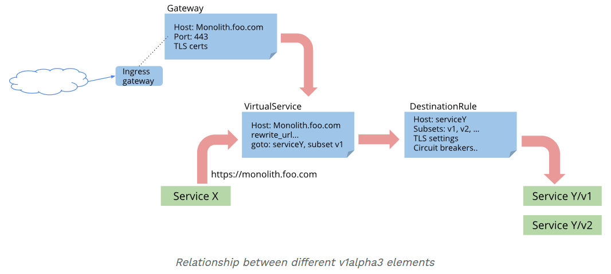
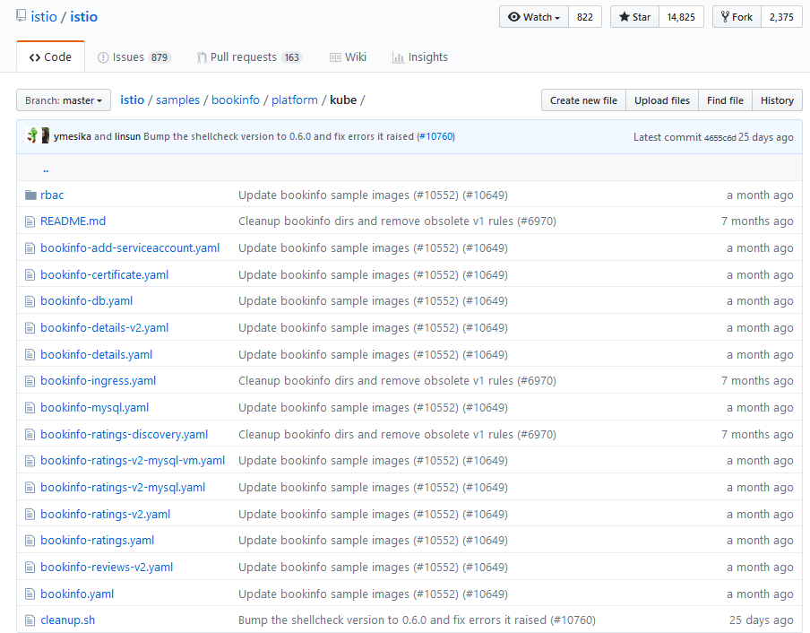

# Routing & Rule Configuration Walkthrough

For more infomation see:
https://istio.io/docs/concepts/traffic-management/

The Gateway can be thought of as the starting point for the topic of route management. The Gateway is a new concept that replaces the traditional Kubernetes Ingress Controller. That is because the Kubernetes Ingress APIs proved inadequate for Istio's routing needs. 

This new architecture makes it possible to leverage or reuse off the shelf network appliances by simply writing a gateway controller.

The previous version was a layer 7 load balancer, but the new implementation leverages layers four through six. 

Let's take a look at some additional components introduced by Istio.

## Using BookInfo for demonstrating routing capabilities

One of the areas that we will explore here is being able to route traffic to various versions of the `reviews` micro service. 


## A brief description of the major components

There are four traffic management configuration resources in Istio: VirtualService, DestinationRule, ServiceEntry, and Gateway:




> Notice the flow: Gateway -> Virtual Service -> DestinationRule -> Service

**A VirtualService** - defines the rules that control how requests for a service are routed within an Istio service mesh.
- The core routing device.

**A DestinationRule** - configures the set of policies to be applied to a request after VirtualService routing has occurred.
- Key word, "after"

**A ServiceEntry** - is commonly used to enable requests to services outside of an Istio service mesh.
 -  For going outside the mesh.

**A Gateway** - configures a load balancer for HTTP/TCP traffic, most commonly operating at the edge of the mesh to enable ingress traffic for an application
> Can be thought of as a customizable load balancer.
- For incoming HTTP/TCP traffic from outside the mesh.
- You can have any number of gateways within the mesh. 
- You can use the labeling capability of Kubernetes to bind gateways to specific workloads, allowing you to reuse off-the-shelf network appliances.
  - There is support for writing a simple gateway controller
   > Basically the load balancer.


This is necessary and needs to be explained.


```

Below you can see the Yaml code that is used to lay down the provisional destination rules that are needed for the remaining examples.

The command to apply all these destinations rules is:

kubectl apply -f samples/bookinfo/networking/destination-rule-all.yaml
```

A DestinationRule configures the set of policies to be applied to a request after VirtualService routing has occurred. They are intended to be authored by service owners, describing the circuit breakers, load balancer settings, TLS settings, and other settings.

Below not all versions of the rating service have been deployed.

They are available at github should the need arise.



BookInfo needs the following set of `destinationrules` for the rest of the examples to work properly. This is not clearly specified in the Istio documentation.


```yaml
apiVersion: networking.istio.io/v1alpha3
kind: DestinationRule
metadata:
  name: productpage
spec:
  host: productpage
  subsets:
  - name: v1
    labels:
      version: v1
---
apiVersion: networking.istio.io/v1alpha3
kind: DestinationRule
metadata:
  name: reviews
spec:
  host: reviews
  subsets:
  - name: v1
    labels:
      version: v1
  - name: v2
    labels:
      version: v2
  - name: v3
    labels:
      version: v3
---
apiVersion: networking.istio.io/v1alpha3
kind: DestinationRule
metadata:
  name: ratings
spec:
  host: ratings
  subsets:
  - name: v1
    labels:
      version: v1
  - name: v2
    labels:
      version: v2
  - name: v2-mysql
    labels:
      version: v2-mysql
  - name: v2-mysql-vm
    labels:
      version: v2-mysql-vm
---
apiVersion: networking.istio.io/v1alpha3
kind: DestinationRule
metadata:
  name: details
spec:
  host: details
  subsets:
  - name: v1
    labels:
      version: v1
  - name: v2
    labels:
      version: v2
---

```

## Basic HTTPS support

You can create a Yaml file of kind: Gateway that provide support for HTTPS for specific hosts in your network, allowing you to define server certificates and private keys.

> See https://istio.io/docs/tasks/traffic-management/secure-ingress/.  Any company with a public facing web application should read this section carefully.

### Example Yaml file for HTTPS 

Your typical port assignment of 443 with certificates and host names.

```
apiVersion: networking.istio.io/v1alpha3
kind: Gateway
metadata:
  name: bookinfo-gateway
spec:
  servers:
  - port:
      number: 443
      name: https
      protocol: HTTPS
    hosts:
    - bookinfo.com
    tls:
      mode: SIMPLE
      serverCertificate: /tmp/tls.crt
      privateKey: /tmp/tls.key
```


## Send 100% of incoming traffic to version 1 of reviews using the VirtualService

The Yaml below directs 100% of the traffic to v1 or the reviews micro service.

As indicated above, you need to apply that laundry list of destination rules above for the code below to work.

```yaml
apiVersion: networking.istio.io/v1alpha3
kind: VirtualService
metadata:
  name: reviews
spec:
  hosts:
  - reviews
  http:
  - route:
    - destination:
        host: reviews
        subset: v1
```

Once this Yaml code is applied, all traffic will be routed only to v1.

Evidence that traffic only routed to reviews v1. As you recall. v1 has no stars, v2 has black stars, and v3 has red stars.


