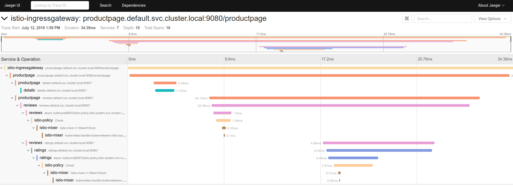
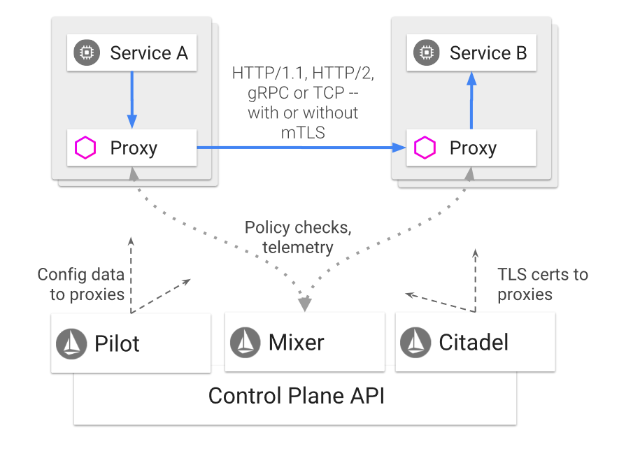
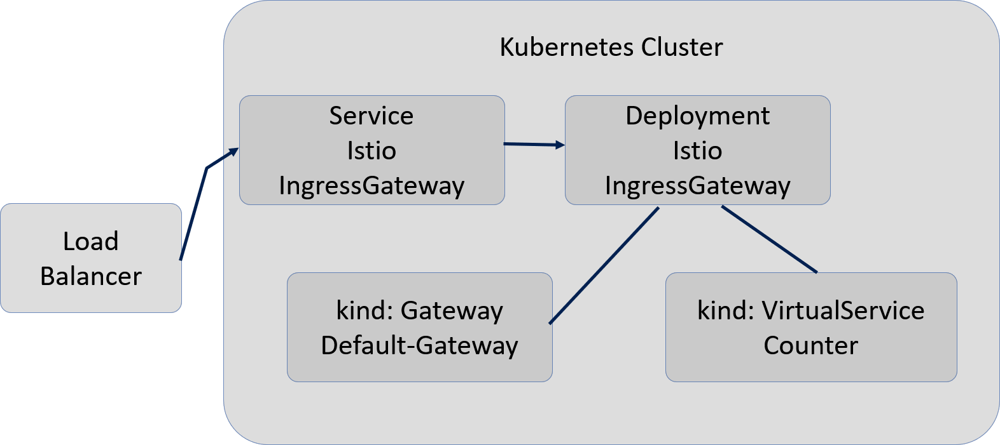
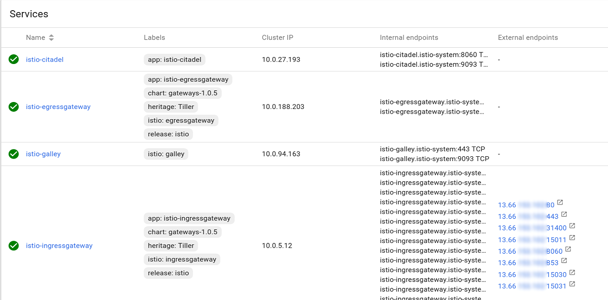

# Overview

Naturally, the goal is to make good use out of everybody's time

Will begin as a level set with Kubernetes and Istio.

## Starting from the beginning

**Start with Kubernetes** - In order to be effective as we learn more advanced topics of Service Mesh us, we should know something solid about the architecture of Kubernetes.

**Know the internals** - It's important to know its internal components and how Kubernetes itself is set up as a series of running containers in the cluster group together in units called pods - which turns out to be the most fundamental concept in Kubernetes.

**Introducing Istio** - Anyone learning Istio needs to understand the basic pillars of Kubernetes.

**Knowing Kubernetes Well** - All the commands necessary in Kubernetes are required to work effectively in the world of Istio.

**Core Istio** - Istio dramatically simplifies the administration of A/B testing, canary releases, rate limiting, access control, monitoring, automatic load-balancing or HTTP, gRPC, WebSocket and TCP Traffic, as well as end to end authentication.

## 6 areas to learn about over the next couple days

**Service Mesh** - Istio is a type of application called a Service Mesh

**Istio Architecture** - what are the core architectural components and how it was implemented. We should learn Istio both from an architectural perspective as well as from a capabilities perspective.

**Traffic Management** - Istio focuses on defining define rules rather than specific routes between pods/VMs. The reason is that you can scale without worrying about specific routes. Relying on rules when you're scaling frees you from the granular details of route tracking.

**Security** - Some pretty compelling features for security.

- Strong identity
- Flexible network policy
- Transparent TLS encryption
- No changes or modifications needed for application code
- Easy integration with existing security systems

**Policies And Telemetry** - includes a flexible model to enforce authorization policies and to collect telemetry for your services. telemetry there is a plug-in model so there is support for Datadog, Fluentd, CloudWatch, etc.

**Performance And Scalability** - there are two basic supports for benchmarking, the first is micro-benchmarks that rely on Golang's native tools and there is also and two and benchmarks that rely on products such as Fortio.

## Why are we here for 2 days?

**Why and What for 2 days** - The main reasons we are all here together today. Perhaps the first primary goal of any public facing website is to be extremely secure, both internally to the organization, as well as externally from customers or nefarious individuals on the broader web.

## How companies are building scalable applications for the cloud

**Goodbye Monoliths** - Another big trend has been organizations with monolithic architectures to move to a world of microservices.

**Smaller Services** - In general, in the context of Kubernetes and Istio, that means breaking applications into various smaller services that run containerize and pods on Kubernetes.

**Plugging in a Service Mesh** - It also means the products like Istio will come into the picture and add their own containers of applications that represents the entire Service Mesh that Istio is.

## (1) What are the core value propositions of Service Mesh?

In Service Mesh technologies, each service instance of a corporate application is paired with an instance of a reverse proxy server. This reverse proxy server is also known as:

- Service proxy
- Sidecar proxy
- Sidecar

## (2) Understanding the pillars of Istio

**What are the core architectural components and how it was implemented** - Show K8s Dashboard

**Sidecars** - In the world of Kubernetes this sidecar runs as another container in the same pod as a corporate application, acting as an intermediary handling all traffic interactions with the corporate application, dispatching and rerouting as necessary.

**Envoy** - In the case of Istio, that sidecar proxy is known as Envoy Proxy (https://www.envoyproxy.io/). Envoy was created by Lyft and is used broadly by some of the biggest companies in the world.

**Envoy handles** - Load balancing and resilience strategies for all internal calls. It provides a coherent layer for observability.

**Envoy provides:**

- Dynamic service discovery
- Load balancing
- TLS termination
- HTTP/2 and gRPC proxies
- Circuit breakers
- Health checks
- Staged rollouts with %-based traffic split
- Fault injection
- Rich metrics

Let's continue with examples of what the Service Mesh brings to companies with public facing websites.

**Understanding the data and control planes** -The control and data plans of Istio bring valuable capabilities.


## (3) Istio capabilities - Traffic Management

Traffic is Key - First of all it provides control over traffic behavior.

Kubernetes Gaps - Kubernetes by itself does not have every feature necessary for a company building a micro service architecture, such as:

- Rich routing rules, retries, failovers, timeouts, and fault injection.

- API supporting access controls, rate limits and quotas.

- Micro service applications require careful monitoring, logging, and performance analysis.

- Strong identity and authentication support is essential.

**It is really about the rules** - It is important to define rules rather than specific routes between pods/VMs.

**Easier scaling** - The reason is that you can scale without worrying about specific routes. Relying on rules when you're scaling frees you from the granular details of route tracking.

**Implementing canary capabilities** - To implement canary capabilities you simply say I want to route 5% traffic to a specific service. That service could have hundreds of pods that are load balanced across.

**Flexible dynamic routing rules** -  let you create rules based upon:

- headers
- tags or labels
- or by percentage weights

**Istio imposes strict control over ingress and egress** - Everything must go through an envoy of the as it enters or leaves the Service Mesh.

**Envoy in the middle** - The fact that the envoy proxy sits in front of your services makes it possible to easily implement:

- A/B Testing
- Canary services

**Protecting your micro services** - Istio provides capabilities that allow you to protect your macro service application.

**Avoiding cascading failure** - To avoid the cascading effect of failure in micro service architectures, the following Istio provided constructs are powerful:

- Timeouts
- Retries
- Circuit breakers

**Relying on the Kubernetes Service Registry** - In terms of keeping their service registry up-to-date, Istio gives this all the Kubernetes to do.

**Istio makes assumptions** - Istio makes the assumption that new instances will be automatically registered with the service registry.

**Fixing pods in poor health** - Istio assumes unhealthy instances will be automatically removed, restarted, and re-added to the service registry.

**Pilot is navigating your cluster network** - Pilot is the Istio component that relies on this service registry. Kubernetes maintains DNS and Istio relies on these names.

**Envoy is always listening and interrupting** - All traffic that is headed for a Kubernetes service is automatically rerouted through envoy, which distributes the traffic across instances in the load balancing pool based on its own sophisticated load-balancing algorithms and the routing rules that you may define.

### Dealing with Failure

We must embrace failure.

**Timeouts** - timeout budgets ensure that the calling service gets a response (success or failure) within a predictable time frame.

**Budgeting** - Bounded retries with timeout budgets

**Clever retries** -  Variable jitter between retries

**How many connections** - Limits on number of concurrent connections

**Upstream services** - Limits requests to upstream services

**Keeping an eye on health** - Active (periodic) health checks on each member of the load balancing pool

**Circuit breakers** - Fine-grained circuit breakers (passive health checks). Applied per instance in the load balancing pool

### Fault injection

From micro service applications it is important to test enter and failure recovery capability

**Poor user experiences** - come from poorly defined timeouts

**Minimize** - High levels of unavailability and critical services

**Forcing Failure** - Istio can inject faults as an alternative to killing and restarting PODS.

**Control HTTP codes in a timely manner** - Istio can return meaningful HTTP codes in a timely manner

**The two fault types** - are `delays` and `aborts` that Istio supports

### Configuring Rules

**A VirtualService** -  defines the rules that control how requests for a service are routed within an Istio service mesh.

**A DestinationRule** - configures the set of policies to be applied to a request after VirtualService routing has occurred.

**A ServiceEntry** - is commonly used to enable requests to services outside of an Istio service mesh.

**A Gateway** - configures a load balancer for HTTP/TCP traffic, most commonly operating at the edge of the mesh to enable ingress traffic for an application.

More Information:

https://istio.io/docs/concepts/traffic-management/

### Some great content around

 - How to split traffic between Release Versions

 - How to implement Timeouts and retries

 - How to implement Injecting Faults to test clients failing

 - How to apply Conditional routing rules

 - How to route based on headers (A rule could be that it applies to an incoming request if it includes a custom “end-user” header that contains the string “jason”)

 - How to decide which routes have more precedencs after routing from the virtual service

   - In other words, which route rules are more powerful than others?

 - Understanding how rules are evaluated. Read the fine print here, "Rule evaluation"

 - How ServiceEntry objects can be used to enable request to services outside of the Service Mesh.

   - The example could be allowing external calls access to a specific wildcard service name like, *.foo.com

 - How gateways can be used to allow traffic to flow. One example is allowing external HTTPS traffic for bookinfo.com

## (4) Istio capabilities - security

**Man in the middle attacks** - To prevent man in the middle attack through traffic encryption

**Mutual TLS** - Supporting Mutual TLS and fine-grained access policies

**Getting audited** - To audit what administrators and applications are doing in the Service Mesh

Learn how:

### Istio security features

- Strong identity
- Flexible network policy
- Transparent TLS encryption
- No changes or modifications needed for application code
- Easy integration with existing security systems

Learn more here:

https://istio.io/docs/concepts/security/

Understand:


**Citadel** - Key and certificate management is done by `Citadel`

**Side cars** - Secure communication between clients and servers is done by `sidecars` and `perimeter proxies`.

**Pilot** - Management of network and routing policy and naming conventions handled by `pilot`.

**Mixer** - Authentication as well as auditing done by `Mixer`

## Identity and Istio

Learn how:

**Integration with Other Platforms** - Istio can leverage service identities from other platforms, such as TCP, AWS, Kubernetes, and even on premises

**SPIFFE** - Understanding SPIFFE and Istio with the same verifiable identity document

**x509** - Understand the support for PKI, x509

**Some good business practices** - Understanding deployment best practices and guidelines

**Link** - https://istio.io/docs/concepts/security/

**Separating application tiers** - Understand the example on how to separate the front end, the backend, and the data store

**Namespaces for access control** - Understand how creating separate name spaces and how administration can be controlled for each of these three name spaces using several service accounts

**Two forms of authentication** - Understanding the forms of authentication (transport versus origin authentication)

**There is good demo for** - Understanding Mutual TLS authentication

**Pilot and `apiserver`** - Understanding how pilot communicates with the Kubernetes `apiserver` and generates its own secure naming information that it will distributed to the sidecar of envoy proxies.

**Defining authentication policies** - Understand how to create authentication policies through `.yaml` files.

**Pilot is a spy** - Understand how pilot watches configuration storage to notice any policy changes. If it finds any it will send them to each of the envoy sidecars.

See https://istio.io/docs/concepts/security/authn.svg in the section, 'Authentication architecture' to understand more about JWT, mutual TLS and destination rules. There is also a great example that walks you through this.

### Take the time to read https://istio.io/docs/concepts/security/

- Authentication policy target selectors

- Transport authentication

- Origin authentication

- Principal binding

- Large section on authorization RBAC (role-based access control

 - After pilot distributes the authorization policies, the envoy runs an authorization engine that authorizes requests at runtime

## (5) Istio capabilities - policies and telemetry

**Control without drawbacks** - One of the design goal up Istio was a difficult challenge. How do you provide written deep controls to the cluster operator, while minimizing the burden on service developers.

**Reduced complexity** - The end result was a reduction in system complexity, separating policy logic from service code and giving the capability to the cluster operators.

**Mixer supporting policy controls and telemetry data** -  is the component that provides policy controls and to collect telemetry information.


Mixer provides:

- Logging
- Monitoring
- Quotas
- ACL checking

## (6) Istio capabilities - performance and scalability

There are two types of benchmarks and measure performance:

**Micro-benchmarks** - which are code level

**End to end benchmarks** - that include entire scenarios

**Key Istio goal** - Support for automation to protect from regressions

Things to learn:

**Fortio** - Istio's use of Fortio (100% open source) which is a synthetic, end-to-end load testing tools

**Cool graphs** - Fortio supports user configurable amount of queries per second (QPS)


**Distributed tracing** - collecting trace bands has always been somewhat challenging. There is an open source project called Jaegar that gives you visual depictions of the way your micro services travel for certain scenarios that you define.



**URL for the Yeager dashboard** -  http://localhost:16686

**Support for visualization of performance data** - in combination of both Grafana and Prometheus, it is possible to get beautiful depictions of the performance information for your cluster.


## Summary

**Next steps** - we've done a high-level overview of all of the various components that make up Istio.

The next step is to go through some of the examples and actually implement these features using the sample BookInfo.

Most companies are encouraged to start here as long as there's no sensitive corporate applications that will be exposed to the Internet. The BookInfo sample provides a nice set of Micro services to begin your learnings with.
# Istio Concepts

## Architecture


An Istio service mesh is logically split into a data plane and a control plane.

- The `data plane` is composed of a set of intelligent proxies (`Envoy`) deployed as sidecars. These proxies mediate and control all network communication between microservices along with `Mixer`, a general-purpose policy and telemetry hub.

- The `control plane` manages and configures the proxies to route traffic. Additionally, the control plane configures `Mixers` to enforce policies and collect telemetry.

The following diagram shows the different components that make up each plane:


 

### Envoy

**Envoy is the Proxy** - Istio uses an extended version of the Envoy proxy. 

**High performance** - Envoy is a high-performance proxy developed in C++ to mediate all inbound and outbound traffic for all services in the service mesh. 

**Features** - Istio leverages Envoy’s many built-in features, for example:

- Dynamic service discovery
- Load balancing
- TLS termination
- HTTP/2 and gRPC proxies
- Circuit breakers
- Health checks
- Staged rollouts with %-based traffic split
- Fault injection
- Rich metrics

**Envoy is a sidecar** - It is deployed as a sidecar to the relevant service in the same Kubernetes pod. 

**Knows traffic behavior** - This deployment allows Istio to extract a wealth of signals about traffic behavior as attributes.

**Feed data to Mixer** - Istio can, in turn, use these attributes in Mixer to enforce policy decisions, and send them to monitoring systems to provide information about the behavior of the entire mesh.

**No need to recompile apps** - The sidecar proxy model also allows you to add Istio capabilities to an existing deployment with no need to rearchitect or rewrite code. You can read more about why we chose this approach in our Design Goals.

### Mixer

**Access Control and Usage Policy** - Mixer enforces access control and usage policies across the service mesh, and collects telemetry data from the Envoy proxy and other services. 

**Works with Envoy Proxy** - The proxy extracts request level attributes, and sends them to Mixer for evaluation.

### Citadel

All about authentication - Citadel provides strong service-to-service and end-user authentication with built-in identity and credential management. 

Encrypt Traffic - You can use Citadel to upgrade unencrypted traffic in the service mesh. 

Policy enforcement - Using Citadel, operators can enforce policies based on service identity rather than on network controls.

Authorizing Services -  You can use Istio’s authorization feature to control who can access your services.

### Galley

Galley validates user authored Istio API configuration on behalf of the other Istio control plane components. Over time, Galley will take over responsibility as the top-level configuration ingestion, processing and distribution component of Istio. It will be responsible for insulating the rest of the Istio components from the details of obtaining user configuration from the underlying platform (e.g. Kubernetes).

# Istio Installation

## The steps to install Istio are:

1. Have a Kubernetes cluster (AKS) ready with kubectl configured.
2. Download Istio
2. Install Helm and Tiller
3. Download the Release

### Download Istio

#### https://istio.io/docs/setup/kubernetes/download-release/

```bash
curl -L https://git.io/getLatestIstio | sh -
cd istio-1.0.5
export PATH=$PWD/bin:$PATH
```
I updated my `.bashrc` file as follows:

```bash
export ISTIO="/root/istio/istio-1.0.5/bin"
export PATH="$PATH:$GOPATH/bin:$GOROOT/bin:$ISTIO"
source <(kubectl completion bash)
```
You may have a different path as I am running as `root` locally.

### Installation with Helm

If a `service account` has not already been installed for Tiller, install one. Be sure to be running Helm v2.12.1:

```bash
kubectl apply -f install/kubernetes/helm/helm-service-account.yaml
```

#### Install Tiller on your cluster with the service account:

```bash
 helm init --service-account tiller
 ```

#### Install Istio

```bash
helm install install/kubernetes/helm/istio --name istio --namespace istio-system
 ```

In my `.bashrc` file I added the ISTIO environment variable.

```bash
export ISTIO="/root/istio/istio-1.0.5/bin"
export PATH="$PATH:$ISTIO"
source <(kubectl completion bash)
```

## Install with Helm and Tiller via helm install

You can install Tiller on your cluster with the service account:

```bash
helm init --service-account tiller
```

### Install Istio:

#### https://istio.io/docs/setup/kubernetes/minimal-install/

```bash
helm install install/kubernetes/helm/istio --name istio-minimal --namespace istio-system \
  --set security.enabled=false \
  --set ingress.enabled=false \
  --set gateways.istio-ingressgateway.enabled=false \
  --set gateways.istio-egressgateway.enabled=false \
  --set galley.enabled=false \
  --set sidecarInjectorWebhook.enabled=false \
  --set mixer.enabled=false \
  --set prometheus.enabled=false \
  --set global.proxy.envoyStatsd.enabled=false \
  --set pilot.sidecar=false
```

**Ensure the istio-pilot-Kubernetes pod is deployed** - Ensure its container is up and running:

```bash
$ kubectl get pods -n istio-system
```
You should see these results:


```bash
NAME                                     READY     STATUS    RESTARTS   AGE
istio-pilot-58c65f74bc-2f5xn             1/1       Running   0          1m
```

# Viewing and Understanding the Istio Components

You will need to install the Kubernetes Dashboard.

## Setting up ClusterRole Binding

It is needed to have access to the Dashboard.

```bash
kubectl create clusterrolebinding kubernetes-dashboard --clusterrole=cluster-admin --serviceaccount=kube-system:kubernetes-dashboard
 ```
 You will need to enalbe the proxy which let's us tunnel in through `localhost`.

```bash
kubectl proxy
Starting to serve on 127.0.0.1:8001
```

 _Figure: Setting up the proxy_

## Accessing the Dashboard

Now go your browser and enter the following:

```bash
http://localhost:8001/api/v1/namespaces/kube-system/services/kubernetes-dashboard/proxy/#!/overview?namespace=default
 ```

 You should see this:

 

## Understanding Istio Inside of Kubernetes

The `istio-system` namespace is where all the components for Istio are stored.

Kubernetes constructs include:

- Deployments
- Pods
- Replicasets
- Services
- ConfigMaps
- Secrets

Let's break it down.

### Deployments

A Deployment controller provides declarative updates for Pods and ReplicaSets.

You describe a desired state in a Deployment object, and the Deployment controller changes the actual state to the desired state at a controlled rate. 

You can define Deployments to create new ReplicaSets, or to remove existing Deployments and adopt all their resources with new Deployments.

**istio-citadel** - An optional health-checking feature. In public key infrastructure (PKI) systems, a certificate signing request (also CSR or certification request) is a message sent from an applicant to a certificate authority in order to apply for a digital identity certificate. This service/pod will detect failures in the CSR signing service.


**istio-egressgateway** - The Control Egress Traffic task demonstrates how external (outside the Kubernetes cluster) HTTP and HTTPS services can be accessed from applications inside the mesh. 
 - By default, Istio-enabled applications are unable to access URLs outside the cluster. 
 - To enable such access, a service entry for the external service must be defined, or, alternatively, direct access to external services must be configured.
 - The idea is that all traffic that leaves the service mesh must flow through a set of dedicated nodes that are separate from the rest of the nodes used for running applications in the cluster.
 - The special nodes will serve for policy enforcement on the egress traffic and will be monitored more thoroughly than the rest of the nodes.

**istio-galley** - Galley is the top-level config ingestion, processing and distribution component of Istio. 
 - It is responsible for insulating the rest of the Istio components from the details of obtaining user configuration from the underlying platform.
 - A resource is an endpoint in the Kubernetes API that stores a collection of API objects of a certain kind. For example, the built-in pods resource contains a collection of Pod objects.
 - Configuration options include authorization, traffic routing, policies/telemetry, and authentication policy.

**istio-ingressgateway** - Istio no longer leverages an `Ingress` controller to handle traffic coming into the cluster. It is really a fancy wrapper around the `Envoy` proxy. 

The istio-pilot, explained next, detects changes the istio-ingressgateway, and sends that configuration information to the `Envoy` sidecars for routing.

The istio-ingressgateway is composed of two resources:

 - `Gateway` - Used to configure the ports for `Envoy`. 
 - `VirtualServices` - Works with `Gateway` to configure `Envoy`.



These resources work together. There is a `Istio IngressGateway Service` that is listening on the Loadbalancer. The `istio-gateway` with help from other components configures the ports, protocol, and certificates. 

The load balancer can be configured through the service type: LoadBalancer. Azure supports automatic configuration and  forward traffic to a port that the IngressGateway Service is listening on. 

The `VirtualServices` resource is key. By including a list of gateways, a virtual service tells Istio to configure those gateways with the routes defined in the VirtualService configuration. 

**istio-pilot** - Routing rules are specified that tell Pilot which pods/VMs are to receive traffic. Pilot manages and configures Envoy proxy/sidecar instances. Pilot provides load balancing information to each Envoy instance. Pilot is responsible for the lifecycle of Envoy instances deployed across the Istio service mesh. 

For example, you can specify via Pilot that you want 5% of traffic for a particular service to go to a canary version irrespective of the size of the canary deployment, or send traffic to a particular version depending on the content of the request.

Supports Dynamic request routing for:

- A/B testing
- Gradual Rollouts
- Canary Releases
- Failure recovery with timeouts, retries, circuit breakers, and fault injection

 **istio-policy** - used to enforce authorization policies, specifically enabling, configuring, and using Istio authentication policies.  It includes such things as access control system, telemetry capturing systems, quota enforcement systems, billing systems.

**istio-sidecar-injector** - a sidecar is a pattern.  A Pod is composed of one or more application containers. A sidecar is a utility container in the Pod and its purpose is to support the main container. 

- Istio uses an extended version of the `Envoy proxy`. Envoy is a high-performance proxy developed in C++ to mediate all inbound and outbound traffic for all services in the service mesh.


 


**istio-telemetry** - used to obtain uniform metrics, logs, traces across the various services. Makes use of Istio Mixer and Istio sidecar.

**prometheus** - collects Istio metrics and makes them available to Prometheus. Prometheus is an open source monitoring solution. See [Prometheus](https://prometheus.io/) link.

### Pods

Explained above in the `Deployment` section. deployments are the higher level object that creates replica sets which create pods. The functional capabilities of these Kubernetes object types are identical.

 

Explained above in the `Deployment` section.

### Replicasets

Explained above in the `Deployment` section.

### Services

Explained above in the `Deployment` section.

### ConfigMaps

`ConfigMaps` allow you to decouple configuration artifacts from image content to keep containerized applications portable.

`ConfigMaps` bind configuration files, command-line arguments, environment variables, port numbers, and other configuration artifacts to your Pods' containers and system components at runtime. 

Here is the list:

istio, istio-galley-configuration, istio-ingress-controller-leader-istio, istio-security-custom-resources, istio-sidecar-injector, istio-statsd-prom-bridge, prometheus 


### Secrets

Intended to hold sensitive information, such as passwords, OAuth tokens, and ssh keys. Putting this information in a secret is safer and more flexible than putting it verbatim in a pod definition or in a docker image

default-token-ksp2b, istio-ca-secret, istio-citadel-service-account-token-fwdcs, istio-egressgateway-service-account-token-w8vzt, istio-galley-service-account-token-6wx4l, istio-ingressgateway-service-account-token-kfs29, istio-mixer-service-account-token-8pdlg, istio-pilot-service-account-token-hzxzj, istio-security-post-install-account-token-5kzmj, istio-sidecar-injector-service-account-token-vdf9g, istio.default, istio.istio-citadel-service-account, istio.istio-egressgateway-service-account, istio.istio-galley-service-account, istio.istio-ingressgateway-service-account, istio.istio-mixer-service-account, istio.istio-pilot-service-account, istio.istio-security-post-install-account, istio.istio-sidecar-injector-service-account, istio.prometheus, prometheus-token-bv7kw

# Installing Walkthrough

This example deploys a sample application composed of four separate microservices used to demonstrate various Istio features. The application displays information about a book, similar to a single catalog entry of an online book store. Displayed on the page is a description of the book, book `details` (ISBN, number of pages, and so on), and a few book `reviews`.

The Bookinfo application is broken into four separate microservices:

- `productpage`. The `productpage` microservice calls the `details` and `reviews` microservices to populate the page.
- `details`. The `details` microservice contains book information.
- `reviews`. The `reviews` microservice contains book `reviews`. It also calls the `ratings` microservice.
- `ratings`. The `ratings` microservice contains book ranking information that accompanies a book review.

There are 3 versions of the `reviews` microservice:

- Version `v1` doesn’t call the `ratings` service.
- Version `v2` calls the `ratings` service, and displays each rating as 1 to 5 black stars.
- Version `v3` calls the `ratings` service, and displays each rating as 1 to 5 red stars.


## More points

There are some other interesting points to notice about the diagram above:

- There are three distinct languages used for each of the different services
- We will learn how to route traffic to specific version numbers, leveraging the concepts of Canary releases

## Deployment of Sidecar

You will also notice in the diagram below that the envoy proxy has been installed into each of the services.


## The Deployment Yaml for Bookinfo

In the next section we are about to deploy Bookinfo using a couple of commands in conjunction with each other (`kubectl` and `istioctl`).

The beauty of these commands is that the 'Envoy' sidecar automatically gets injected into the each of the services.

it might be worth noting that there is a bash script do the cleanup, `cleanup.sh`.

```
  platform
    └── kube
        ├── bookinfo-add-serviceaccount.yaml
        ├── bookinfo-certificate.yaml
        ├── bookinfo-db.yaml
        ├── bookinfo-details-v2.yaml
        ├── bookinfo-details.yaml
        ├── bookinfo-ingress.yaml
        ├── bookinfo-mysql.yaml
        ├── bookinfo-ratings-discovery.yaml
        ├── bookinfo-ratings-v2-mysql-vm.yaml
        ├── bookinfo-ratings-v2-mysql.yaml
        ├── bookinfo-ratings-v2.yaml
        ├── bookinfo-ratings.yaml
        ├── bookinfo-reviews-v2.yaml
        ├── bookinfo.yaml
        ├── cleanup.sh
        ├── istio-rbac-details-reviews.yaml
        ├── istio-rbac-enable.yaml
        ├── istio-rbac-namespace.yaml
        ├── istio-rbac-productpage.yaml
        ├── istio-rbac-ratings.yaml
        ├── rbac
        │   ├── details-reviews-policy.yaml
        │   ├── namespace-policy.yaml
        │   ├── productpage-policy.yaml
        │   ├── ratings-policy.yaml
        │   └── rbac-config-ON.yaml
        └── README.md
```

### Command line to deploy Bookinfo

This particular version of the command is known as `manual sidecar injection` because `kubectl` is combined with `istioctl`.


```/bash
$ kubectl apply -f <(istioctl kube-inject -f samples/bookinfo/platform/kube/bookinfo.yaml)

service/details created
deployment.extensions/details-v1 created
service/ratings created
deployment.extensions/ratings-v1 created
service/reviews created
deployment.extensions/reviews-v1 created
deployment.extensions/reviews-v2 created
deployment.extensions/reviews-v3 created
service/productpage created
deployment.extensions/productpage-v1 created

```

Let's go ahead and verify that the appropriate components got installed:

```
$ kubectl get services

NAME          CLUSTER-IP     EXTERNAL-IP   PORT(S)    AGE
details       10.0.130.153   <none>        9080/TCP   6m
kubernetes    10.0.0.1       <none>        443/TCP    1d
productpage   10.0.254.100   <none>        9080/TCP   6m
ratings       10.0.178.102   <none>        9080/TCP   6m
reviews       10.0.112.9     <none>        9080/TCP   6m
```

You can also check the part as follows:

```
$ kubectl get pods

NAME                              READY     STATUS    RESTARTS   AGE
details-v1-5458f64c65-zkzf5       2/2       Running   0          9m
productpage-v1-577c9594b7-s9jsw   2/2       Running   0          9m
ratings-v1-79467df9b5-8gs8z       2/2       Running   0          9m
reviews-v1-5d46b744bd-bdh84       2/2       Running   0          9m
reviews-v2-7f7d7f99f7-xfm25       2/2       Running   0          9m
reviews-v3-7bc67f66-zpt64         2/2       Running   0          9m
```

### The Whole system

```
kubectl get pods --all-namespaces
NAMESPACE      NAME                                     READY     STATUS    RESTARTS   AGE
default        details-v1-5458f64c65-ggw24              2/2       Running   0          17m
default        productpage-v1-577c9594b7-7z72z          2/2       Running   0          17m
default        ratings-v1-79467df9b5-wmdff              2/2       Running   0          17m
default        reviews-v1-5d46b744bd-68qqh              2/2       Running   0          17m
default        reviews-v2-7f7d7f99f7-n27pl              2/2       Running   0          17m
default        reviews-v3-7bc67f66-m4knw                2/2       Running   0          17m
istio-system   istio-citadel-55cdfdd57c-f7d56           1/1       Running   0          20m
istio-system   istio-egressgateway-7798845f5d-6b2js     1/1       Running   0          20m
istio-system   istio-galley-76bbb946c8-djz8f            1/1       Running   0          20m
istio-system   istio-ingressgateway-78c6d8b8d7-x7lks    1/1       Running   0          20m
istio-system   istio-pilot-5fcb895bff-fdlmm             2/2       Running   0          20m
istio-system   istio-policy-7b6cc95d7b-bktjl            2/2       Running   0          20m
istio-system   istio-sidecar-injector-9c6698858-7tjxk   1/1       Running   0          20m
istio-system   istio-telemetry-bfc9ff784-nbrv5          2/2       Running   0          20m
istio-system   prometheus-65d6f6b6c-p6sw9               1/1       Running   0          20m
kube-system    coredns-7d6976d69b-l7d6n                 1/1       Running   0          26m
kube-system    coredns-7d6976d69b-vpm6p                 1/1       Running   0          29m
kube-system    coredns-autoscaler-6fcdb7d64-5pwff       1/1       Running   0          29m
kube-system    heapster-7b66f54b4c-nwx8d                2/2       Running   0          26m
kube-system    kube-proxy-htqwx                         1/1       Running   0          26m
kube-system    kube-proxy-vxt9m                         1/1       Running   0          26m
kube-system    kube-proxy-wlqnz                         1/1       Running   0          26m
kube-system    kube-svc-redirect-m6vl7                  2/2       Running   0          26m
kube-system    kube-svc-redirect-wmdzm                  2/2       Running   0          26m
kube-system    kube-svc-redirect-wxcs9                  2/2       Running   0          26m
kube-system    kubernetes-dashboard-dfbbfd8-jp7t5       1/1       Running   0          29m
kube-system    metrics-server-7b97f9cd9-4nntm           1/1       Running   0          29m
kube-system    omsagent-6njcm                           1/1       Running   0          26m
kube-system    omsagent-8dgh7                           1/1       Running   0          26m
kube-system    omsagent-d54kj                           1/1       Running   0          26m
kube-system    omsagent-rs-cdf89dbf9-c2c99              1/1       Running   0          29m
kube-system    tiller-deploy-776b5cb874-nwlmp           1/1       Running   0          21m
kube-system    tunnelfront-86c95cbf6c-64clx             1/1       Running   0          29m
```

Notice that the `reviews` pods has various versions. We will be taking a closer look at this with the upcoming demos, where we route a specific version of traffic to specific versions of the `release` microservice.

## Control Ingress Traffic

**The typical way to exposing services** - The Kubernetes Ingress Resource is used to specify services that should be exposed outside the cluster. 

**The better approach** - In an Istio service mesh, a better approach is to use Istio Gateway. 

**Why Better ?** - A Gateway allows Istio features such as monitoring and route rules to be applied to traffic entering the cluster.



As you can see from the image above, the deployment of BookInfo on the Azure Kubernetes Service is automatically resulted in a layer 4 load balancer getting deployed, thus exposing a publicly accessible IP address.

You can either go to the Kubernetes dashboard or you can issue the following command:

```bash
kubectl get svc istio-ingressgateway -n istio-system
```

The result should look something like this:

```bash
NAME                   CLUSTER-IP   EXTERNAL-IP     PORT(S)                                                                                                                   AGE
istio-ingressgateway   10.0.5.12    13.66.153.108   80:31380/TCP,443:31390/TCP,31400:31400/TCP,15011:30095/TCP,8060:31630/TCP,853:32106/TCP,15030:30937/TCP,15031:30425/TCP   1d
```

## Determining the ingress IP and port

**Browser enabled** - you need to make the application accessible from outside of your Kubernetes cluster, e.g., from a browser. 

**How to browser-enable** - An Istio Gateway is used for this purpose.

**Define a gateway** - The command below can create ingress gateway for the application:

```
$ kubectl apply -f samples/bookinfo/networking/bookinfo-gateway.yaml
```

**Confirm the gateway** -  with the following command.

```
kubectl get gateway
```

You should see the gateway:

```
NAME               AGE
bookinfo-gateway   32s
```

### Confirming with the Browser

| Public IP Address | URL
|:--|:---|
| 13.66.153.108 | http://13.66.153.108/productpage|


## Cleaning up and removing BookInfo

**To uninstall from Kubernetes environment** - Delete the routing rules and terminate the application pods

```
$ samples/bookinfo/platform/kube/cleanup.sh
```

### Confirm shutdown

```
$ kubectl get virtualservices   #-- there should be no virtual services
$ kubectl get destinationrules  #-- there should be no destination rules
$ kubectl get gateway           #-- there should be no gateway
$ kubectl get pods               #-- the Bookinfo pods should be deleted
```
# Authentication With Istio Overview

## 2 Types of Istio Authentication Auth

**Type 1: Transport authentication** - Also known as service-to-service authentication: verifies the direct client making the connection. 

 - **TLS (Transport Layer Security)** - is the standard Internet Security protocol, successor of SSL (Secure Socket Layer)

 - **Secure Comm** - It is used to provide secured connections for communications done over Internet and in private cluster.

 - **Integrity** - It provides privacy & integrity of data between two applications communicating with each other.

- **Istio provides** - a key management system to automate key and certificate generation, distribution, and rotation.

- **Istio Offers Mutual TLS** - Istio offers mutual TLS as a full stack solution for transport authentication.

    - **Mutual TLS** - Also known as a two-way authentication refers to two parties authenticating each other at the same time, being a default mode of authentication in some 
    - **x509** - is used for authentication.

**Type 2: Origin authentication** - Also known as end-user authentication: verifies the original client making the request as an end-user or device. 

- Message authentication or data origin authentication is a property that a message has not been modified while in transit (data integrity) and that the receiving party can verify the source of the message.
- The authentication is based on a secret key shared by two parties to authenticate information transmitted between them
    - **JWT Token** - Istio enables request-level authentication with JSON Web Token (JWT) validation and a streamlined developer experience for Auth0, Firebase Auth, Google Auth, and custom auth.

**Auth Policies, where stored?** - The authentication policies in the Istio config store via a custom Kubernetes API.

**Pilot helps keep things up to date** - Pilot keeps them up-to-date for each proxy, along with the keys where appropriate.

## Mutual TLS authentication

**Envoy plays key role** - Istio tunnels service-to-service communication through the client side and server side Envoy proxies
# Walkthrough to Understand Mutual TLS


> You can follow along here as well: https://istio.io/docs/tasks/security/authn-policy/

The purpose of this section is to implement Transport Authentication. The goal is to limit traffic in and out of Kubernetes namespaces.

x509 Certificates will be used for this purpose, supporting two-way authentication with a key management system to automate key and certificate generation, distribution, and rotation.

This will provide privacy & integrity of data between two applications communicating with each other. This will also provide secured connections for both communications done over Internet and in private cluster.

Two namespaces will be provided so we can show that even with Istio installed, Mutual TLS support isn't the default. We  have to turn it on. So in the first part will will show that services across namespaces can talk to each other. 

We will then establish a `Destination Rule` for the ns=bar that disables traffic to the other namespaces, including the ns=legacy.

If attempts are made by apps in the ns=bar to reach other apps in other namespaces, they will be prohibited, getting an HTTP code of 56 (command terminated with exit code 56), instead of 200 (OK).

## Key commands


Applications
    
- httpbin
- sleep

Namespaces

 - foo
    - httpbin
    - sleep
 - bar
    - httpbin
    - sleep
 - legacy
    - httpbin
    - sleep

 **Provisioning apps (httpbin, sleep) for Namespace = foo**

Create a  namespace

- kubectl create ns foo
- ns=foo

Provision httpbin in Namespace=foo

- kubectl apply -f <(istioctl kube-inject -f samples/httpbin/httpbin.yaml) -n foo
- Service=httpbin, Pod=httpbin, Namespace=foo
- Includes Istio sidecar container

Provision sleep in Namespace=foo

- kubectl apply -f <(istioctl kube-inject -f samples/sleep/sleep.yaml) -n foo
- Service=sleep, Pod=sleep, Namespace=foo
- Includes Istio sidecar container

**Provisioning apps (httpbin, sleep) for Namespace = bar**

Create a  namespace

- kubectl create ns bar
- ns=bar

Provision httpbin in Namespace=bar

- kubectl apply -f <(istioctl kube-inject -f samples/httpbin/httpbin.yaml) -n bar
- Service=httpbin, Pod=httpbin, Namespace=bar
- Includes Istio sidecar container

Provision sleep in Namespace=bar

- kubectl apply -f <(istioctl kube-inject -f samples/sleep/sleep.yaml) -n bar
- Service=sleep, Pod=sleep, Namespace=bar
- Includes Istio sidecar container


**Provisioning apps (httpbin, sleep) for Namespace = legacy**

Create a  namespace

- kubectl create ns legacy
- ns=legacy

Provision httpbin in Namespace=legacy

- kubectl apply -f samples/httpbin/httpbin.yaml -n legacy
- Service=httpbin, Pod=httpbin, Namespace=legacy
- Includes Istio sidecar container

Provision sleep in Namespace=legacy

- kubectl apply -f < samples/sleep/sleep.yaml -n legacy
- Service=sleep, Pod=sleep, Namespace=legacy
- Does NOT include Istio sidecar container


**Some key commands**

> Get the name of a pod
> - kubectl get pod -l app=sleep -n bar -o jsonpath= {.items..metadata.name}
> 
>  Get the containers in a pod
> - kubectl get pods sleep-7dc47f96b6-7dfld -n bar -o jsonpath='{.spec.containers[*].name}'
> 
>  Get information for Kubernetes Service INTERNAL endpoint
>   kubectl get services httpbin -o wide -n foo
> - Internal Endpoint = Service Name + Namespace + Port
> 
>  Remote into a container that is in a specific pod and namespace
> - kubectl exec -it sleep-7dc47f96b6-7dfld -n bar --container sleep -- /bin/sh
> 
> Issue Curl command against Internal Endpoint of httpbin service
> - curl http://httpbin.foo:8000 -w "%{http_code}\n"

**Provision 3 namespaces: (1) foo; (2) bar; (3) legacy. foo and bar have Istio support. `Legacy` does not** 

Let's provision all the apps in all the namespaces.

```bash
$ kubectl create ns foo
$ kubectl apply -f <(istioctl kube-inject -f samples/httpbin/httpbin.yaml) -n foo
$ kubectl apply -f <(istioctl kube-inject -f samples/sleep/sleep.yaml) -n foo
$ kubectl create ns bar
$ kubectl apply -f <(istioctl kube-inject -f samples/httpbin/httpbin.yaml) -n bar
$ kubectl apply -f <(istioctl kube-inject -f samples/sleep/sleep.yaml) -n bar
$ kubectl create ns legacy
$ kubectl apply -f samples/httpbin/httpbin.yaml -n legacy
$ kubectl apply -f samples/sleep/sleep.yaml -n legacy
```

The output from the above commands.

```bash
namespace/foo created
   service/httpbin created
   deployment.extensions/httpbin created

   service/sleep created
   deployment.extensions/sleep created

namespace/bar created
   service/httpbin created
   deployment.extensions/httpbin created

   service/sleep created
   deployment.extensions/sleep created

namespace/legacy created
   service/httpbin created
   deployment.extensions/httpbin created

   service/sleep created
   deployment.extensions/sleep created

```

## Let's review the pods and services deployed

Let's make sure we understand the httpbin app and the sleep app. Here are the yaml files. Be aware that the Envoy proxy (sidecar) will be added to the namespaces foo and bar. 

Below you can see these are simple apps. httpbin is a Python web site and sleep gives us the ability to issue `curl` commands.

### httpbin.yaml

```yml
apiVersion: v1
kind: Service
metadata:
  name: httpbin
  labels:
    app: httpbin
spec:
  ports:
  - name: http
    port: 8000
  selector:
    app: httpbin
---
apiVersion: extensions/v1beta1
kind: Deployment
metadata:
  name: httpbin
spec:
  replicas: 1
  template:
    metadata:
      labels:
        app: httpbin
        version: v1
    spec:
      containers:
      - image: docker.io/citizenstig/httpbin
        imagePullPolicy: IfNotPresent
        name: httpbin
        ports:
        - containerPort: 8000
```


### sleep.yaml

```yml
apiVersion: v1
kind: Service
metadata:
  name: sleep
  labels:
    app: sleep
spec:
  ports:
  - port: 80
    name: http
  selector:
    app: sleep
---
apiVersion: extensions/v1beta1
kind: Deployment
metadata:
  name: sleep
spec:
  replicas: 1
  template:
    metadata:
      labels:
        app: sleep
    spec:
      containers:
      - name: sleep
        image: pstauffer/curl
        command: ["/bin/sleep", "3650d"]
        imagePullPolicy: IfNotPresent
---
```

## Start to verify that no mutual TLS - we CAN do curl commands

Let's now verify that there is no Mutual TLS that we could communicate among namespaces, pods and containers.

Begin by issuing a command from one namespace to another:
- **Source** = NS=bar, APP=sleep, PURPOSE=Try to reach destination NS=foo
- **Destination** = NS=foo, APP=httpbin, PURPOSE=Respond to source

You will need to issue a `kubectl exec` into the sleep container.

### Get the name of a pod

```
kubectl get pod -l app=sleep -n bar -o jsonpath={.items..metadata.name}
 sleep-7dc47f96b6-7dfld
```


### Get the containers in a pod

 
 ```
kubectl get pods sleep-7dc47f96b6-7dfld -n bar -o jsonpath='{.spec.containers[*].name}'

sleep istio-proxy'
```


### Get information for Kubernetes Service INTERNAL endpoint
 
Now that we are in the `sleep` container, do a `curl`.

But before we issue the curl command, we need to target a specific container in the pod.

What is important now is to try to access the internal endpoint using the `curl` command.

The internal endpoint is composed of 3 pieces.

- Service Name
- Namespace
- Port

 ```
kubectl get services httpbin -o wide -n foo
```

Here is the output:

```
NAME      CLUSTER-IP     EXTERNAL-IP   PORT(S)    AGE       SELECTOR \
httpbin   10.0.103.141   <none>        8000/TCP   12h       app=httpbin
```

**Service Name** - httpbin

**Namespace** - foo

**Port** - 8000

**Result** - http://httbin.foo:8000


 ### Remote into a container that is in a specific pod and namespace
   
```
kubectl exec -it sleep-7dc47f96b6-7dfld -n bar -- /bin/sh
```

####  Executing inside container - ready for command

```
Defaulting container name to sleep.
Use 'kubectl describe pod/sleep-7dc47f96b6-7dfld' to see all of the containers in this pod.
/ # 
```

```
/ curl http://httpbin.foo:8000 -w "%{http_code}\n"
```

### Curl command works! (`200` means `ok` as http code)

```
<h2 id="AUTHOR">AUTHOR</h2>
 
 </body>
 </html>200
```

## Turn Mutual TLS on and build DestinationRule

Let us begin by verifying there are no authentication policies.

```
kubectl get policies.authentication.istio.io --all-namespaces
```

Empty results:

```
No resources found.
```

Check  that there are no mesh policies.

```
kubectl get meshpolicies.authentication.istio.io
NAME      KIND
default   MeshPolicy.v1alpha1.authentication.istio.io

```


```
kubectl get destinationrules.networking.istio.io --all-namespaces -o yaml | grep "host:"
    host: istio-policy.istio-system.svc.cluster.local
    host: istio-telemetry.istio-system.svc.cluster.local
```
**No destination rules** - Verify that there are no destination rules that apply on the example services. 

**Check `host:` value** -  You can do this by checking the host: value of existing destination rules and make sure they do not match. For example:

```
kubectl get destinationrules.networking.istio.io --all-namespaces -o yaml

**RESULTS:**

apiVersion: v1
items:
- apiVersion: networking.istio.io/v1alpha3
  kind: DestinationRule
  metadata:
    creationTimestamp: 2019-01-30T04:46:58Z
    generation: 1
    name: istio-policy
    namespace: istio-system
    resourceVersion: "22419"
    selfLink: /apis/networking.istio.io/v1alpha3/namespaces/istio-system/destinationrules/istio-policy
    uid: 136ad272-244a-11e9-bdd7-8a8dfb8de0fa
  spec:
    host: istio-policy.istio-system.svc.cluster.local
    trafficPolicy:
      connectionPool:
        http:
          http2MaxRequests: 10000
          maxRequestsPerConnection: 10000
- apiVersion: networking.istio.io/v1alpha3
  kind: DestinationRule
  metadata:
    creationTimestamp: 2019-01-30T04:46:58Z
    generation: 1
    name: istio-telemetry
    namespace: istio-system
    resourceVersion: "22415"
    selfLink: /apis/networking.istio.io/v1alpha3/namespaces/istio-system/destinationrules/istio-telemetry
    uid: 135a6652-244a-11e9-bdd7-8a8dfb8de0fa
  spec:
    host: istio-telemetry.istio-system.svc.cluster.local
    trafficPolicy:
      connectionPool:
        http:
          http2MaxRequests: 10000
          maxRequestsPerConnection: 10000
kind: List
metadata: {}
resourceVersion: ""
selfLink: ""
```


## Globally enabling Mutual TLS

The next step is to submit a mass authentication policy. We will do this by creating a YAML files. The policy we create will specify that all workloads in the mesh will ONLY accept TLS encrypted requests. 

As you can see, this authentication policy has the kind: MeshPolicy. The name of the policy must be default, and it contains no targets specification (as it is intended to apply to all services in the mesh).

Notice the `kind:` as seen below:

#### default-mesh-policy.yaml

```
apiVersion: "authentication.istio.io/v1alpha1"
kind: "MeshPolicy"
metadata:
  name: "default"
spec:
  peers:
  - mtls: {}
EOF
```

### Require TLS for all communications

In this next test we are going to apply the rule that we just discussed, thereby preventing a `curl` command from succeeding from one container to another.

```
kubectl apply -f default-mesh-policy.yml

meshpolicy.authentication.istio.io/default configured
```

Get back inside the sleep service in ns=bar.

```
kubectl exec -it sleep-7dc47f96b6-7dfld -n bar -- /bin/sh
```

Issue the command to the `httpbin` in the `foo` namespace.

```
/ curl http://httpbin.foo:8000 -w "%{http_code}\n"
```

At this point, only the receiving side is configured to use mutual TLS. If you run the curl command between Istio services (i.e those with sidecars), all requests will fail with a 503 error code as the client side is still using plain-text.

> upstream connect error or disconnect/reset before headers
> Error 503

## Configuring Destination rules

you can set up routing destination rules. using these rules you would be able to limit matches to only services in the cluster. This means that external services would not be able to communicate with services in the cluster.

These destination rules are also set up for non-authorization type of reasons. For example they can be used for `canarying.`

Allow internal traffic in cluster with Mutual TLS.

```
apiVersion: "networking.istio.io/v1alpha3"
kind: "DestinationRule"
metadata:
  name: "default"
  namespace: "default"
spec:
  host: "*.local"
  trafficPolicy:
    tls:
      mode: ISTIO_MUTUAL
```

Run the YAML file:

```
kubectl apply -f  all-internal-traffic.yml
destinationrule "default" created
```

Now we can see if we can once again hit an internal endpoint (httpbin from sleep).


 ### Remote into a container that is in a specific pod and namespace
   
```
kubectl exec -it sleep-7dc47f96b6-7dfld -n bar -- /bin/sh
```

####  Executing inside container - ready for command

```
Defaulting container name to sleep.
Use 'kubectl describe pod/sleep-7dc47f96b6-7dfld' to see all of the containers in this pod.
/ # 
```

```
/ curl http://httpbin.foo:8000 -w "%{http_code}\n"
```

### Curl command works! (`200` means `ok` as http code)

```
<h2 id="AUTHOR">AUTHOR</h2>
 
 </body>
 </html>200
```

### Success! 

As you can see from the commands above, Re-running the testing allows all requests between Istio-services to be completed successfully.

## But should still should be off-limits to legacy apps

Those applications not running under the Istio fabric should be prevented from accessing cluster resources.


```
kubectl get pod -l app=sleep -n legacy -o jsonpath={.items..metadata.name}
```

 ### Remote into a container that is in a specific pod and namespace
   
```
kubectl exec -it sleep-7dc47f96b6-7dfld -n legacy -- /bin/sh
sleep-86cf99dfd6-ckndw
```

####  Executing inside container - ready for command

```
Defaulting container name to sleep.
Use 'kubectl describe pod/sleep-86cf99dfd6-ckndw' to see all of the containers in this pod.
/ # 
```

```
/ curl http://httpbin.foo:8000 -w "%{http_code}\n"
```

### Curl command works! (`200` means `ok` as http code)

```
(6) Could not resolve host: httbin.foo 000
curl: (56) Recv failure: Connection reset by peer
```

### Success again!

so the results above are in alignment with our expectations. We do support service to service communication, as long as it is within the service mesh/Istio environment. The `legacy` namespace, however, was created outside the service mesh/Istio environment. Therefore, any applications from inside the `legacy` namespace are unable to communicate with any of the services that run within the service mesh. 


# Introducing Canary functionality

For more infomation see:
https://istio.io/docs/concepts/traffic-management/


**What is a canary release** - The main purpose of Canary deployments is to reduce the risk of introducing new software and production.

**Re-route a subset of traffic** - The idea is that it is preferable to route a small amount of traffic to the new notes so that it is possible to verify correct functionality, before routing all the traffic to the new release.

**In the above diagram** - It means that you could allocate a certain percentage of traffic to version 3, while still having version 2 in production at the same time supporting the remaining traffic.

**Blue Green is a little different** - The other related option for deployment is called Blue Green Deployment. blue-green deployment allows you to deploy a new version of your software to a completely new subset of your infrastructure, to which no users are routed.

**Test with Internal Users** - The idea is that internal users could do the test first on a subset in the world of Blue Green deployment. only when the internal users agree that the functionality and behavior is appropriate, do you start rerouting traffic from the old deployment to the new deployment.


**Simple Example** -  Istio, you can specify that v1 of a service receives 90% of incoming traffic, while v2 of that service only receives 10%. 

**Keep both versions** -Using Istio you can deploy v2 of your service and use built-in traffic management mechanisms to shift traffic to your updated services at a network level, then remove the v1 Pods.

**Dynamic-Routing** - Istio also gives you the ability to implement dynamic request routing (based on HTTP headers), failure recovery, retries, circuit breakers, and fault injection. For more information, check out the Traffic Management documentation.

- Layer 7 Load Balancing
- in the diagram below notice that based on an HTTP header, it is possible to route traffic to `Reviews-V2`, instead of `Reviews-V2`.


**Let's learn more about traffic routing** - This post walks through a technique that highlights a particularly useful way that you can implement Istio incrementally – in this case, only the traffic management features – without having to individually update each of your Pods.


**Forced Delays** - You can also introduce delays into the calling of your backend services for the purpose of testing timeouts in client requests.


## Example of Canary version

**% to specific versions** - You can specify via Pilot that you want 5% of traffic for a particular service to go to a canary version irrespective of the size of the canary deployment, or send traffic to a particular version depending on the content of the request.

### What is Pilot?

**Pilot** - Manages and configures all the Envoy proxy instances deployed in a particular Istio service mesh. 

**It is about Rules** - Pilot lets you specify which rules you want to use to route traffic between Envoy proxies and configure failure recovery features such as timeouts, retries, and circuit breakers. 

**Envoys automatically propagate routes** - It also maintains a canonical model of all the services in the mesh and uses this model to let Envoy instances know about the other Envoy instances in the mesh via its discovery service.

**Envoy talk to Pilot** - the load-balancing information in the sidecar is obtained from Pilot.

**Health Checks** - the system does periodic health checks, looking at other instances in the load-balancing pool. This enables intelligent traffic routing.

- When the number of health check failures for a given instance exceeds a pre-specified threshold

## Load Balancing Types

Istio currently allows three load balancing modes: round robin, random, and weighted least request.


# Routing & Rule Configuration Walkthrough

For more infomation see:
https://istio.io/docs/concepts/traffic-management/

The Gateway can be thought of as the starting point for the topic of route management. The Gateway is a new concept that replaces the traditional Kubernetes Ingress Controller. That is because the Kubernetes Ingress APIs proved inadequate for Istio's routing needs. 

This new architecture makes it possible to leverage or reuse off the shelf network appliances by simply writing a gateway controller.

The previous version was a layer 7 load balancer, but the new implementation leverages layers four through six. 

Let's take a look at some additional components introduced by Istio.

## Using BookInfo for demonstrating routing capabilities

One of the areas that we will explore here is being able to route traffic to various versions of the `reviews` micro service. 


## A brief description of the major components

There are four traffic management configuration resources in Istio: VirtualService, DestinationRule, ServiceEntry, and Gateway:


> Notice the flow: Gateway -> Virtual Service -> DestinationRule -> Service

**A VirtualService** - defines the rules that control how requests for a service are routed within an Istio service mesh.
- The core routing device.

**A DestinationRule** - configures the set of policies to be applied to a request after VirtualService routing has occurred.
- Key word, "after"

**A ServiceEntry** - is commonly used to enable requests to services outside of an Istio service mesh.
 -  For going outside the mesh.

**A Gateway** - configures a load balancer for HTTP/TCP traffic, most commonly operating at the edge of the mesh to enable ingress traffic for an application
> Can be thought of as a customizable load balancer.
- For incoming HTTP/TCP traffic from outside the mesh.
- You can have any number of gateways within the mesh. 
- You can use the labeling capability of Kubernetes to bind gateways to specific workloads, allowing you to reuse off-the-shelf network appliances.
  - There is support for writing a simple gateway controller
   > Basically the load balancer.


This is necessary and needs to be explained.


```

Below you can see the Yaml code that is used to lay down the provisional destination rules that are needed for the remaining examples.

The command to apply all these destinations rules is:

kubectl apply -f samples/bookinfo/networking/destination-rule-all.yaml
```

A DestinationRule configures the set of policies to be applied to a request after VirtualService routing has occurred. They are intended to be authored by service owners, describing the circuit breakers, load balancer settings, TLS settings, and other settings.

Below not all versions of the rating service have been deployed.

They are available at github should the need arise.


BookInfo needs the following set of `destinationrules` for the rest of the examples to work properly. This is not clearly specified in the Istio documentation.


```yaml
apiVersion: networking.istio.io/v1alpha3
kind: DestinationRule
metadata:
  name: productpage
spec:
  host: productpage
  subsets:
  - name: v1
    labels:
      version: v1
---
apiVersion: networking.istio.io/v1alpha3
kind: DestinationRule
metadata:
  name: reviews
spec:
  host: reviews
  subsets:
  - name: v1
    labels:
      version: v1
  - name: v2
    labels:
      version: v2
  - name: v3
    labels:
      version: v3
---
apiVersion: networking.istio.io/v1alpha3
kind: DestinationRule
metadata:
  name: ratings
spec:
  host: ratings
  subsets:
  - name: v1
    labels:
      version: v1
  - name: v2
    labels:
      version: v2
  - name: v2-mysql
    labels:
      version: v2-mysql
  - name: v2-mysql-vm
    labels:
      version: v2-mysql-vm
---
apiVersion: networking.istio.io/v1alpha3
kind: DestinationRule
metadata:
  name: details
spec:
  host: details
  subsets:
  - name: v1
    labels:
      version: v1
  - name: v2
    labels:
      version: v2
---

```

## Basic HTTPS support

You can create a Yaml file of kind: Gateway that provide support for HTTPS for specific hosts in your network, allowing you to define server certificates and private keys.

> See https://istio.io/docs/tasks/traffic-management/secure-ingress/.  Any company with a public facing web application should read this section carefully.

### Example Yaml file for HTTPS 

Your typical port assignment of 443 with certificates and host names.

```
apiVersion: networking.istio.io/v1alpha3
kind: Gateway
metadata:
  name: bookinfo-gateway
spec:
  servers:
  - port:
      number: 443
      name: https
      protocol: HTTPS
    hosts:
    - bookinfo.com
    tls:
      mode: SIMPLE
      serverCertificate: /tmp/tls.crt
      privateKey: /tmp/tls.key
```


## Send 100% of incoming traffic to version 1 of reviews using the VirtualService

The Yaml below directs 100% of the traffic to v1 or the reviews micro service.

As indicated above, you need to apply that laundry list of destination rules above for the code below to work.

```yaml
apiVersion: networking.istio.io/v1alpha3
kind: VirtualService
metadata:
  name: reviews
spec:
  hosts:
  - reviews
  http:
  - route:
    - destination:
        host: reviews
        subset: v1
```

Once this Yaml code is applied, all traffic will be routed only to v1.

Evidence that traffic only routed to reviews v1. As you recall. v1 has no stars, v2 has black stars, and v3 has red stars.


## Configuring the circuit breaker

It is not uncommon during heavy loads for micro service calls to hang without a response. Oftentimes, unnecessarily high levels of resources are consumed while the caller is waiting for the service to respond. Taken too far, the service may be unable to respond at all causing a cascading effect across the application stack composed of a series of micro services.

Services sometimes become unresponsive due to slow network connections, timeout, or the resources being overcommitted or temporarily unavailable. The blocked requests that queue up will therefore unnecessarily hold critical system resources such as memory, threads, and database connections.

The preference in these situations is to faill immediately. This could help prevent a client application from repeatedly trying to execute an operation that's likely to fail.

The idea is that after a series of consecutive failures, a threshold is reached in the circuit breaker trips. This enables the remote service to fail immediately, at which point there will be a timeout that expires the circuit breaker, which is then allowed a limited number of requests to pass through.

With Istio the sidecar proxy (Envoy) takes over and provides circuit breaker services, as a proxy for operations that might fail. The proxy should monitor the number of recent failures that have occurred, and use this information to decide whether to allow the operation to proceed, or simply return an exception immediately.

Create a destination rule to apply circuit breaking settings when calling the httpbin service:

# Circuit Breaker Pattern

```
apiVersion: networking.istio.io/v1alpha3
kind: DestinationRule
metadata:
  name: httpbin
spec:
  host: httpbin
  trafficPolicy:
    connectionPool:
      tcp:
        maxConnections: 1
      http:
        http1MaxPendingRequests: 1
        maxRequestsPerConnection: 1
    outlierDetection:
      consecutiveErrors: 1
      interval: 1s
      baseEjectionTime: 3m
      maxEjectionPercent: 100
```

## Apply Circuit Breaker

```
kubectl apply -f circuit-breaker.yml
# If you'd like to clean up
#kubectl delete -f circuit-breaker.yml
```

Verify the destination rule was created correctly. You can output yaml to do so.

```
$ kubectl get destinationrule httpbin -o yaml
```

> Validate the DestinationRule

```
apiVersion: networking.istio.io/v1alpha3
kind: DestinationRule
metadata:
  annotations:
    kubectl.kubernetes.io/last-applied-configuration: |
      {"apiVersion":"networking.istio.io/v1alpha3","kind":"DestinationRule","metadata":{"annotations":{},"name":"httpbin","namespace":"default"},"spec":{"host":"httpbin","trafficPolicy":{"connectionPool":{"http":{"http1MaxPendingRequests":1,"maxRequestsPerConnection":1},"tcp":{"maxConnections":1}},"outlierDetection":{"baseEjectionTime":"3m","consecutiveErrors":1,"interval":"1s","maxEjectionPercent":100}}}}
  creationTimestamp: 2019-02-02T22:49:18Z
  generation: 1
  name: httpbin
  namespace: default
  resourceVersion: "125034"
  selfLink: /apis/networking.istio.io/v1alpha3/namespaces/default/destinationrules/httpbin
  uid: c5fab2ca-273c-11e9-af39-0a58ac1f0a5f
spec:
  host: httpbin
  trafficPolicy:
    connectionPool:
      http:
        http1MaxPendingRequests: 1
        maxRequestsPerConnection: 1
      tcp:
        maxConnections: 1
    outlierDetection:
      baseEjectionTime: 3m
      consecutiveErrors: 1
      interval: 1s
      maxEjectionPercent: 100
```
# Using the Fortio Load Testing Service to Trigger Circuit Breaker

Fortio will be learned for the load testing. You can learn more at Github.

Fortio runs at a specified query per second (qps) and records an histogram of execution time and calculates percentiles (e.g. p99 ie the response time such as 99% of the requests take less than that number (in seconds, SI unit)). It can run for a set duration, for a fixed number of calls, or until interrupted (at a constant target QPS, or max speed/load per connection/thread).

The name fortio comes from greek φορτίο which means load/burden.


Here is a simple GET request that will not trigger the circuit breaker.

```
FORTIO_POD=$(kubectl get pod | grep fortio | awk '{ print $1 }')
echo $FORTIO_POD
fortio-deploy-5d5c6bf6b9-c6jvt
kubectl exec -it $FORTIO_POD  -c fortio /usr/local/bin/fortio -- load -curl  http://httpbin:8000/get
Status 200 comes back.
```

# Two Steps left - (1) Perform a higher stress load est ing script (2) Query the Istio Proxy for the performance Statistics

This first command like

```
kubectl exec -it $FORTIO_POD  -c fortio /usr/local/bin/fortio -- load -c 3 -qps 0 -n 20 -loglevel Warning http://httpbin:8000/get
```

```
kubectl exec -it $FORTIO_POD  -c istio-proxy  -- sh -c 'curl localhost:15000/stats' | grep httpbin | grep pending
```

PERFORM SOME LOAD TESTING

```
kubectl exec -it $FORTIO_POD  -c fortio /usr/local/bin/fortio -- load -c 3 -qps 0 -n 20 -loglevel Warning http://httpbin:8000/get
```

You can see the detailed output.

```
02:23:16 I logger.go:97> Log level is now 3 Warning (was 2 Info)
Fortio 1.0.1 running at 0 queries per second, 2->2 procs, for 20 calls: http://httpbin:8000/get
Starting at max qps with 3 thread(s) [gomax 2] for exactly 20 calls (6 per thread + 2)
02:23:16 W http_client.go:604> Parsed non ok code 503 (HTTP/1.1 503)
02:23:16 W http_client.go:604> Parsed non ok code 503 (HTTP/1.1 503)
02:23:16 W http_client.go:604> Parsed non ok code 503 (HTTP/1.1 503)
02:23:16 W http_client.go:604> Parsed non ok code 503 (HTTP/1.1 503)
02:23:16 W http_client.go:604> Parsed non ok code 503 (HTTP/1.1 503)
02:23:16 W http_client.go:604> Parsed non ok code 503 (HTTP/1.1 503)
02:23:16 W http_client.go:604> Parsed non ok code 503 (HTTP/1.1 503)
02:23:16 W http_client.go:604> Parsed non ok code 503 (HTTP/1.1 503)
02:23:16 W http_client.go:604> Parsed non ok code 503 (HTTP/1.1 503)
02:23:16 W http_client.go:604> Parsed non ok code 503 (HTTP/1.1 503)
02:23:16 W http_client.go:604> Parsed non ok code 503 (HTTP/1.1 503)
02:23:16 W http_client.go:604> Parsed non ok code 503 (HTTP/1.1 503)
Ended after 41.570256ms : 20 calls. qps=481.11
Aggregated Function Time : count 20 avg 0.005685239 +/- 0.007864 min 0.000337612 max 0.026969444 sum 0.113704781
# range, mid point, percentile, count
>= 0.000337612 <= 0.001 , 0.000668806 , 25.00, 5
> 0.001 <= 0.002 , 0.0015 , 50.00, 5
> 0.002 <= 0.003 , 0.0025 , 55.00, 1
> 0.003 <= 0.004 , 0.0035 , 70.00, 3
> 0.004 <= 0.005 , 0.0045 , 75.00, 1
> 0.005 <= 0.006 , 0.0055 , 80.00, 1
> 0.009 <= 0.01 , 0.0095 , 85.00, 1
> 0.02 <= 0.025 , 0.0225 , 95.00, 2
> 0.025 <= 0.0269694 , 0.0259847 , 100.00, 1
# target 50% 0.002
# target 75% 0.005
# target 90% 0.0225
# target 99% 0.0265756
# target 99.9% 0.0269301
Sockets used: 15 (for perfect keepalive, would be 3)
Code 200 : 8 (40.0 %)
Code 503 : 12 (60.0 %)
Response Header Sizes : count 20 avg 92.1 +/- 112.8 min 0 max 231 sum 1842
Response Body/Total Sizes : count 20 avg 370 +/- 184.1 min 217 max 596 sum 7400
All done 20 calls (plus 0 warmup) 5.685 ms avg, 481.1 qps
```

This next command checks the istio-proxy for some stats.

```
kubectl exec -it $FORTIO_POD  -c istio-proxy  -- sh -c 'curl localhost:15000/stats' | grep httpbin | grep pending
```
The results:

```
cluster.outbound|8000||httpbin.default.svc.cluster.local.upstream_rq_pending_active: 0
cluster.outbound|8000||httpbin.default.svc.cluster.local.upstream_rq_pending_failure_eject: 0

// Pending overflow below
cluster.outbound|8000||httpbin.default.svc.cluster.local.upstream_rq_pending_overflow: 11
cluster.outbound|8000||httpbin.default.svc.cluster.local.upstream_rq_pending_total: 10
```

# Misc Commands 

Sommand commands I'm collecting.

```bash

FORTIO_POD=$(kubectl get pod | grep fortio | awk "{ print $1 }")
history | grep "kubectl.*istioctl"
history | grep "kubectl.*istioctl" > test.txt & vim test.txt
history | grep "kubectl.*istioctl" > test.txt && vim test.txt
kubectl apply -f  all-internal-traffic.yml
kubectl apply -f circuit-breaker.yml
kubectl apply -f default-mesh-policy.yml
kubectl apply -f install/kubernetes/helm/helm-service-account.yaml
kubectl apply -f <(istioctl kube-inject -f samples/bookinfo/kube/bookinfo.yaml)
kubectl apply -f <(istioctl kube-inject -f samples/bookinfo/platform/kube/bookinfo.yaml)
kubectl apply -f <(istioctl kube-inject -f samples/httpbin/httpbin.yaml) -n bar
kubectl apply -f <(istioctl kube-inject -f samples/httpbin/httpbin.yaml) -n foo
kubectl apply -f <(istioctl kube-inject -f samples/httpbin/sample-client/fortio-deploy.yaml)
kubectl apply -f <(istioctl kube-inject -f samples/sleep/sleep.yaml) -n bar
kubectl apply -f <(istioctl kube-inject -f samples/sleep/sleep.yaml) -n foo
kubectl apply -f kubernetes/step-1-create-voting-app.yaml --namespace voting
kubectl apply -f kubernetes/step-2-update-voting-analytics-to-1.1.yaml --namespace voting
kubectl apply -f kubernetes/step-3-update-voting-app-with-new-storage.yaml --namespace voting
kubectl apply -f samples/bookinfo/networking/bookinfo-gateway.yaml
kubectl apply -f samples/bookinfo/networking/destination-rule-all.yaml
kubectl apply -f samples/httpbin/httpbin.yaml -n legacy
kubectl apply -f < samples/sleep/sleep.yaml -n legacy
kubectl apply -f samples/sleep/sleep.yaml -n legacy
kubectl create clusterrolebinding kubernetes-dashboard --clusterrole=cluster-admin --serviceaccount=kube-system:kubernetes-dashboard
kubectl create -f < (istioctl kube-inject -f bookinfo.yaml)
kubectl create -f <(istioctl kube-inject -f bookinfo.yaml)
kubectl create -f <(istioctl kube-inject -f $(BOOKINFOYAML))
kubectl create -f <(istioctl kube-inject -f ${BOOKINFOYAML})
kubectl create namespace voting
kubectl create ns bar
kubectl create ns foo
kubectl create ns legacy
kubectl delete deploy httpbin fortio-deploy
kubectl delete destinationrule httpbin
kubectl delete -f circuit-breaker.yml
kubectl delete svc httpbin
kubectl describe pod voting-app-1-0-6c65c4bdd4-bdmld --namespace voting
kubectl exec -it $FORTIO_POD  -c fortio /usr/local/bin/fortio -- load -c 2 -qps 0 -n 20 -loglevel Warning http://httpbin:8000/get
kubectl exec -it $FORTIO_POD  -c fortio /usr/local/bin/fortio -- load -c 3 -qps 0 -n 20 -loglevel Warning http://httpbin:8000/get
kubectl exec -it $FORTIO_POD  -c fortio /usr/local/bin/fortio -- load -curl  http://httpbin:8000/get
kubectl exec -it $FORTIO_POD  -c istio-proxy  -- sh -c "curl localhost:15000/stats" | grep httpbin | grep pending
kubectl exec -it sleep-7dc47f96b6-7dfld -n bar -- /bin/sh
- kubectl exec -it sleep-7dc47f96b6-7dfld -n bar --container sleep -- /bin/sh
kubectl exec -it sleep-7dc47f96b6-7dfld -n bar --container sleep -- /bin/sh
kubectl exec -it sleep-7dc47f96b6-7dfld -n legacy -- /bin/sh
kubectl get destinationrule httpbin -o yaml
kubectl get destinationrules.networking.istio.io --all-namespaces -o yaml
kubectl get destinationrules.networking.istio.io --all-namespaces -o yaml | grep "host:"
kubectl get destinationrules  #-- there should be no destination rules
kubectl get gateway
kubectl get gateway           #-- there should be no gateway
kubectl get meshpolicies.authentication.istio.io
kubectl get pod -l app=sleep -n bar -o jsonpath= {.items..metadata.name}
kubectl get pod -l app=sleep -n bar -o jsonpath={.items..metadata.name}
kubectl get pod -l app=sleep -n legacy -o jsonpath={.items..metadata.name}
kubectl get pods
kubectl get pods --all-namespaces
kubectl get pods --namespace voting
kubectl get pods -n istio-system
kubectl get pods -n voting
kubectl get pods sleep-7dc47f96b6-7dfld -n bar -o jsonpath="{.spec.containers[*].name}"
kubectl get pods               #-- the Bookinfo pods should be deleted
kubectl get policies.authentication.istio.io --all-namespaces
kubectl get service istio-ingressgateway --namespace istio-system -o jsonpath="{.status.loadBalancer.ingress[0].ip}"
kubectl get services
kubectl get services httpbin -o wide -n foo
kubectl get svc istio-ingressgateway -n istio-system
kubectl get virtualservices   #-- there should be no virtual services
kubectl.kubernetes.io/last-applied-configuration: |
kubectl label namespace voting istio-injection=enabled
kubectl proxy


kubectl apply -f <(istioctl kube-inject -f samples/bookinfo/kube/bookinfo.yaml)
kubectl apply -f <(istioctl kube-inject -f samples/bookinfo/kube/bookinfo.yaml)
kubectl create -f < (istioctl kube-inject -f bookinfo.yaml)
kubectl create -f <(istioctl kube-inject -f bookinfo.yaml)
kubectl create -f <(istioctl kube-inject -f bookinfo.yaml)
kubectl create -f <(istioctl kube-inject -f $(BOOKINFOYAML))
kubectl create -f <(istioctl kube-inject -f ${BOOKINFOYAML})
kubectl create -f <(istioctl kube-inject -f ${BOOKINFOYAML})
kubectl apply -f <(istioctl kube-inject -f samples/bookinfo/platform/kube/bookinfo.yaml)
history | grep "kubectl.*istioctl"
history | grep "kubectl.*istioctl" > test.txt & vim test.txt
history | grep "kubectl.*istioctl" > test.txt && vim test.txt

kubectl apply -f <(istioctl kube-inject -f samples/httpbin/httpbin.yaml) -n foo
kubectl apply -f <(istioctl kube-inject -f samples/sleep/sleep.yaml) -n foo
kubectl apply -f <(istioctl kube-inject -f samples/httpbin/httpbin.yaml) -n bar
kubectl apply -f <(istioctl kube-inject -f samples/sleep/sleep.yaml) -n bar
kubectl apply -f < samples/sleep/sleep.yaml -n legacy
kubectl get pod -l app=sleep -n bar -o jsonpath= {.items..metadata.name}
kubectl get pods sleep-7dc47f96b6-7dfld -n bar -o jsonpath="{.spec.containers[*].name}"
kubectl exec -it sleep-7dc47f96b6-7dfld -n bar --container sleep -- /bin/sh
kubectl create ns foo
kubectl apply -f <(istioctl kube-inject -f samples/httpbin/httpbin.yaml) -n foo
kubectl apply -f <(istioctl kube-inject -f samples/sleep/sleep.yaml) -n foo
kubectl create ns bar
kubectl apply -f <(istioctl kube-inject -f samples/httpbin/httpbin.yaml) -n bar
kubectl apply -f <(istioctl kube-inject -f samples/sleep/sleep.yaml) -n bar
kubectl create ns legacy
kubectl apply -f samples/httpbin/httpbin.yaml -n legacy
kubectl apply -f samples/sleep/sleep.yaml -n legacy
kubectl get pod -l app=sleep -n bar -o jsonpath={.items..metadata.name}
kubectl get pods sleep-7dc47f96b6-7dfld -n bar -o jsonpath="{.spec.containers[*].name}"
kubectl get services httpbin -o wide -n foo
kubectl exec -it sleep-7dc47f96b6-7dfld -n bar -- /bin/sh
kubectl get policies.authentication.istio.io --all-namespaces
kubectl get meshpolicies.authentication.istio.io
kubectl get destinationrules.networking.istio.io --all-namespaces -o yaml | grep "host:"
kubectl get destinationrules.networking.istio.io --all-namespaces -o yaml
kubectl apply -f default-mesh-policy.yml
kubectl exec -it sleep-7dc47f96b6-7dfld -n bar -- /bin/sh
kubectl apply -f  all-internal-traffic.yml
kubectl exec -it sleep-7dc47f96b6-7dfld -n bar -- /bin/sh
kubectl get pod -l app=sleep -n legacy -o jsonpath={.items..metadata.name}
kubectl exec -it sleep-7dc47f96b6-7dfld -n legacy -- /bin/sh


bash install-helm.sh
cd helm
cd ../helm
cd helmcharts
cd helm-prometheus/
cd /home/azureuser/helmcharts
cd install-helm/
cd learn-helm/
cp show-all.sh /datadrive/helm/project-prometheus
git clone https://github.com/kubernetes/helm.git
grep helm *
grep helm *.sh
grep helm *.sh *.txt
helm
helm delete
helm delete prometheus
helm delete --purge grafana
helm del --purge grafana
helm del --purge prometheus
helm del --purge prometheus && helm del --purge grafana
helm fetch -h
helm fetch incubator/istio
helm fetch stable/prometheus
helm get stable/mysql
helm -h
helm init
helm init --service-account tiller
helm init --service-account tiller --kube-context k8s.example.org
helm init --upgrade
helm inspect prom/node-exporter
helm inspect stable/node-exporter
helm inspect stable/prometheus
helm inspect stable/prometheus | grep -i dae
helm inspect stable/prometheus | vim -
helm install incubator/istio --set rbac.install=false
helm install incubator/istio --set rbac.install=true
helm install install/kubernetes/helm/istio --name istio --namespace istio-system
helm install install/kubernetes/helm/istio --name istio --namespace istio-system   --set global.controlPlaneSecurityEnabled=true   --set grafana.enabled=true   --set tracing.enabled=true   --set kiali.enabled=true
helm install  stable/prometheus
helm list
helm list --all
helm ls
helm ls --all prometheus
helm ls | awk "{print $1}"
helm ls | awk "{print $1}" | vim -
helm repo update
helm search node-exporter
helm search prometheus
helm status
helm template install/kubernetes/helm/istio --name istio --namespace istio-system > $HOME/istio.yaml
helm version
https://storage.googleapis.com/kubernetes-helm/helm-v2.12.1-linux-amd64.tar.gz
if [ -d /home/azureuser/helmcharts ]; then rm -Rf /home/azureuser/helmcharts; fi
init
install install/kubernetes/helm/istio --name istio --namespace istio-system   --set global.controlPlaneSecurityEnabled=true   --set grafana.enabled=true   --set tracing.enabled=true   --set kiali.enabled=true
kubectl apply -f install/kubernetes/helm/helm-service-account.yaml
linux-amd64/helm /usr/local/bin/helm
mkdir helm
mkdir helmcharts
mkdir /helmcharts
mkdir helm-prometheus
mkdir /home/azureuser/helmcharts
mkdir install-helm
mkdir learn-helm
mv charts/ helm
-r gpac helm
rm -Rf helmcharts
rm -Rf /home/azureuser/helmcharts
rm -r helm-prometheus/
snap install helm --classic
vim install-helm.sh
tar xvzf helm-v2.12.1-linux-amd64.tar.gz
```


# Create an HTTPS service with Istio sidecar with mutual TLS enabled

**Control Plane with TLS enabled** - You need to deploy Istio control plane with mutual TLS enabled. If you have istio control plane with mutual TLS disabled installed, please delete it. For example, if you followed the quick start:

```
$ kubectl delete -f install/kubernetes/istio-demo.yaml
```

And wait for everything is down, i.e., there is no pod in control plane namespace (istio-system).

```
$ kubectl get pod -n istio-system
No resources found.
```

Then deploy the Istio control plane with mutual TLS enabled:

```
$ kubectl apply -f install/kubernetes/istio-demo-auth.yaml
```

Make sure everything is up and running:

```
$ kubectl get po -n istio-system
NAME                                       READY     STATUS      RESTARTS   AGE
grafana-6f6dff9986-r6xnq                   1/1       Running     0          23h
istio-citadel-599f7cbd46-85mtq             1/1       Running     0          1h
istio-cleanup-old-ca-mcq94                 0/1       Completed   0          23h
istio-egressgateway-78dd788b6d-jfcq5       1/1       Running     0          23h
istio-ingressgateway-7dd84b68d6-dxf28      1/1       Running     0          23h
istio-mixer-post-install-g8n9d             0/1       Completed   0          23h
istio-pilot-d5bbc5c59-6lws4                2/2       Running     0          23h
istio-policy-64595c6fff-svs6v              2/2       Running     0          23h
istio-sidecar-injector-645c89bc64-h2dnx    1/1       Running     0          23h
istio-statsd-prom-bridge-949999c4c-mv8qt   1/1       Running     0          23h
istio-telemetry-cfb674b6c-rgdhb            2/2       Running     0          23h
istio-tracing-754cdfd695-wqwr4             1/1       Running     0          23h
prometheus-86cb6dd77c-ntw88                1/1       Running     0          23h
servicegraph-5849b7d696-jrk8h              1/1       Running     0          23h
```

Then redeploy the HTTPS service and sleep service

```
$ kubectl delete -f <(bin/istioctl kube-inject -f samples/sleep/sleep.yaml)
$ kubectl apply -f <(bin/istioctl kube-inject -f samples/sleep/sleep.yaml)
$ kubectl delete -f <(bin/istioctl kube-inject -f samples/https/nginx-app.yaml)
$ kubectl apply -f <(bin/istioctl kube-inject -f samples/https/nginx-app.yaml)
```

Make sure the pod is up and running

```
$ kubectl get pod
NAME                              READY     STATUS    RESTARTS   AGE
my-nginx-9dvet                    2/2       Running   0          1h
sleep-77f457bfdd-hdknx            2/2       Running   0          18h
```

And run

```
$ kubectl exec $(kubectl get pod -l app=sleep -o jsonpath={.items..metadata.name}) -c sleep -- curl https://my-nginx -k
```

Output:

```
...
<h1>Welcome to nginx!</h1>
...
```


The reason is that for the workflow “sleep -> sleep-proxy -> nginx-proxy -> nginx”, the whole flow is L7 traffic, and there is a L4 mutual TLS encryption between sleep-proxy and nginx-proxy. In this case, everything works fine.

However, if you run this command from istio-proxy container, it will not work. And it should not.

$ kubectl exec $(kubectl get pod -l app=sleep -o jsonpath={.items..metadata.name}) -c istio-proxy -- curl https://my-nginx -k
curl: (35) gnutls_handshake() failed: Handshake failed
command terminated with exit code 35

The reason is that for the workflow “sleep-proxy -> nginx-proxy -> nginx”, nginx-proxy is expected mutual TLS traffic from sleep-proxy. In the command above, sleep-proxy does not provide client cert. As a result, it won’t work. Moreover, even sleep-proxy provides client cert in above command, it won’t work either since the traffic will be downgraded to http from nginx-proxy to nginx.

### Cleanup
```
$ kubectl delete -f samples/sleep/sleep.yaml
$ kubectl delete -f samples/https/nginx-app.yaml
$ kubectl delete configmap nginxconfigmap
$ kubectl delete secret nginxsecret
```

