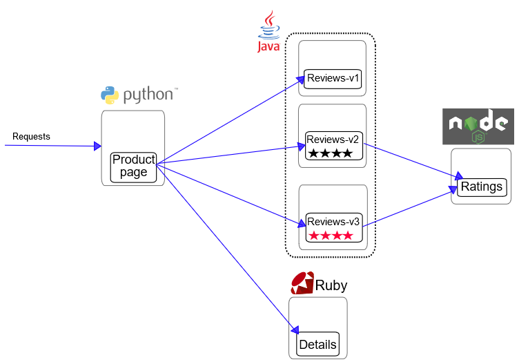
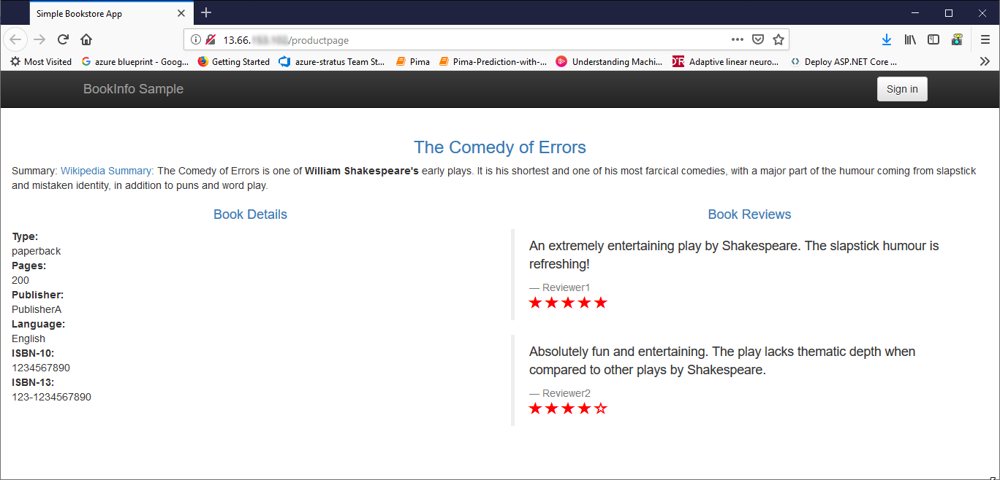
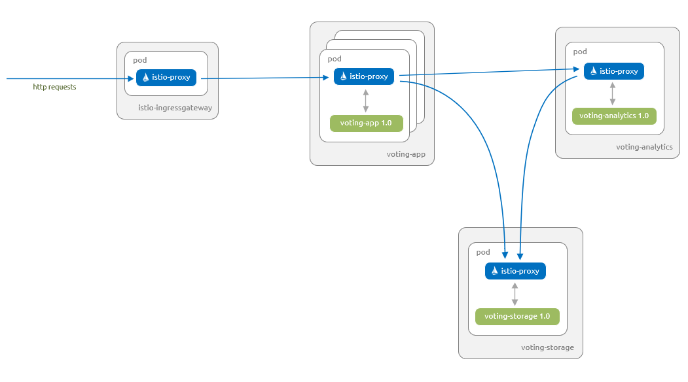
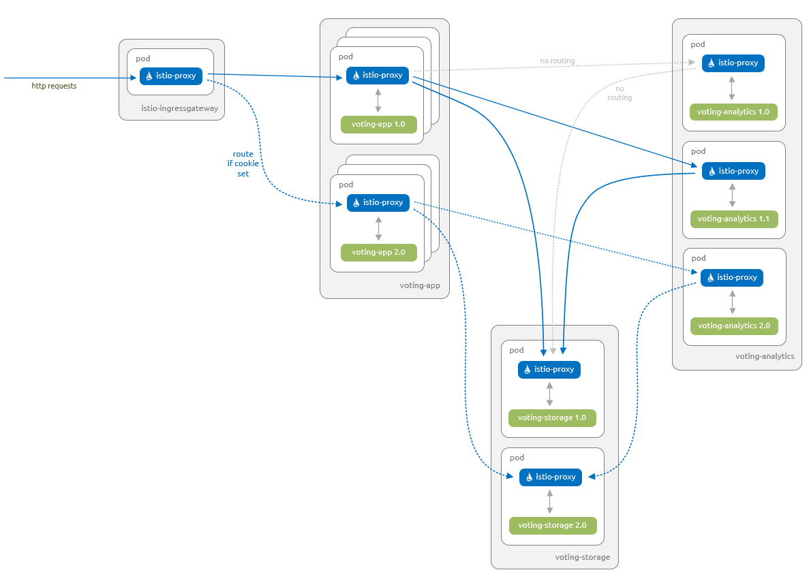

# Authentication With Istio Overview

## 2 Types of Istio Authentication Auth

**Type 1: Transport authentication** - Also known as service-to-service authentication: verifies the direct client making the connection.
 - **TLS (Transport Layer Security)** - is the standard Internet Security protocol, successor of SSL (Secure Socket Layer)
 - **Secure Comm** - It is used to provide secured connections for communications done over Internet and in private cluster.
 - **Integrity** - It provides privacy & integrity of data between two applications communicating with each other.
- **Istio provides** - a key management system to automate key and certificate generation, distribution, and rotation.
- **Istio Offers Mutual TLS** - Istio offers mutual TLS as a full stack solution for transport authentication.
    - **Mutual TLS** - Also known as a two-way authentication refers to two parties authenticating each other at the same time, being a default mode of authentication in some
    - **x509** - is used for authentication.

**Type 2: Origin authentication** - Also known as end-user authentication: verifies the original client making the request as an end-user or device.

- Message authentication or data origin authentication is a property that a message has not been modified while in transit (data integrity) and that the receiving party can verify the source of the message.
- The authentication is based on a secret key shared by two parties to authenticate information transmitted between them
    - **JWT Token** - Istio enables request-level authentication with JSON Web Token (JWT) validation and a streamlined developer experience for Auth0, Firebase Auth, Google Auth, and custom auth.

**Auth Policies, where stored?** - The authentication policies in the Istio config store via a custom Kubernetes API.

**Pilot helps keep things up to date** - Pilot keeps them up-to-date for each proxy, along with the keys where appropriate.

## Mutual TLS authentication

**Envoy plays key role** - Istio tunnels service-to-service communication through the client side and server side Envoy proxies
# Installing Walkthrough

This example deploys a sample application composed of four separate microservices used to demonstrate various Istio features. The application displays information about a book, similar to a single catalog entry of an online book store. Displayed on the page is a description of the book, book `details` (ISBN, number of pages, and so on), and a few book `reviews`.

The Bookinfo application is broken into four separate microservices:

- `productpage`. The `productpage` microservice calls the `details` and `reviews` microservices to populate the page.
- `details`. The `details` microservice contains book information.
- `reviews`. The `reviews` microservice contains book `reviews`. It also calls the `ratings` microservice.
- `ratings`. The `ratings` microservice contains book ranking information that accompanies a book review.

There are 3 versions of the `reviews` microservice:

- Version `v1` doesn’t call the `ratings` service.
- Version `v2` calls the `ratings` service, and displays each rating as 1 to 5 black stars.
- Version `v3` calls the `ratings` service, and displays each rating as 1 to 5 red stars.



## More points

There are some other interesting points to notice about the diagram above:

- There are three distinct languages used for each of the different services
- We will learn how to route traffic to specific version numbers, leveraging the concepts of Canary releases

## Deployment of Sidecar

You will also notice in the diagram below that the envoy proxy has been installed into each of the services.


## The Deployment Yaml for Bookinfo

In the next section we are about to deploy Bookinfo using a couple of commands in conjunction with each other (`kubectl` and `istioctl`).

The beauty of these commands is that the 'Envoy' sidecar automatically gets injected into the each of the services.

it might be worth noting that there is a bash script do the cleanup, `cleanup.sh`.

```
  platform
    └── kube
        ├── bookinfo-add-serviceaccount.yaml
        ├── bookinfo-certificate.yaml
        ├── bookinfo-db.yaml
        ├── bookinfo-details-v2.yaml
        ├── bookinfo-details.yaml
        ├── bookinfo-ingress.yaml
        ├── bookinfo-mysql.yaml
        ├── bookinfo-ratings-discovery.yaml
        ├── bookinfo-ratings-v2-mysql-vm.yaml
        ├── bookinfo-ratings-v2-mysql.yaml
        ├── bookinfo-ratings-v2.yaml
        ├── bookinfo-ratings.yaml
        ├── bookinfo-reviews-v2.yaml
        ├── bookinfo.yaml
        ├── cleanup.sh
        ├── istio-rbac-details-reviews.yaml
        ├── istio-rbac-enable.yaml
        ├── istio-rbac-namespace.yaml
        ├── istio-rbac-productpage.yaml
        ├── istio-rbac-ratings.yaml
        ├── rbac
        │   ├── details-reviews-policy.yaml
        │   ├── namespace-policy.yaml
        │   ├── productpage-policy.yaml
        │   ├── ratings-policy.yaml
        │   └── rbac-config-ON.yaml
        └── README.md
```

### Command line to deploy Bookinfo

This particular version of the command is known as `manual sidecar injection` because `kubectl` is combined with `istioctl`.

```/bash
$ kubectl apply -f <(istioctl kube-inject -f samples/bookinfo/platform/kube/bookinfo.yaml)

service/details created
deployment.extensions/details-v1 created
service/ratings created
deployment.extensions/ratings-v1 created
service/reviews created
deployment.extensions/reviews-v1 created
deployment.extensions/reviews-v2 created
deployment.extensions/reviews-v3 created
service/productpage created
deployment.extensions/productpage-v1 created

```

Let's go ahead and verify that the appropriate components got installed:

```
$ kubectl get services

NAME          CLUSTER-IP     EXTERNAL-IP   PORT(S)    AGE
details       10.0.130.153   <none>        9080/TCP   6m
kubernetes    10.0.0.1       <none>        443/TCP    1d
productpage   10.0.254.100   <none>        9080/TCP   6m
ratings       10.0.178.102   <none>        9080/TCP   6m
reviews       10.0.112.9     <none>        9080/TCP   6m
```

You can also check the part as follows:

```
$ kubectl get pods

NAME                              READY     STATUS    RESTARTS   AGE
details-v1-5458f64c65-zkzf5       2/2       Running   0          9m
productpage-v1-577c9594b7-s9jsw   2/2       Running   0          9m
ratings-v1-79467df9b5-8gs8z       2/2       Running   0          9m
reviews-v1-5d46b744bd-bdh84       2/2       Running   0          9m
reviews-v2-7f7d7f99f7-xfm25       2/2       Running   0          9m
reviews-v3-7bc67f66-zpt64         2/2       Running   0          9m
```

### The Whole system

```
kubectl get pods --all-namespaces
NAMESPACE      NAME                                     READY     STATUS    RESTARTS   AGE
default        details-v1-5458f64c65-ggw24              2/2       Running   0          17m
default        productpage-v1-577c9594b7-7z72z          2/2       Running   0          17m
default        ratings-v1-79467df9b5-wmdff              2/2       Running   0          17m
default        reviews-v1-5d46b744bd-68qqh              2/2       Running   0          17m
default        reviews-v2-7f7d7f99f7-n27pl              2/2       Running   0          17m
default        reviews-v3-7bc67f66-m4knw                2/2       Running   0          17m
istio-system   istio-citadel-55cdfdd57c-f7d56           1/1       Running   0          20m
istio-system   istio-egressgateway-7798845f5d-6b2js     1/1       Running   0          20m
istio-system   istio-galley-76bbb946c8-djz8f            1/1       Running   0          20m
istio-system   istio-ingressgateway-78c6d8b8d7-x7lks    1/1       Running   0          20m
istio-system   istio-pilot-5fcb895bff-fdlmm             2/2       Running   0          20m
istio-system   istio-policy-7b6cc95d7b-bktjl            2/2       Running   0          20m
istio-system   istio-sidecar-injector-9c6698858-7tjxk   1/1       Running   0          20m
istio-system   istio-telemetry-bfc9ff784-nbrv5          2/2       Running   0          20m
istio-system   prometheus-65d6f6b6c-p6sw9               1/1       Running   0          20m
kube-system    coredns-7d6976d69b-l7d6n                 1/1       Running   0          26m
kube-system    coredns-7d6976d69b-vpm6p                 1/1       Running   0          29m
kube-system    coredns-autoscaler-6fcdb7d64-5pwff       1/1       Running   0          29m
kube-system    heapster-7b66f54b4c-nwx8d                2/2       Running   0          26m
kube-system    kube-proxy-htqwx                         1/1       Running   0          26m
kube-system    kube-proxy-vxt9m                         1/1       Running   0          26m
kube-system    kube-proxy-wlqnz                         1/1       Running   0          26m
kube-system    kube-svc-redirect-m6vl7                  2/2       Running   0          26m
kube-system    kube-svc-redirect-wmdzm                  2/2       Running   0          26m
kube-system    kube-svc-redirect-wxcs9                  2/2       Running   0          26m
kube-system    kubernetes-dashboard-dfbbfd8-jp7t5       1/1       Running   0          29m
kube-system    metrics-server-7b97f9cd9-4nntm           1/1       Running   0          29m
kube-system    omsagent-6njcm                           1/1       Running   0          26m
kube-system    omsagent-8dgh7                           1/1       Running   0          26m
kube-system    omsagent-d54kj                           1/1       Running   0          26m
kube-system    omsagent-rs-cdf89dbf9-c2c99              1/1       Running   0          29m
kube-system    tiller-deploy-776b5cb874-nwlmp           1/1       Running   0          21m
kube-system    tunnelfront-86c95cbf6c-64clx             1/1       Running   0          29m
```

Notice that the `reviews` pods has various versions. We will be taking a closer look at this with the upcoming demos, where we route a specific version of traffic to specific versions of the `release` microservice.

## Control Ingress Traffic

**The typical way to exposing services** - The Kubernetes Ingress Resource is used to specify services that should be exposed outside the cluster.

**The better approach** - In an Istio service mesh, a better approach is to use Istio Gateway.

**Why Better ?** - A Gateway allows Istio features such as monitoring and route rules to be applied to traffic entering the cluster.


As you can see from the image above, the deployment of BookInfo on the Azure Kubernetes Service is automatically resulted in a layer 4 load balancer getting deployed, thus exposing a publicly accessible IP address.

You can either go to the Kubernetes dashboard or you can issue the following command:

```bash
kubectl get svc istio-ingressgateway -n istio-system
```

The result should look something like this:

```bash
NAME                   CLUSTER-IP   EXTERNAL-IP     PORT(S)                                                                                                                   AGE
istio-ingressgateway   10.0.5.12    13.66.153.108   80:31380/TCP,443:31390/TCP,31400:31400/TCP,15011:30095/TCP,8060:31630/TCP,853:32106/TCP,15030:30937/TCP,15031:30425/TCP   1d
```

## Determining the ingress IP and port

**Browser enabled** - you need to make the application accessible from outside of your Kubernetes cluster, e.g., from a browser.

**How to browser-enable** - An Istio Gateway is used for this purpose.

**Define a gateway** - The command below can create ingress gateway for the application:

```
$ kubectl apply -f samples/bookinfo/networking/bookinfo-gateway.yaml
```

**Confirm the gateway** -  with the following command.

```
kubectl get gateway
```

You should see the gateway:

```
NAME               AGE
bookinfo-gateway   32s
```

### Confirming with the Browser

| Public IP Address | URL
|:--|:---|
| 13.66.153.108 | http://13.66.153.108/productpage|



## Cleaning up and removing BookInfo

**To uninstall from Kubernetes environment** - Delete the routing rules and terminate the application pods

```
$ samples/bookinfo/platform/kube/cleanup.sh
```

### Confirm shutdown

```
$ kubectl get virtualservices   #-- there should be no virtual services
$ kubectl get destinationrules  #-- there should be no destination rules
$ kubectl get gateway           #-- there should be no gateway
$ kubectl get pods               #-- the Bookinfo pods should be deleted
```
# Introducing Canary functionality

For more infomation see:
https://istio.io/docs/concepts/traffic-management/


**What is a canary release** - The main purpose of Canary deployments is to reduce the risk of introducing new software and production.

**Re-route a subset of traffic** - The idea is that it is preferable to route a small amount of traffic to the new notes so that it is possible to verify correct functionality, before routing all the traffic to the new release.

**In the above diagram** - It means that you could allocate a certain percentage of traffic to version 3, while still having version 2 in production at the same time supporting the remaining traffic.

**Blue Green is a little different** - The other related option for deployment is called Blue Green Deployment. blue-green deployment allows you to deploy a new version of your software to a completely new subset of your infrastructure, to which no users are routed.

**Test with Internal Users** - The idea is that internal users could do the test first on a subset in the world of Blue Green deployment. only when the internal users agree that the functionality and behavior is appropriate, do you start rerouting traffic from the old deployment to the new deployment.

**Simple Example** -  Istio, you can specify that v1 of a service receives 90% of incoming traffic, while v2 of that service only receives 10%.

**Keep both versions** -Using Istio you can deploy v2 of your service and use built-in traffic management mechanisms to shift traffic to your updated services at a network level, then remove the v1 Pods.

**Dynamic-Routing** - Istio also gives you the ability to implement dynamic request routing (based on HTTP headers), failure recovery, retries, circuit breakers, and fault injection. For more information, check out the Traffic Management documentation.

- Layer 7 Load Balancing
- in the diagram below notice that based on an HTTP header, it is possible to route traffic to `Reviews-V2`, instead of `Reviews-V2`.


**Let's learn more about traffic routing** - This post walks through a technique that highlights a particularly useful way that you can implement Istio incrementally – in this case, only the traffic management features – without having to individually update each of your Pods.


**Forced Delays** - You can also introduce delays into the calling of your backend services for the purpose of testing timeouts in client requests.


## Example of Canary version

**% to specific versions** - You can specify via Pilot that you want 5% of traffic for a particular service to go to a canary version irrespective of the size of the canary deployment, or send traffic to a particular version depending on the content of the request.

### What is Pilot?

**Pilot** - Manages and configures all the Envoy proxy instances deployed in a particular Istio service mesh.

**It is about Rules** - Pilot lets you specify which rules you want to use to route traffic between Envoy proxies and configure failure recovery features such as timeouts, retries, and circuit breakers.

**Envoys automatically propagate routes** - It also maintains a canonical model of all the services in the mesh and uses this model to let Envoy instances know about the other Envoy instances in the mesh via its discovery service.

**Envoy talk to Pilot** - the load-balancing information in the sidecar is obtained from Pilot.

**Health Checks** - the system does periodic health checks, looking at other instances in the load-balancing pool. This enables intelligent traffic routing.

- When the number of health check failures for a given instance exceeds a pre-specified threshold

## Load Balancing Types

Istio currently allows three load balancing modes: round robin, random, and weighted least request.

## Prerequisite

> * created an AKS cluster (Kubernetes 1.10 and above, with RBAC enabled) [AKS quickstart](https://github.com/MicrosoftDocs/azure-docs/blob/master/articles/aks/kubernetes-walkthrough.md)
> * An established `kubectl` connection with the cluster
> * Istio installed in your cluster [install Istio in AKS](https://github.com/MicrosoftDocs/azure-docs/blob/master/articles/aks/istio-install.md)

## About this application scenario

The sample AKS voting app provides two voting options (Cats or Dogs) to users. There is a storage component that persists the number of votes for each option. Additionally, there is an analytics component that provides details around the votes cast for each option.

In this article, you start by deploying version *1.0* of the voting app and version *1.0* of the analytics component. The analytics component provides simple counts for the number of votes. The voting app and analytics component interact with version *1.0* of the storage component, which is backed by Redis.

You upgrade the analytics component to version *1.1*, which provides counts, and now totals and percentages.

A subset of users test version *2.0* of the app via a canary release. This new version uses a storage component that is backed by a MySQL database.

Once you're confident that version *2.0* works as expected on your subset of users, you roll out version *2.0* to all your users.

## Deploy the application

Let's start by deploying the application into your Azure Kubernetes Service (AKS) cluster. The following diagram shows what runs by the end of this section - version *1.0* of all components with inbound requests serviced via the Istio ingress gateway:



The artifacts you need to follow along with this article are available in the [Azure-Samples/aks-voting-app](https://github.com/Azure-Samples/aks-voting-app) GitHub repo. You can either download the artifacts or clone the repo as follows:

```console
git clone https://github.com/Azure-Samples/aks-voting-app.git
```

Change to the following folder in the downloaded / cloned repo and run all subsequent steps from this folder:

```console
cd scenarios/intelligent-routing-with-istio
```

First, create a namespace in your AKS cluster for the sample AKS voting app named *voting* as follows:

```console
kubectl create namespace voting
```

Label the namespace with `istio-injection=enabled`. This label instructs Istio to automatically inject the istio-proxies as sidecars into all of your pods in this namespace.

```console
kubectl label namespace voting istio-injection=enabled
```

Now let's create the components for the AKS Voting app. Create these components in the *voting* namespace created in a previous step.

```console
kubectl apply -f kubernetes/step-1-create-voting-app.yaml --namespace voting
```

The following example output shows the resources were successfully created:

```
deployment.apps/voting-storage-1-0 created
service/voting-storage created
deployment.apps/voting-analytics-1-0 created
service/voting-analytics created
deployment.apps/voting-app-1-0 created
service/voting-app created
```

> [!NOTE]
> Istio has some specific requirements around pods and services. For more information, see the [Istio Requirements for Pods and Services documentation](https://istio.io/docs/setup/kubernetes/spec-requirements/).

To see the pods that have been created, use the [kubectl get pods](https://kubernetes.io/docs/reference/generated/kubectl/kubectl-commands#get) command as follows:

```console
kubectl get pods -n voting
```

The following example output shows there are three instances of the *voting-app* pod and a single instance of both the *voting-analytics* and *voting-storage* pods. Each of the pods has two containers. One of these containers is the component, and the other is the *istio-proxy*:

```
NAME                                    READY     STATUS    RESTARTS   AGE
voting-analytics-1-0-669f99dcc8-lzh7k   2/2       Running   0          1m
voting-app-1-0-6c65c4bdd4-bdmld         2/2       Running   0          1m
voting-app-1-0-6c65c4bdd4-gcrng         2/2       Running   0          1m
voting-app-1-0-6c65c4bdd4-strzc         2/2       Running   0          1m
voting-storage-1-0-7954799d96-5fv9r     2/2       Running   0          1m
```

To see information about the pod, use the [kubectl describe pod](https://kubernetes.io/docs/reference/generated/kubectl/kubectl-commands#describe). Replace the pod name with the name of a pod in your own AKS cluster from the previous output:

```console
kubectl describe pod voting-app-1-0-6c65c4bdd4-bdmld --namespace voting
```

The *istio-proxy* container has automatically been injected by Istio to manage the network traffic to and from your components, as shown in the following example output:

```
[...]
Containers:
  voting-app:
    Image:         mcr.microsoft.com/aks/samples/voting/app:1.0
    ...
  istio-proxy:
    Image:         docker.io/istio/proxyv2:1.0.4
[...]
```

You can't connect to the voting app until you create the Istio Gateway and Virtual Service. These Istio resources route traffic from the default Istio ingress gateway to our application.

> [!NOTE]
> A *Gateway* is a component at the edge of the service mesh that receives inbound or outbound HTTP and TCP traffic.
>
> A *Virtual Service* defines a set of routing rules for one or more destination services.

Use the `istioctl` client binary to deploy the Gateway and Virtual Service yaml. As with the `kubectl apply` command, remember to specify the namespace that these resources are deployed into.

```console
istioctl create -f istio/step-1-create-voting-app-gateway.yaml --namespace voting
```

Obtain the IP address of the Istio Ingress Gateway using the following command:

```console
kubectl get service istio-ingressgateway --namespace istio-system -o jsonpath='{.status.loadBalancer.ingress[0].ip}'
```

The following example output shows the IP address of the Ingress Gateway:

```
52.187.250.239
```

Open up a browser and paste in the IP address. The sample AKS voting app is displayed.


The information at the bottom of the screen shows that the app uses version *1.0* of the *voting-app* and version *1.0* (Redis) as the storage option.

## Update the application

We let's deploy a new version of the analytics component. This new version *1.1* displays totals and percentages in addition to the count for each category.

The following diagram shows what runs at the end of this section - only version *1.1* of our *voting-analytics* component has traffic routed from the *voting-app* component. Even though version *1.0* of our *voting-analytics* component continues to run and is referenced by the *voting-analytics* service, the Istio proxies disallow traffic to and from it.


Let's deploy version *1.1* of the *voting-analytics* component. Create this component in the *voting* namespace:

```console
kubectl apply -f kubernetes/step-2-update-voting-analytics-to-1.1.yaml --namespace voting
```

Open the sample AKS voting app in a browser again, using the IP address of the Istio Ingress Gateway obtained in the previous step.

Your browser alternates between the two views shown below. Since you are using a Kubernetes Service for the *voting-analytics* component with only a single label selector (`app: voting-analytics`), Kubernetes uses the default behavior of round-robin between the pods that match that selector. In this case, it is both version *1.0* and *1.1* of your *voting-analytics* pods.


You can visualize the switching between the two versions of the *voting-analytics* component as follows. Remember to use the IP address of your own Istio Ingress Gateway.

```console
INGRESS_IP=52.187.250.239
for i in {1..5}; do curl -si $INGRESS_IP | grep results; done
```

The following example output shows the relevant part of the returned web site as the site switches between versions:

```
  <div id="results"> Cats: 2 | Dogs: 4 </div>
  <div id="results"> Cats: 2 | Dogs: 4 </div>
  <div id="results"> Cats: 2/6 (33%) | Dogs: 4/6 (67%) </div>
  <div id="results"> Cats: 2 | Dogs: 4 </div>
  <div id="results"> Cats: 2/6 (33%) | Dogs: 4/6 (67%) </div>
```

### Lock down traffic to version 1.1 of the application

Now let's lock down traffic to only version *1.1* of the *voting-analytics* component and to version *1.0* of the *voting-storage* component. You then define routing rules for all of the other components.

> * A *Virtual Service* defines a set of routing rules for one or more destination services.
> * A *Destination Rule* defines traffic policies and version specific policies.
> * A *Policy* defines what authentication methods can be accepted on workload(s).

You use the `istioctl` client binary to replace the Virtual Service definition on your *voting-app* and add Destination Rules and Virtual Services for the other components.

You also add a Policy to the *voting* namespace to ensure that all communicate between services is secured using mutual TLS and client certificates.

As there is an existing Virtual Service definition for *voting-app* that you replace, use the `istioctl replace` command as follows:

```console
istioctl replace -f istio/step-2a-update-voting-app-virtualservice.yaml --namespace voting
```

The following example output shows the Istio Virtual Service are successfully updated:

```
Updated config virtual-service/voting/voting-app to revision 141902
```

Next, use the `istioctl create` command to add the new Policy and also the new Destination Rules and Virtual Services for all the other components.

* The Policy has `peers.mtls.mode` set to `STRICT` to ensure that mutual TLS is enforced between your services within the *voting* namespace.
* You also set the `trafficPolicy.tls.mode` to `ISTIO_MUTUAL` in all our Destination Rules. Istio provides services with strong identities and secures communications between services using mutual TLS and client certificates that Istio transparently manages.

```console
istioctl create -f istio/step-2b-add-routing-for-all-components.yaml --namespace voting
```

The following example output shows the new Policy, Destination Rules, and Virtual Services are successfully created:

```
Created config policy/voting/default to revision 142118
Created config destination-rule/voting/voting-app at revision 142119
Created config destination-rule/voting/voting-analytics at revision 142120
Created config virtual-service/voting/voting-analytics at revision 142121
Created config destination-rule/voting/voting-storage at revision 142122
Created config virtual-service/voting/voting-storage at revision 142123
```

If you open the AKS Voting app in a browser again, only the new version *1.1* of the *voting-analytics* component is used by the *voting-app* component.


You can more easily visualize that we are now only routed to version *1.1* of your *voting-analytics* component as follows. Remember to use the IP address of your Istio ingress gateway.

You can visualize that you are now only routed to version *1.1* of your *voting-analytics* component as follows. Remember to use the IP address of your own Istio Ingress Gateway:

```azurecli-interactive
INGRESS_IP=52.187.250.239
for i in {1..5}; do curl -si $INGRESS_IP | grep results; done
```

The following example output shows the relevant part of the returned web site:

```
  <div id="results"> Cats: 2/6 (33%) | Dogs: 4/6 (67%) </div>
  <div id="results"> Cats: 2/6 (33%) | Dogs: 4/6 (67%) </div>
  <div id="results"> Cats: 2/6 (33%) | Dogs: 4/6 (67%) </div>
  <div id="results"> Cats: 2/6 (33%) | Dogs: 4/6 (67%) </div>
  <div id="results"> Cats: 2/6 (33%) | Dogs: 4/6 (67%) </div>
```

Confirm that Istio uses mutual TLS to secure communications between each of our services. The following commands check the TLS settings for each of the *voting-app* services:

```console
istioctl authn tls-check voting-app.voting.svc.cluster.local
istioctl authn tls-check voting-analytics.voting.svc.cluster.local
istioctl authn tls-check voting-storage.voting.svc.cluster.local
```

This following example output shows that mutual TLS is enforced for each of the services via the Policy and Destination Rules:

```
HOST:PORT                                    STATUS     SERVER     CLIENT     AUTHN POLICY       DESTINATION RULE
voting-app.voting.svc.cluster.local:8080     OK         mTLS       mTLS       default/voting     voting-app/voting

HOST:PORT                                          STATUS     SERVER     CLIENT     AUTHN POLICY       DESTINATION RULE
voting-analytics.voting.svc.cluster.local:8080     OK         mTLS       mTLS       default/voting     voting-analytics/voting

HOST:PORT                                        STATUS     SERVER     CLIENT     AUTHN POLICY       DESTINATION RULE
voting-storage.voting.svc.cluster.local:6379     OK         mTLS       mTLS       default/voting     voting-storage/voting
```

## Roll out a canary release of the application

Now let's deploy a new version *2.0* of the *voting-app*, *voting-analytics*, and *voting-storage* components. The new *voting-storage* component use MySQL instead of Redis, and the *voting-app* and *voting-analytics* components are updated to allow them to use this new *voting-storage* component.

The *voting-app* component now supports feature flag functionality. This feature flag allows you to test the canary release capability of Istio for a subset of users.

The following diagram shows what runs at the end of this section.

* Version *1.0* of the *voting-app* component, version *1.1* of the *voting-analytics* component and version *1.0* of the *voting-storage* component are able to communicate with each other.
* Version *2.0* of the *voting-app* component, version *2.0* of the *voting-analytics* component and version *2.0* of the *voting-storage* component are able to communicate with each other.
* Version *2.0* of the *voting-app* component are only accessible to users that have a specific feature flag set. This change is managed using a feature flag via a cookie.



First, update the Istio Destination Rules and Virtual Services to cater for these new components. These updates ensure that you don't route traffic incorrectly to the new components and users don't get unexpected access:

```console
istioctl replace -f istio/step-3-add-routing-for-2.0-components.yaml --namespace voting
```

The following example output shows the Destination Rules and Virtual Services are successfully updated:

```
Updated config destination-rule/voting/voting-app to revision 150930
Updated config virtual-service/voting/voting-app to revision 150931
Updated config destination-rule/voting/voting-analytics to revision 150937
Updated config virtual-service/voting/voting-analytics to revision 150939
Updated config destination-rule/voting/voting-storage to revision 150940
Updated config virtual-service/voting/voting-storage to revision 150941
```

Next, let's add the Kubernetes objects for the new version *2.0* components. You also update the *voting-storage* service to include the *3306* port for MySQL:

```console
kubectl apply -f kubernetes/step-3-update-voting-app-with-new-storage.yaml --namespace voting
```

The following example output shows the Kubernetes objects are successfully updated or created:

```
service/voting-storage configured
secret/voting-storage-secret created
deployment.apps/voting-storage-2-0 created
persistentvolumeclaim/mysql-pv-claim created
deployment.apps/voting-analytics-2-0 created
deployment.apps/voting-app-2-0 created
```

Wait until all the version *2.0* pods are running. Use the kubectl get pods command to view all pods in the *voting* namespace:

```azurecli-interactive
kubectl get pods --namespace voting
```

You should now be able to switch between the version *1.0* and version *2.0* (canary) of the voting application. The feature flag toggle at the bottom of the screen sets a cookie. This cookie is used by the *voting-app* Virtual Service to route users to the new version *2.0*.


The vote counts are different between the versions of the app. This difference highlights that you are using two different storage backends.

## Finalize the rollout

Once you've successfully tested the canary release, update the *voting-app* Virtual Service to route all traffic to version *2.0* of the *voting-app* component. All users then see version *2.0* of the application, regardless of whether the feature flag is set or not:


Update all the Destination Rules to remove the versions of the components you no longer want active. Then, update all the Virtual Services to stop referencing those versions.

Since there's no longer any traffic to any of the older versions of the components, you can now safely delete all the deployments for those components.


You have now successfully rolled out a new version of the AKS Voting App.

## Configuring the circuit breaker

It is not uncommon during heavy loads for micro service calls to hang without a response. Oftentimes, unnecessarily high levels of resources are consumed while the caller is waiting for the service to respond. Taken too far, the service may be unable to respond at all causing a cascading effect across the application stack composed of a series of micro services.

Services sometimes become unresponsive due to slow network connections, timeout, or the resources being overcommitted or temporarily unavailable. The blocked requests that queue up will therefore unnecessarily hold critical system resources such as memory, threads, and database connections.

The preference in these situations is to faill immediately. This could help prevent a client application from repeatedly trying to execute an operation that's likely to fail.

The idea is that after a series of consecutive failures, a threshold is reached in the circuit breaker trips. This enables the remote service to fail immediately, at which point there will be a timeout that expires the circuit breaker, which is then allowed a limited number of requests to pass through.

With Istio the sidecar proxy (Envoy) takes over and provides circuit breaker services, as a proxy for operations that might fail. The proxy should monitor the number of recent failures that have occurred, and use this information to decide whether to allow the operation to proceed, or simply return an exception immediately.

Create a destination rule to apply circuit breaking settings when calling the httpbin service:

# Circuit Breaker Pattern

```
apiVersion: networking.istio.io/v1alpha3
kind: DestinationRule
metadata:
  name: httpbin
spec:
  host: httpbin
  trafficPolicy:
    connectionPool:
      tcp:
        maxConnections: 1
      http:
        http1MaxPendingRequests: 1
        maxRequestsPerConnection: 1
    outlierDetection:
      consecutiveErrors: 1
      interval: 1s
      baseEjectionTime: 3m
      maxEjectionPercent: 100
```

## Apply Circuit Breaker

```
kubectl apply -f circuit-breaker.yml
# If you'd like to clean up
#kubectl delete -f circuit-breaker.yml
```

Verify the destination rule was created correctly. You can output yaml to do so.

```
$ kubectl get destinationrule httpbin -o yaml
```

> Validate the DestinationRule

```
apiVersion: networking.istio.io/v1alpha3
kind: DestinationRule
metadata:
  annotations:
    kubectl.kubernetes.io/last-applied-configuration: |
      {"apiVersion":"networking.istio.io/v1alpha3","kind":"DestinationRule","metadata":{"annotations":{},"name":"httpbin","namespace":"default"},"spec":{"host":"httpbin","trafficPolicy":{"connectionPool":{"http":{"http1MaxPendingRequests":1,"maxRequestsPerConnection":1},"tcp":{"maxConnections":1}},"outlierDetection":{"baseEjectionTime":"3m","consecutiveErrors":1,"interval":"1s","maxEjectionPercent":100}}}}
  creationTimestamp: 2019-02-02T22:49:18Z
  generation: 1
  name: httpbin
  namespace: default
  resourceVersion: "125034"
  selfLink: /apis/networking.istio.io/v1alpha3/namespaces/default/destinationrules/httpbin
  uid: c5fab2ca-273c-11e9-af39-0a58ac1f0a5f
spec:
  host: httpbin
  trafficPolicy:
    connectionPool:
      http:
        http1MaxPendingRequests: 1
        maxRequestsPerConnection: 1
      tcp:
        maxConnections: 1
    outlierDetection:
      baseEjectionTime: 3m
      consecutiveErrors: 1
      interval: 1s
      maxEjectionPercent: 100
```
# Using the Fortio Load Testing Service to Trigger Circuit Breaker

Fortio will be learned for the load testing. You can learn more at Github.

Fortio runs at a specified query per second (qps) and records an histogram of execution time and calculates percentiles (e.g. p99 ie the response time such as 99% of the requests take less than that number (in seconds, SI unit)). It can run for a set duration, for a fixed number of calls, or until interrupted (at a constant target QPS, or max speed/load per connection/thread).

The name fortio comes from greek φορτίο which means load/burden.


Here is a simple GET request that will not trigger the circuit breaker.

```
FORTIO_POD=$(kubectl get pod | grep fortio | awk '{ print $1 }')
echo $FORTIO_POD
fortio-deploy-5d5c6bf6b9-c6jvt
kubectl exec -it $FORTIO_POD  -c fortio /usr/local/bin/fortio -- load -curl  http://httpbin:8000/get
Status 200 comes back.
```

# Two Steps left - (1) Perform a higher stress load est ing script (2) Query the Istio Proxy for the performance Statistics

This first command like

```
kubectl exec -it $FORTIO_POD  -c fortio /usr/local/bin/fortio -- load -c 3 -qps 0 -n 20 -loglevel Warning http://httpbin:8000/get
```

```
kubectl exec -it $FORTIO_POD  -c istio-proxy  -- sh -c 'curl localhost:15000/stats' | grep httpbin | grep pending
```

PERFORM SOME LOAD TESTING

```
kubectl exec -it $FORTIO_POD  -c fortio /usr/local/bin/fortio -- load -c 3 -qps 0 -n 20 -loglevel Warning http://httpbin:8000/get
```

You can see the detailed output.

```
02:23:16 I logger.go:97> Log level is now 3 Warning (was 2 Info)
Fortio 1.0.1 running at 0 queries per second, 2->2 procs, for 20 calls: http://httpbin:8000/get
Starting at max qps with 3 thread(s) [gomax 2] for exactly 20 calls (6 per thread + 2)
02:23:16 W http_client.go:604> Parsed non ok code 503 (HTTP/1.1 503)
02:23:16 W http_client.go:604> Parsed non ok code 503 (HTTP/1.1 503)
02:23:16 W http_client.go:604> Parsed non ok code 503 (HTTP/1.1 503)
02:23:16 W http_client.go:604> Parsed non ok code 503 (HTTP/1.1 503)
02:23:16 W http_client.go:604> Parsed non ok code 503 (HTTP/1.1 503)
02:23:16 W http_client.go:604> Parsed non ok code 503 (HTTP/1.1 503)
02:23:16 W http_client.go:604> Parsed non ok code 503 (HTTP/1.1 503)
02:23:16 W http_client.go:604> Parsed non ok code 503 (HTTP/1.1 503)
02:23:16 W http_client.go:604> Parsed non ok code 503 (HTTP/1.1 503)
02:23:16 W http_client.go:604> Parsed non ok code 503 (HTTP/1.1 503)
02:23:16 W http_client.go:604> Parsed non ok code 503 (HTTP/1.1 503)
02:23:16 W http_client.go:604> Parsed non ok code 503 (HTTP/1.1 503)
Ended after 41.570256ms : 20 calls. qps=481.11
Aggregated Function Time : count 20 avg 0.005685239 +/- 0.007864 min 0.000337612 max 0.026969444 sum 0.113704781
# range, mid point, percentile, count
>= 0.000337612 <= 0.001 , 0.000668806 , 25.00, 5
> 0.001 <= 0.002 , 0.0015 , 50.00, 5
> 0.002 <= 0.003 , 0.0025 , 55.00, 1
> 0.003 <= 0.004 , 0.0035 , 70.00, 3
> 0.004 <= 0.005 , 0.0045 , 75.00, 1
> 0.005 <= 0.006 , 0.0055 , 80.00, 1
> 0.009 <= 0.01 , 0.0095 , 85.00, 1
> 0.02 <= 0.025 , 0.0225 , 95.00, 2
> 0.025 <= 0.0269694 , 0.0259847 , 100.00, 1
# target 50% 0.002
# target 75% 0.005
# target 90% 0.0225
# target 99% 0.0265756
# target 99.9% 0.0269301
Sockets used: 15 (for perfect keepalive, would be 3)
Code 200 : 8 (40.0 %)
Code 503 : 12 (60.0 %)
Response Header Sizes : count 20 avg 92.1 +/- 112.8 min 0 max 231 sum 1842
Response Body/Total Sizes : count 20 avg 370 +/- 184.1 min 217 max 596 sum 7400
All done 20 calls (plus 0 warmup) 5.685 ms avg, 481.1 qps
```

This next command checks the istio-proxy for some stats.

```
kubectl exec -it $FORTIO_POD  -c istio-proxy  -- sh -c 'curl localhost:15000/stats' | grep httpbin | grep pending
```
The results:

```
cluster.outbound|8000||httpbin.default.svc.cluster.local.upstream_rq_pending_active: 0
cluster.outbound|8000||httpbin.default.svc.cluster.local.upstream_rq_pending_failure_eject: 0

// Pending overflow below
cluster.outbound|8000||httpbin.default.svc.cluster.local.upstream_rq_pending_overflow: 11
cluster.outbound|8000||httpbin.default.svc.cluster.local.upstream_rq_pending_total: 10
```

# Misc Commands

```bash
FORTIO_POD=$(kubectl get pod | grep fortio | awk '{ print $1 }')
history | grep "kubectl.*istioctl"
history | grep "kubectl.*istioctl" > test.txt & vim test.txt
history | grep "kubectl.*istioctl" > test.txt && vim test.txt
kubectl apply -f  all-internal-traffic.yml
kubectl apply -f circuit-breaker.yml
kubectl apply -f default-mesh-policy.yml
kubectl apply -f install/kubernetes/helm/helm-service-account.yaml
kubectl apply -f <(istioctl kube-inject -f samples/bookinfo/kube/bookinfo.yaml)
kubectl apply -f <(istioctl kube-inject -f samples/bookinfo/platform/kube/bookinfo.yaml)
kubectl apply -f <(istioctl kube-inject -f samples/httpbin/httpbin.yaml) -n bar
kubectl apply -f <(istioctl kube-inject -f samples/httpbin/httpbin.yaml) -n foo
kubectl apply -f <(istioctl kube-inject -f samples/httpbin/sample-client/fortio-deploy.yaml)
kubectl apply -f <(istioctl kube-inject -f samples/sleep/sleep.yaml) -n bar
kubectl apply -f <(istioctl kube-inject -f samples/sleep/sleep.yaml) -n foo
kubectl apply -f kubernetes/step-1-create-voting-app.yaml --namespace voting
kubectl apply -f kubernetes/step-2-update-voting-analytics-to-1.1.yaml --namespace voting
kubectl apply -f kubernetes/step-3-update-voting-app-with-new-storage.yaml --namespace voting
kubectl apply -f samples/bookinfo/networking/bookinfo-gateway.yaml
kubectl apply -f samples/bookinfo/networking/destination-rule-all.yaml
kubectl apply -f samples/httpbin/httpbin.yaml -n legacy
kubectl apply -f < samples/sleep/sleep.yaml -n legacy
kubectl apply -f samples/sleep/sleep.yaml -n legacy
kubectl create clusterrolebinding kubernetes-dashboard --clusterrole=cluster-admin --serviceaccount=kube-system:kubernetes-dashboard
kubectl create -f < (istioctl kube-inject -f bookinfo.yaml)
kubectl create -f <(istioctl kube-inject -f bookinfo.yaml)
kubectl create -f <(istioctl kube-inject -f $(BOOKINFOYAML))
kubectl create -f <(istioctl kube-inject -f ${BOOKINFOYAML})
kubectl create namespace voting
kubectl create ns bar
kubectl create ns foo
kubectl create ns legacy
kubectl delete deploy httpbin fortio-deploy
kubectl delete destinationrule httpbin
kubectl delete -f circuit-breaker.yml
kubectl delete svc httpbin
kubectl describe pod voting-app-1-0-6c65c4bdd4-bdmld --namespace voting
kubectl exec -it $FORTIO_POD  -c fortio /usr/local/bin/fortio -- load -c 2 -qps 0 -n 20 -loglevel Warning http://httpbin:8000/get
kubectl exec -it $FORTIO_POD  -c fortio /usr/local/bin/fortio -- load -c 3 -qps 0 -n 20 -loglevel Warning http://httpbin:8000/get
kubectl exec -it $FORTIO_POD  -c fortio /usr/local/bin/fortio -- load -curl  http://httpbin:8000/get
kubectl exec -it $FORTIO_POD  -c istio-proxy  -- sh -c 'curl localhost:15000/stats' | grep httpbin | grep pending
kubectl exec -it sleep-7dc47f96b6-7dfld -n bar -- /bin/sh
kubectl exec -it sleep-7dc47f96b6-7dfld -n bar --container sleep -- /bin/sh
kubectl exec -it sleep-7dc47f96b6-7dfld -n bar --container sleep -- /bin/sh
kubectl exec -it sleep-7dc47f96b6-7dfld -n legacy -- /bin/sh
kubectl get destinationrule httpbin -o yaml
kubectl get destinationrules.networking.istio.io --all-namespaces -o yaml
kubectl get destinationrules.networking.istio.io --all-namespaces -o yaml | grep "host:"
kubectl get destinationrules  #-- there should be no destination rules
kubectl get gateway
kubectl get gateway           #-- there should be no gateway
kubectl get meshpolicies.authentication.istio.io
kubectl get pod -l app=sleep -n bar -o jsonpath= {.items..metadata.name}
kubectl get pod -l app=sleep -n bar -o jsonpath={.items..metadata.name}
kubectl get pod -l app=sleep -n legacy -o jsonpath={.items..metadata.name}
kubectl get pods
kubectl get pods --all-namespaces
kubectl get pods --namespace voting
kubectl get pods -n istio-system
kubectl get pods -n voting
kubectl get pods sleep-7dc47f96b6-7dfld -n bar -o jsonpath='{.spec.containers[*].name}'
kubectl get pods               #-- the Bookinfo pods should be deleted
kubectl get policies.authentication.istio.io --all-namespaces
kubectl get service istio-ingressgateway --namespace istio-system -o jsonpath='{.status.loadBalancer.ingress[0].ip}'
kubectl get services
kubectl get services httpbin -o wide -n foo
kubectl get svc istio-ingressgateway -n istio-system
kubectl get virtualservices   #-- there should be no virtual services
kubectl.kubernetes.io/last-applied-configuration: |
kubectl label namespace voting istio-injection=enabled
kubectl proxy
kubectl apply -f <(istioctl kube-inject -f samples/bookinfo/kube/bookinfo.yaml)
kubectl apply -f <(istioctl kube-inject -f samples/bookinfo/kube/bookinfo.yaml)
kubectl create -f < (istioctl kube-inject -f bookinfo.yaml)
kubectl create -f <(istioctl kube-inject -f bookinfo.yaml)
kubectl create -f <(istioctl kube-inject -f bookinfo.yaml)
kubectl create -f <(istioctl kube-inject -f $(BOOKINFOYAML))
kubectl create -f <(istioctl kube-inject -f ${BOOKINFOYAML})
kubectl create -f <(istioctl kube-inject -f ${BOOKINFOYAML})
kubectl apply -f <(istioctl kube-inject -f samples/bookinfo/platform/kube/bookinfo.yaml)
history | grep "kubectl.*istioctl"
history | grep "kubectl.*istioctl" > test.txt & vim test.txt
history | grep "kubectl.*istioctl" > test.txt && vim test.txt

kubectl apply -f <(istioctl kube-inject -f samples/httpbin/httpbin.yaml) -n foo
kubectl apply -f <(istioctl kube-inject -f samples/sleep/sleep.yaml) -n foo
kubectl apply -f <(istioctl kube-inject -f samples/httpbin/httpbin.yaml) -n bar
kubectl apply -f <(istioctl kube-inject -f samples/sleep/sleep.yaml) -n bar
kubectl apply -f < samples/sleep/sleep.yaml -n legacy
kubectl get pod -l app=sleep -n bar -o jsonpath= {.items..metadata.name}
kubectl get pods sleep-7dc47f96b6-7dfld -n bar -o jsonpath='{.spec.containers[*].name}'
kubectl exec -it sleep-7dc47f96b6-7dfld -n bar --container sleep -- /bin/sh
kubectl create ns foo
kubectl apply -f <(istioctl kube-inject -f samples/httpbin/httpbin.yaml) -n foo
kubectl apply -f <(istioctl kube-inject -f samples/sleep/sleep.yaml) -n foo
kubectl create ns bar
kubectl apply -f <(istioctl kube-inject -f samples/httpbin/httpbin.yaml) -n bar
kubectl apply -f <(istioctl kube-inject -f samples/sleep/sleep.yaml) -n bar
kubectl create ns legacy
kubectl apply -f samples/httpbin/httpbin.yaml -n legacy
kubectl apply -f samples/sleep/sleep.yaml -n legacy
kubectl get pod -l app=sleep -n bar -o jsonpath={.items..metadata.name}
kubectl get pods sleep-7dc47f96b6-7dfld -n bar -o jsonpath='{.spec.containers[*].name}'
kubectl get services httpbin -o wide -n foo
kubectl exec -it sleep-7dc47f96b6-7dfld -n bar -- /bin/sh
kubectl get policies.authentication.istio.io --all-namespaces
kubectl get meshpolicies.authentication.istio.io
kubectl get destinationrules.networking.istio.io --all-namespaces -o yaml | grep "host:"
kubectl get destinationrules.networking.istio.io --all-namespaces -o yaml
kubectl apply -f default-mesh-policy.yml
kubectl exec -it sleep-7dc47f96b6-7dfld -n bar -- /bin/sh
kubectl apply -f  all-internal-traffic.yml
kubectl exec -it sleep-7dc47f96b6-7dfld -n bar -- /bin/sh
kubectl get pod -l app=sleep -n legacy -o jsonpath={.items..metadata.name}
kubectl exec -it sleep-7dc47f96b6-7dfld -n legacy -- /bin/sh

bash install-helm.sh
cd helm
cd ../helm
cd helmcharts
cd helm-prometheus/
cd /home/azureuser/helmcharts
cd install-helm/
cd learn-helm/
cp show-all.sh /datadrive/helm/project-prometheus
git clone https://github.com/kubernetes/helm.git
grep helm *
grep helm *.sh
grep helm *.sh *.txt
helm
helm delete
helm delete prometheus
helm delete --purge grafana
helm del --purge grafana
helm del --purge prometheus
helm del --purge prometheus && helm del --purge grafana
helm fetch -h
helm fetch incubator/istio
helm fetch stable/prometheus
helm get stable/mysql
helm -h
helm init
helm init --service-account tiller
helm init --service-account tiller --kube-context k8s.example.org
helm init --upgrade
helm inspect prom/node-exporter
helm inspect stable/node-exporter
helm inspect stable/prometheus
helm inspect stable/prometheus | grep -i dae
helm inspect stable/prometheus | vim -
helm install incubator/istio --set rbac.install=false
helm install incubator/istio --set rbac.install=true
helm install install/kubernetes/helm/istio --name istio --namespace istio-system
helm install install/kubernetes/helm/istio --name istio --namespace istio-system   --set global.controlPlaneSecurityEnabled=true   --set grafana.enabled=true   --set tracing.enabled=true   --set kiali.enabled=true
helm install  stable/prometheus
helm list
helm list --all
helm ls
helm ls --all prometheus
helm ls | awk '{print $1}'
helm ls | awk '{print $1}' | vim -
helm repo update
helm search node-exporter
helm search prometheus
helm status
helm template install/kubernetes/helm/istio --name istio --namespace istio-system > $HOME/istio.yaml
helm version
https://storage.googleapis.com/kubernetes-helm/helm-v2.12.1-linux-amd64.tar.gz
if [ -d /home/azureuser/helmcharts ]; then rm -Rf /home/azureuser/helmcharts; fi
init
install install/kubernetes/helm/istio --name istio --namespace istio-system   --set global.controlPlaneSecurityEnabled=true   --set grafana.enabled=true   --set tracing.enabled=true   --set kiali.enabled=true
kubectl apply -f install/kubernetes/helm/helm-service-account.yaml
linux-amd64/helm /usr/local/bin/helm
mkdir helm
mkdir helmcharts
mkdir /helmcharts
mkdir helm-prometheus
mkdir /home/azureuser/helmcharts
mkdir install-helm
mkdir learn-helm
mv charts/ helm
-r gpac helm
rm -Rf helmcharts
rm -Rf /home/azureuser/helmcharts
rm -r helm-prometheus/
snap install helm --classic
vim install-helm.sh
tar xvzf helm-v2.12.1-linux-amd64.tar.gz
