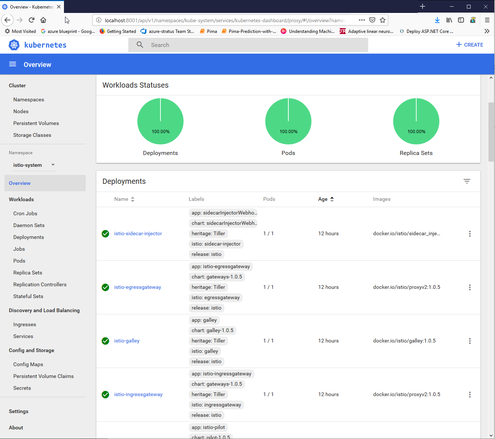

# Istio Installation

## The steps to install Istio are:

1. Have a Kubernetes cluster (AKS) ready with kubectl configured.
2. Download Istio
2. Install Helm and Tiller
3. Download the Release

### Download Istio

#### https://istio.io/docs/setup/kubernetes/download-release/

```bash
curl -L https://git.io/getLatestIstio | sh -
cd istio-1.0.5
export PATH=$PWD/bin:$PATH
```
I updated my `.bashrc` file as follows:

```bash
export ISTIO="/root/istio/istio-1.0.5/bin"
export PATH="$PATH:$GOPATH/bin:$GOROOT/bin:$ISTIO"
source <(kubectl completion bash)
```
You may have a different path as I am running as `root` locally.

### Installation with Helm

If a `service account` has not already been installed for Tiller, install one:

```bash
kubectl apply -f install/kubernetes/helm/helm-service-account.yaml
```

#### Install Tiller on your cluster with the service account:

```bash
 helm init --service-account tiller
 ```

#### Install Istio

```bash
helm install install/kubernetes/helm/istio --name istio --namespace istio-system
 ```

In my `.bashrc` file I added the ISTIO environment variable.

```bash
export ISTIO="/root/istio/istio-1.0.5/bin"
export PATH="$PATH:$ISTIO"
source <(kubectl completion bash)
```

## Install with Helm and Tiller via helm install

You can install Tiller on your cluster with the service account:

```bash
helm init --service-account tiller
```

### Install Istio:

#### https://istio.io/docs/setup/kubernetes/minimal-install/

```bash
helm install install/kubernetes/helm/istio --name istio-minimal --namespace istio-system \
  --set security.enabled=false \
  --set ingress.enabled=false \
  --set gateways.istio-ingressgateway.enabled=false \
  --set gateways.istio-egressgateway.enabled=false \
  --set galley.enabled=false \
  --set sidecarInjectorWebhook.enabled=false \
  --set mixer.enabled=false \
  --set prometheus.enabled=false \
  --set global.proxy.envoyStatsd.enabled=false \
  --set pilot.sidecar=false
```

**Ensure the istio-pilot-Kubernetes pod is deployed** - Ensure its container is up and running:

```bash
$ kubectl get pods -n istio-system
```
You should see these results:


```bash
NAME                                     READY     STATUS    RESTARTS   AGE
istio-pilot-58c65f74bc-2f5xn             1/1       Running   0          1m
```

# Viewing and Understanding the Istio Components

You will need to install the Kubernetes Dashboard.

## Setting up ClusterRole Binding

It is needed to have access to the Dashboard.

```bash
kubectl create clusterrolebinding kubernetes-dashboard --clusterrole=cluster-admin --serviceaccount=kube-system:kubernetes-dashboard
 ```
 You will need to enalbe the proxy which let's us tunnel in through `localhost`.

```bash
kubectl proxy
Starting to serve on 127.0.0.1:8001
```

 _Figure: Setting up the proxy_

## Accessing the Dashboard

Now go your browser and enter the following:

```bash
http://localhost:8001/api/v1/namespaces/kube-system/services/kubernetes-dashboard/proxy/#!/overview?namespace=default
 ```

 You should see this:

 

## Understanding Istio Inside of Kubernetes

The `istio-system` namespace is where all the components for Istio are stored.

Kubernetes constructs include:

- Deployments
- Pods
- Replicasets
- Services
- ConfigMaps
- Secrets

Let's break it down.

### Deployments

A Deployment controller provides declarative updates for Pods and ReplicaSets.

You describe a desired state in a Deployment object, and the Deployment controller changes the actual state to the desired state at a controlled rate. 

You can define Deployments to create new ReplicaSets, or to remove existing Deployments and adopt all their resources with new Deployments.

**istio-citadel** - An optional health-checking feature. In public key infrastructure (PKI) systems, a certificate signing request (also CSR or certification request) is a message sent from an applicant to a certificate authority in order to apply for a digital identity certificate. This service/pod will detect failures in the CSR signing service.


**istio-egressgateway** - The Control Egress Traffic task demonstrates how external (outside the Kubernetes cluster) HTTP and HTTPS services can be accessed from applications inside the mesh. 
 - By default, Istio-enabled applications are unable to access URLs outside the cluster. 
 - To enable such access, a service entry for the external service must be defined, or, alternatively, direct access to external services must be configured.
 - The idea is that all traffic that leaves the service mesh must flow through a set of dedicated nodes that are separate from the rest of the nodes used for running applications in the cluster.
 - The special nodes will serve for policy enforcement on the egress traffic and will be monitored more thoroughly than the rest of the nodes.

**istio-galley** - Galley is the top-level config ingestion, processing and distribution component of Istio. 
 - It is responsible for insulating the rest of the Istio components from the details of obtaining user configuration from the underlying platform.
 - A resource is an endpoint in the Kubernetes API that stores a collection of API objects of a certain kind. For example, the built-in pods resource contains a collection of Pod objects.
 - Configuration options include authorization, traffic routing, policies/telemetry, and authentication policy.

**istio-ingressgateway** - Istio no longer leverages an `Ingress` controller to handle traffic coming into the cluster. It is really a fancy wrapper around the `Envoy` proxy. 

The istio-pilot, explained next, detects changes the istio-ingressgateway, and sends that configuration information to the `Envoy` sidecars for routing.

The istio-ingressgateway is composed of two resources:

 - `Gateway` - Used to configure the ports for `Envoy`. 
 - `VirtualServices` - Works with `Gateway` to configure `Envoy`.

These resources work together. There is a `Istio IngressGateway Service` that is listening on the Loadbalancer. The `istio-gateway` with help from other components configures the ports, protocol, and certificates. 

The load balancer can be configured through the service type: LoadBalancer. Azure supports automatic configuration and  forward traffic to a port that the IngressGateway Service is listening on. 


**istio-pilot** - x

**istio-policy** - x

**istio-sidecar-injector** - x

**istio-telemetry** - x

**prometheus** - x

### Pods

### Replicasets

### Services


### ConfigMaps


### Secrets


### 


### 


### 

```bash
 ```

#### x

```bash
 ```

#### x

```bash
 ```

#### x

```bash
 ```

#### x

```bash
 ```

#### x

```bash
 ```

#### x

```bash
 ```

```bash
 ```


```bash
 ```