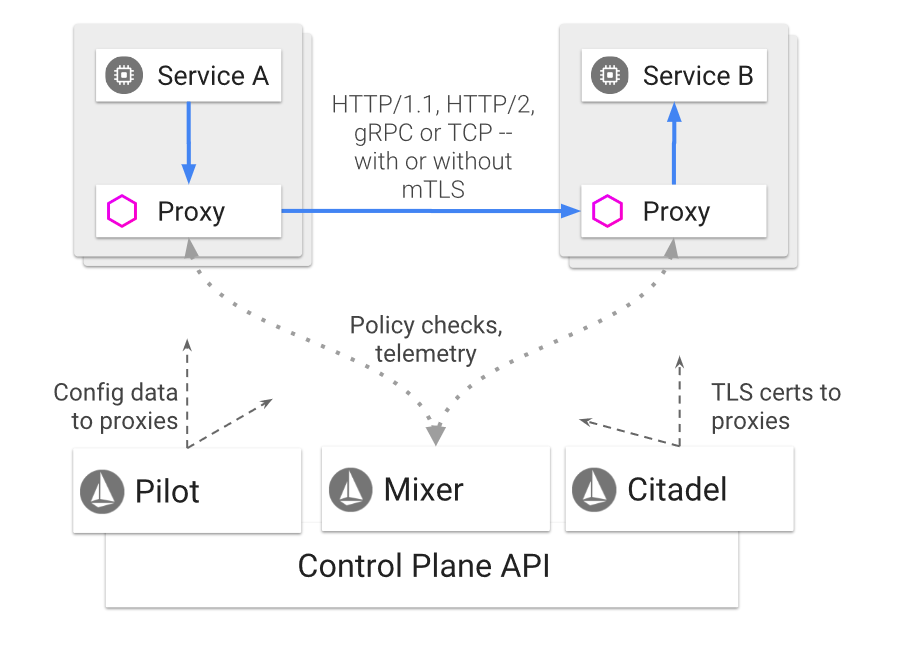
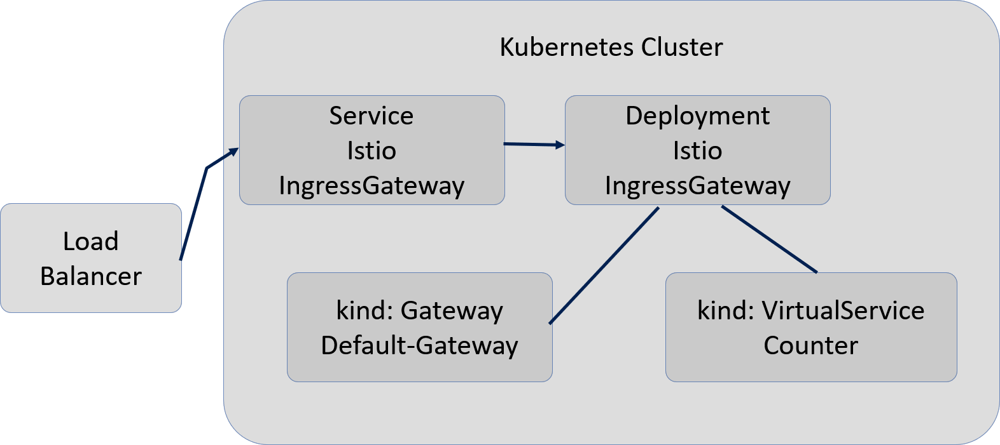

# Istio Concepts

## Architecture

An Istio service mesh is logically split into a data plane and a control plane.

- The `data plane` is composed of a set of intelligent proxies (`Envoy`) deployed as sidecars. These proxies mediate and control all network communication between microservices along with `Mixer`, a general-purpose policy and telemetry hub.

- The `control plane` manages and configures the proxies to route traffic. Additionally, the control plane configures `Mixers` to enforce policies and collect telemetry.

The following diagram shows the different components that make up each plane:


 

### Envoy

**Envoy is the Proxy** - Istio uses an extended version of the Envoy proxy. 

**High performance** - Envoy is a high-performance proxy developed in C++ to mediate all inbound and outbound traffic for all services in the service mesh. 

**Features** - Istio leverages Envoy’s many built-in features, for example:

    Dynamic service discovery
    Load balancing
    TLS termination
    HTTP/2 and gRPC proxies
    Circuit breakers
    Health checks
    Staged rollouts with %-based traffic split
    Fault injection
    Rich metrics

**Envoy is a sidecar** - It is deployed as a sidecar to the relevant service in the same Kubernetes pod. 

**Knows traffic behavior** - This deployment allows Istio to extract a wealth of signals about traffic behavior as attributes.

**Feed data to Mixer** - Istio can, in turn, use these attributes in Mixer to enforce policy decisions, and send them to monitoring systems to provide information about the behavior of the entire mesh.

**No need to recompile apps** - The sidecar proxy model also allows you to add Istio capabilities to an existing deployment with no need to rearchitect or rewrite code. You can read more about why we chose this approach in our Design Goals.

### Mixer

**Access Control and Usage Policy** - Mixer enforces access control and usage policies across the service mesh, and collects telemetry data from the Envoy proxy and other services. 

**Works with Envoy Proxy** - The proxy extracts request level attributes, and sends them to Mixer for evaluation.

### Citadel

All about authentication - Citadel provides strong service-to-service and end-user authentication with built-in identity and credential management. 

Encrypt Traffic - You can use Citadel to upgrade unencrypted traffic in the service mesh. 

Policy enforcement - Using Citadel, operators can enforce policies based on service identity rather than on network controls.

Authorizing Services -  You can use Istio’s authorization feature to control who can access your services.

### Galley

Galley validates user authored Istio API configuration on behalf of the other Istio control plane components. Over time, Galley will take over responsibility as the top-level configuration ingestion, processing and distribution component of Istio. It will be responsible for insulating the rest of the Istio components from the details of obtaining user configuration from the underlying platform (e.g. Kubernetes).

# Istio Installation

## The steps to install Istio are:

1. Have a Kubernetes cluster (AKS) ready with kubectl configured.
2. Download Istio
2. Install Helm and Tiller
3. Download the Release

### Download Istio

#### https://istio.io/docs/setup/kubernetes/download-release/

```bash
curl -L https://git.io/getLatestIstio | sh -
cd istio-1.0.5
export PATH=$PWD/bin:$PATH
```
I updated my `.bashrc` file as follows:

```bash
export ISTIO="/root/istio/istio-1.0.5/bin"
export PATH="$PATH:$GOPATH/bin:$GOROOT/bin:$ISTIO"
source <(kubectl completion bash)
```
You may have a different path as I am running as `root` locally.

### Installation with Helm

If a `service account` has not already been installed for Tiller, install one:

```bash
kubectl apply -f install/kubernetes/helm/helm-service-account.yaml
```

#### Install Tiller on your cluster with the service account:

```bash
 helm init --service-account tiller
 ```

#### Install Istio

```bash
helm install install/kubernetes/helm/istio --name istio --namespace istio-system
 ```

In my `.bashrc` file I added the ISTIO environment variable.

```bash
export ISTIO="/root/istio/istio-1.0.5/bin"
export PATH="$PATH:$ISTIO"
source <(kubectl completion bash)
```

## Install with Helm and Tiller via helm install

You can install Tiller on your cluster with the service account:

```bash
helm init --service-account tiller
```

### Install Istio:

#### https://istio.io/docs/setup/kubernetes/minimal-install/

```bash
helm install install/kubernetes/helm/istio --name istio-minimal --namespace istio-system \
  --set security.enabled=false \
  --set ingress.enabled=false \
  --set gateways.istio-ingressgateway.enabled=false \
  --set gateways.istio-egressgateway.enabled=false \
  --set galley.enabled=false \
  --set sidecarInjectorWebhook.enabled=false \
  --set mixer.enabled=false \
  --set prometheus.enabled=false \
  --set global.proxy.envoyStatsd.enabled=false \
  --set pilot.sidecar=false
```

**Ensure the istio-pilot-Kubernetes pod is deployed** - Ensure its container is up and running:

```bash
$ kubectl get pods -n istio-system
```
You should see these results:


```bash
NAME                                     READY     STATUS    RESTARTS   AGE
istio-pilot-58c65f74bc-2f5xn             1/1       Running   0          1m
```

# Viewing and Understanding the Istio Components

You will need to install the Kubernetes Dashboard.

## Setting up ClusterRole Binding

It is needed to have access to the Dashboard.

```bash
kubectl create clusterrolebinding kubernetes-dashboard --clusterrole=cluster-admin --serviceaccount=kube-system:kubernetes-dashboard
 ```
 You will need to enalbe the proxy which let's us tunnel in through `localhost`.

```bash
kubectl proxy
Starting to serve on 127.0.0.1:8001
```

 _Figure: Setting up the proxy_

## Accessing the Dashboard

Now go your browser and enter the following:

```bash
http://localhost:8001/api/v1/namespaces/kube-system/services/kubernetes-dashboard/proxy/#!/overview?namespace=default
 ```

 You should see this:

 

## Understanding Istio Inside of Kubernetes

The `istio-system` namespace is where all the components for Istio are stored.

Kubernetes constructs include:

- Deployments
- Pods
- Replicasets
- Services
- ConfigMaps
- Secrets

Let's break it down.

### Deployments

A Deployment controller provides declarative updates for Pods and ReplicaSets.

You describe a desired state in a Deployment object, and the Deployment controller changes the actual state to the desired state at a controlled rate. 

You can define Deployments to create new ReplicaSets, or to remove existing Deployments and adopt all their resources with new Deployments.

**istio-citadel** - An optional health-checking feature. In public key infrastructure (PKI) systems, a certificate signing request (also CSR or certification request) is a message sent from an applicant to a certificate authority in order to apply for a digital identity certificate. This service/pod will detect failures in the CSR signing service.


**istio-egressgateway** - The Control Egress Traffic task demonstrates how external (outside the Kubernetes cluster) HTTP and HTTPS services can be accessed from applications inside the mesh. 
 - By default, Istio-enabled applications are unable to access URLs outside the cluster. 
 - To enable such access, a service entry for the external service must be defined, or, alternatively, direct access to external services must be configured.
 - The idea is that all traffic that leaves the service mesh must flow through a set of dedicated nodes that are separate from the rest of the nodes used for running applications in the cluster.
 - The special nodes will serve for policy enforcement on the egress traffic and will be monitored more thoroughly than the rest of the nodes.

**istio-galley** - Galley is the top-level config ingestion, processing and distribution component of Istio. 
 - It is responsible for insulating the rest of the Istio components from the details of obtaining user configuration from the underlying platform.
 - A resource is an endpoint in the Kubernetes API that stores a collection of API objects of a certain kind. For example, the built-in pods resource contains a collection of Pod objects.
 - Configuration options include authorization, traffic routing, policies/telemetry, and authentication policy.

**istio-ingressgateway** - Istio no longer leverages an `Ingress` controller to handle traffic coming into the cluster. It is really a fancy wrapper around the `Envoy` proxy. 

The istio-pilot, explained next, detects changes the istio-ingressgateway, and sends that configuration information to the `Envoy` sidecars for routing.

The istio-ingressgateway is composed of two resources:

 - `Gateway` - Used to configure the ports for `Envoy`. 
 - `VirtualServices` - Works with `Gateway` to configure `Envoy`.



These resources work together. There is a `Istio IngressGateway Service` that is listening on the Loadbalancer. The `istio-gateway` with help from other components configures the ports, protocol, and certificates. 

The load balancer can be configured through the service type: LoadBalancer. Azure supports automatic configuration and  forward traffic to a port that the IngressGateway Service is listening on. 

The `VirtualServices` resource is key. By including a list of gateways, a virtual service tells Istio to configure those gateways with the routes defined in the VirtualService configuration. 

**istio-pilot** - Routing rules are specified that tell Pilot which pods/VMs are to receive traffic. Pilot manages and configures Envoy proxy/sidecar instances. Pilot provides load balancing information to each Envoy instance. Pilot is responsible for the lifecycle of Envoy instances deployed across the Istio service mesh. 

For example, you can specify via Pilot that you want 5% of traffic for a particular service to go to a canary version irrespective of the size of the canary deployment, or send traffic to a particular version depending on the content of the request.

Supports Dynamic request routing for:

- A/B testing
- Gradual Rollouts
- Canary Releases
- Failure recovery with timeouts, retries, circuit breakers, and fault injection

 **istio-policy** - used to enforce authorization policies, specifically enabling, configuring, and using Istio authentication policies.  It includes such things as access control system, telemetry capturing systems, quota enforcement systems, billing systems.

**istio-sidecar-injector** - a sidecar is a pattern.  A Pod is composed of one or more application containers. A sidecar is a utility container in the Pod and its purpose is to support the main container. 

- Istio uses an extended version of the `Envoy proxy`. Envoy is a high-performance proxy developed in C++ to mediate all inbound and outbound traffic for all services in the service mesh.


 


**istio-telemetry** - used to obtain uniform metrics, logs, traces across the various services. Makes use of Istio Mixer and Istio sidecar.

**prometheus** - collects Istio metrics and makes them available to Prometheus. Prometheus is an open source monitoring solution. See [Prometheus](https://prometheus.io/) link.

### Pods

Explained above in the `Deployment` section. deployments are the higher level object that creates replica sets which create pods. The functional capabilities of these Kubernetes object types are identical.

 

Explained above in the `Deployment` section.

### Replicasets

Explained above in the `Deployment` section.

### Services

Explained above in the `Deployment` section.

### ConfigMaps

`ConfigMaps` allow you to decouple configuration artifacts from image content to keep containerized applications portable.

`ConfigMaps` bind configuration files, command-line arguments, environment variables, port numbers, and other configuration artifacts to your Pods' containers and system components at runtime. 

Here is the list:

istio, istio-galley-configuration, istio-ingress-controller-leader-istio, istio-security-custom-resources, istio-sidecar-injector, istio-statsd-prom-bridge, prometheus 


### Secrets

Intended to hold sensitive information, such as passwords, OAuth tokens, and ssh keys. Putting this information in a secret is safer and more flexible than putting it verbatim in a pod definition or in a docker image

default-token-ksp2b, istio-ca-secret, istio-citadel-service-account-token-fwdcs, istio-egressgateway-service-account-token-w8vzt, istio-galley-service-account-token-6wx4l, istio-ingressgateway-service-account-token-kfs29, istio-mixer-service-account-token-8pdlg, istio-pilot-service-account-token-hzxzj, istio-security-post-install-account-token-5kzmj, istio-sidecar-injector-service-account-token-vdf9g, istio.default, istio.istio-citadel-service-account, istio.istio-egressgateway-service-account, istio.istio-galley-service-account, istio.istio-ingressgateway-service-account, istio.istio-mixer-service-account, istio.istio-pilot-service-account, istio.istio-security-post-install-account, istio.istio-sidecar-injector-service-account, istio.prometheus, prometheus-token-bv7kw


